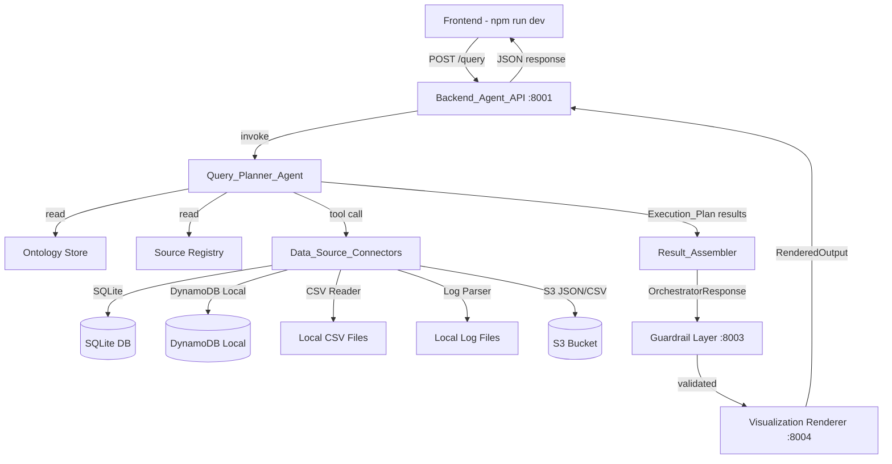
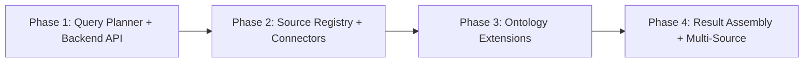
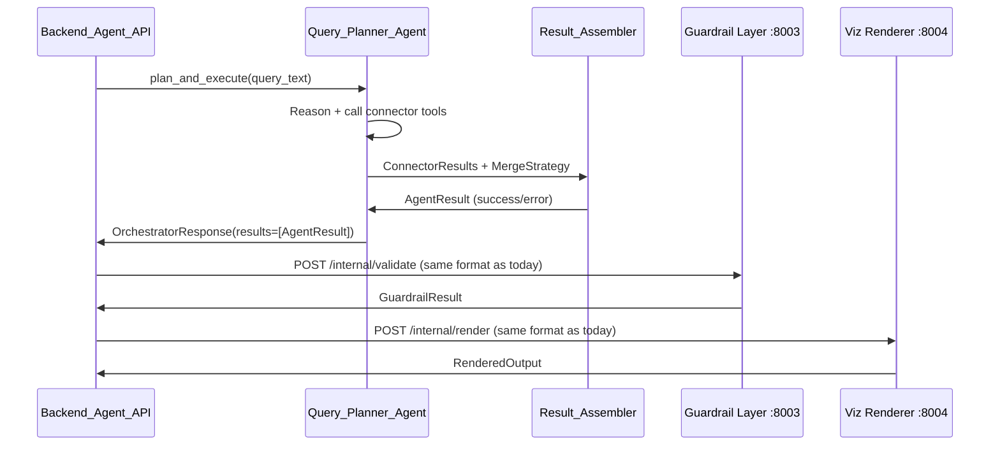
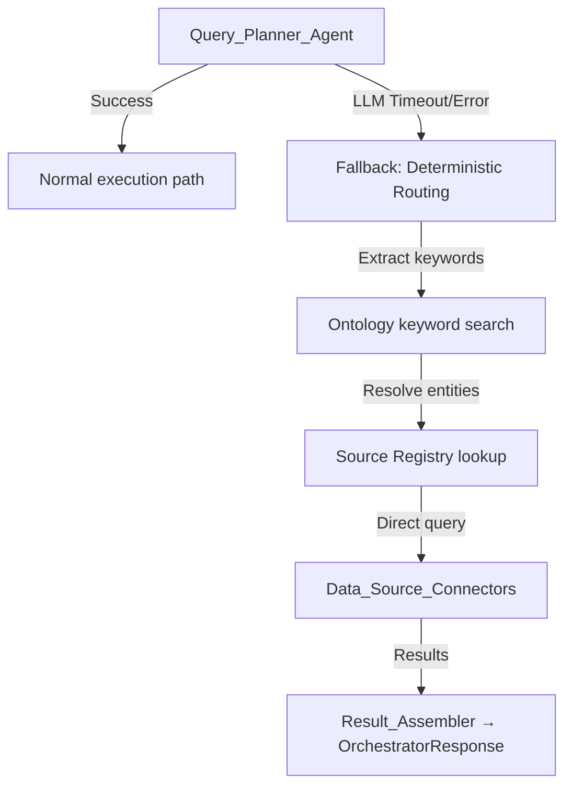

# Design Document: Agent Multi-Source Retrieval

## Overview

This design replaces the current NLP Translator + Orchestrator Hub two-service architecture with a single **Query_Planner_Agent** (Strands SDK agent) that interprets natural language queries, reasons about the ontology and registered data sources, and produces an Execution_Plan. The plan is executed against modular **Data_Source_Connectors** (SQLite/RDS, DynamoDB Local, S3 CSV, log files), and results are merged by a **Result_Assembler** before passing through the existing Guardrail → Visualization pipeline unchanged.

### Key Design Principles

1. **Frontend stays as-is**: No containerization, no ECS deployment. The React app continues running via `npm run dev` and talks to a single Backend_Agent_API gateway.
2. **Incremental stabilization**: Each major component (Query Planner, then connectors, then registry) is integrated and tested independently before combining.
3. **Minimum-cost testing**: SQLite replaces RDS, DynamoDB Local replaces cloud DynamoDB, local files replace S3 for new source testing.
4. **Viz pipeline preserved**: The Guardrail Layer (port 8003) and Visualization Renderer (port 8004) are untouched — the new architecture produces the same `OrchestratorResponse` shape they expect.
5. **Ontology extended, not replaced**: The existing ontology model gains a `source_mapping` field to express concept-to-source relationships.

### What Changes

| Current | New |
|---------|-----|
| NLP Translator (port 8001) | Backend_Agent_API (port 8001, same port) |
| Orchestrator Hub (port 8002) | Removed — logic absorbed into Query_Planner_Agent |
| Spoke Agent (port 8010) | Removed — replaced by Data_Source_Connectors as Strands tools |
| Hardcoded S3 data sources | Source_Registry with dynamic connector routing |
| OntologyConcept (no source info) | OntologyConcept + `source_mapping` field |

### What Does NOT Change

- Guardrail Layer (port 8003) — unchanged
- Visualization Renderer (port 8004) — unchanged (PRESERVED AS-IS)
- Frontend code and its API contract (`POST /query` with `query_text`)
- OrchestratorResponse / GuardrailResult / RenderedOutput model schemas
- S3-backed ontology storage format

## Architecture

### High-Level Flow



### Service Topology (After Migration)

| Service | Port | Role | Status |
|---------|------|------|--------|
| Backend_Agent_API | 8001 | Gateway + Query Planner orchestration | **New** (replaces NLP API) |
| Guardrail Layer | 8003 | Content validation | Unchanged |
| Visualization Renderer | 8004 | Chart.js config generation | Unchanged |

The Orchestrator Hub (8002) and Spoke Agent (8010) are retired. Their functionality is subsumed by the Query_Planner_Agent running in-process within the Backend_Agent_API.

### Incremental Migration Strategy



- **Phase 1**: Replace NLP + Orchestrator with Query_Planner_Agent. Existing S3 data sources work via legacy connector. Verify end-to-end with current queries.
- **Phase 2**: Implement Source_Registry and Data_Source_Connectors (SQLite, DynamoDB Local, CSV, Logs). Register existing S3 sources.
- **Phase 3**: Extend ontology with source_mapping. Update Query Planner to use source-aware reasoning.
- **Phase 4**: Implement Result_Assembler for cross-source joins. Full multi-source queries operational.

## Components and Interfaces

### 1. Backend_Agent_API (FastAPI Gateway)

**Responsibility**: Accept frontend queries, manage sessions, invoke the Query_Planner_Agent, and return responses through the Guardrail → Viz pipeline.

```python
# Endpoint contract (unchanged from current NLP API)
POST /query
  Request:  {"query_text": str}
  Response: {"rendered_output": RenderedOutput, "latency": dict, "query_id": str, "correlation_id": str}

# New internal endpoints
GET  /health
GET  /v1/sources          # List registered data sources
POST /v1/sources          # Register a new data source
DELETE /v1/sources/{id}   # Deregister a source

# Backward compatibility
POST /internal/process    # Deprecated, proxies to Query_Planner_Agent
```

**Key decisions**:
- Reuses port 8001 to avoid frontend URL changes
- Session context stored in-memory (dict keyed by session_id from request header)
- CORS configured identically to current NLP API

### 2. Query_Planner_Agent (Strands Agent)

**Responsibility**: Interpret natural language, reason about ontology + source registry, produce and execute an Execution_Plan.

```python
from strands import Agent, tool

class QueryPlannerAgent:
    """Single Strands Agent that replaces NLP Translator + Orchestrator Hub."""
    
    def __init__(self, ontology_store, source_registry, connectors):
        self._agent = Agent(
            system_prompt=QUERY_PLANNER_SYSTEM_PROMPT,
            tools=[
                self.lookup_ontology,
                self.search_sources,
                self.query_sql_source,
                self.query_dynamodb_source,
                self.query_csv_source,
                self.query_log_source,
                self.query_s3_json_source,
            ],
            model=get_strands_bedrock_model(),
        )
    
    async def plan_and_execute(self, query_text: str, session_context: dict) -> OrchestratorResponse:
        """Main entry point: NL query → OrchestratorResponse."""
        ...
```

**Tools exposed to the agent**:
| Tool | Purpose |
|------|---------|
| `lookup_ontology` | Search ontology concepts by keyword, traverse relationships |
| `search_sources` | Query Source_Registry for sources matching concept IDs |
| `query_sql_source` | Execute parameterized SQL against a registered SQLite/RDS source |
| `query_dynamodb_source` | Execute scan/query against DynamoDB Local or cloud |
| `query_csv_source` | Read and filter a registered CSV source |
| `query_log_source` | Parse and filter structured log files |
| `query_s3_json_source` | Fetch and query JSON data from S3 (legacy path) |

**Fallback behavior** (Requirement 9.4): If the agent fails to produce an Execution_Plan (LLM error, timeout), fall back to the existing deterministic ontology-based routing logic (keyword extraction → entity resolution → direct data source query).

### 3. Data_Source_Connector (Abstract Interface)

**Responsibility**: Execute queries against a specific data source type, returning a uniform result structure.

```python
from abc import ABC, abstractmethod
from dataclasses import dataclass
from typing import Any

@dataclass
class ConnectorResult:
    """Uniform result from any data source connector."""
    status: Literal["success", "error"]
    columns: list[str]
    rows: list[list[Any]]
    row_count: int
    data_source: str
    error_type: str | None = None
    error_description: str | None = None
    metadata: dict[str, Any] = field(default_factory=dict)

class DataSourceConnector(ABC):
    """Abstract base for all data source connectors."""
    
    @abstractmethod
    def execute(self, query_params: dict[str, Any]) -> ConnectorResult:
        """Execute a query against this data source."""
        ...
    
    @abstractmethod
    def health_check(self) -> bool:
        """Lightweight connectivity check."""
        ...
    
    @property
    @abstractmethod
    def source_type(self) -> str:
        """Return the connector type identifier (e.g., 'sqlite', 'dynamodb', 'csv', 'logs')."""
        ...
```

**Implementations**:

| Connector | Backend | Testing Mode | Production Mode |
|-----------|---------|-------------|-----------------|
| `SQLConnector` | SQLAlchemy | SQLite file | RDS PostgreSQL/MySQL |
| `DynamoDBConnector` | boto3 | DynamoDB Local (port 8000) | AWS DynamoDB |
| `CSVConnector` | pandas/csv | Local filesystem | S3 paths |
| `LogConnector` | custom parser | Local log files | S3/CloudWatch |
| `S3JSONConnector` | boto3 + json | Local JSON files | S3 bucket |

### 4. Source_Registry

**Responsibility**: Store and query data source configurations, schema descriptors, and ontology concept mappings.

```python
class SourceRegistry:
    """Configuration store for registered data sources."""
    
    def __init__(self, config_path: str = "data/source_registry.json"):
        self._sources: dict[str, SourceConfig] = {}
        self._load(config_path)
    
    def register(self, config: SourceConfig) -> None: ...
    def deregister(self, source_id: str) -> None: ...
    def find_by_concepts(self, concept_ids: list[str]) -> list[SourceConfig]: ...
    def get_schema(self, source_id: str) -> SchemaDescriptor | None: ...
    def health_check(self, source_id: str) -> bool: ...
```

**Storage**: JSON file on local filesystem (`data/source_registry.json`). No S3 dependency for registry config — keeps it simple and fast for local dev.

### 5. Result_Assembler

**Responsibility**: Merge results from multiple connectors according to the Execution_Plan's merge strategy.

```python
class ResultAssembler:
    """Merges results from multiple data source queries."""
    
    def assemble(self, results: list[ConnectorResult], strategy: MergeStrategy) -> AgentResult:
        """Combine connector results into a single AgentResult."""
        ...
    
    def _union(self, results: list[ConnectorResult]) -> dict: ...
    def _join(self, results: list[ConnectorResult], join_key: str) -> dict: ...
    def _aggregate(self, results: list[ConnectorResult]) -> dict: ...
```

**Merge strategies**:
- `union`: Stack rows from all sources (same schema assumed)
- `join`: Inner join on a specified key column
- `aggregate`: Combine aggregated metrics from different sources

### 6. Ontology Store Extensions

**What changes**: The `OntologyConcept` model gains a `source_mapping` field. The `OntologyStore` gains a method to resolve concepts to their data sources.

```python
# Extended model
class SourceMapping(BaseModel):
    """Maps a concept to its data source and access path."""
    source_id: str           # References SourceRegistry entry
    access_path: str         # Table name, collection, file path, etc.
    field_mappings: dict[str, str] = Field(default_factory=dict)  # concept_property → source_column

class OntologyConcept(BaseModel):
    concept_id: str
    label: str
    properties: dict[str, Any] = Field(default_factory=dict)
    relationships: list[OntologyRelationship] = Field(default_factory=list)
    source_mapping: SourceMapping | None = None  # NEW: optional source awareness
```

**Backward compatibility**: `source_mapping` is optional (`None` by default). Existing ontology JSON files without this field continue to deserialize correctly.

### 7. Integration Point: New Architecture → Existing Viz Pipeline

The critical contract: the Query_Planner_Agent must produce an `OrchestratorResponse` that the Guardrail Layer accepts unchanged.



The `OrchestratorResponse` produced by the Query_Planner_Agent uses the same schema as the current Orchestrator Hub output. The Guardrail and Viz services see no difference.

## Data Models

### Execution_Plan

```python
class SubTask(BaseModel):
    """A single data retrieval sub-task within an execution plan."""
    task_id: str
    source_id: str
    connector_type: str  # "sql", "dynamodb", "csv", "logs", "s3_json"
    query_params: dict[str, Any]  # Connector-specific params
    depends_on: list[str] = Field(default_factory=list)  # task_ids this depends on

class MergeStrategy(BaseModel):
    """How to combine results from multiple sub-tasks."""
    method: Literal["union", "join", "aggregate", "single"]
    join_key: str | None = None
    aggregate_columns: list[str] = Field(default_factory=list)

class ExecutionPlan(BaseModel):
    """Complete plan for a multi-source query."""
    plan_id: str
    query_text: str
    sub_tasks: list[SubTask]
    merge_strategy: MergeStrategy
    created_at: datetime
    reasoning: str  # Agent's explanation of source selection
```

### SourceConfig (Source Registry Entry)

```python
class SchemaDescriptor(BaseModel):
    """Describes the structure of a data source."""
    columns: list[ColumnDescriptor]
    primary_key: str | None = None
    relationships: list[str] = Field(default_factory=list)  # References to other source_ids

class ColumnDescriptor(BaseModel):
    """A single column in a schema descriptor."""
    name: str
    data_type: str  # "string", "integer", "float", "boolean", "datetime"
    nullable: bool = True
    description: str = ""

class SourceConfig(BaseModel):
    """Configuration for a registered data source."""
    source_id: str
    source_name: str
    connector_type: Literal["sql", "dynamodb", "csv", "logs", "s3_json"]
    connection_params: dict[str, Any]  # Connector-specific (db_path, endpoint, file_path, etc.)
    schema: SchemaDescriptor
    ontology_concepts: list[str]  # concept_ids this source provides data for
    enabled: bool = True
```

### ConnectorResult (Uniform Query Output)

```python
@dataclass
class ConnectorResult:
    status: Literal["success", "error"]
    columns: list[str]
    rows: list[list[Any]]
    row_count: int
    data_source: str
    error_type: str | None = None
    error_description: str | None = None
    metadata: dict[str, Any] = field(default_factory=dict)  # Timing, query stats, etc.
```

### Extended OntologyConcept

```python
class SourceMapping(BaseModel):
    source_id: str
    access_path: str  # Table name, DDB table, file path
    field_mappings: dict[str, str] = Field(default_factory=dict)

class OntologyConcept(BaseModel):
    concept_id: str
    label: str
    properties: dict[str, Any] = Field(default_factory=dict)
    relationships: list[OntologyRelationship] = Field(default_factory=list)
    source_mapping: SourceMapping | None = None  # NEW
```

### Session Context (Conversational State)

```python
class SessionContext(BaseModel):
    """In-memory conversational state for follow-up queries."""
    session_id: str
    history: list[dict[str, Any]] = Field(default_factory=list)  # Prior query/result pairs
    last_entity_refs: list[str] = Field(default_factory=list)
    last_sources_used: list[str] = Field(default_factory=list)
    created_at: datetime
    last_active: datetime
```


## Correctness Properties

*A property is a characteristic or behavior that should hold true across all valid executions of a system — essentially, a formal statement about what the system should do. Properties serve as the bridge between human-readable specifications and machine-verifiable correctness guarantees.*

### Property 1: SQL Connector Data Round-Trip

*For any* valid tabular dataset (random columns with string/integer/float types, random rows), inserting the data into a SQLite database via the SQL connector and then querying it back should produce a result with the same columns and equivalent row data (accounting for type coercion rules).

**Validates: Requirements 2.1**

### Property 2: DynamoDB Connector Data Round-Trip

*For any* valid DynamoDB item (random attribute names and values of types string, number, boolean, list, map), putting the item via the DynamoDB connector and then querying/scanning it back should return an item with equivalent attribute values.

**Validates: Requirements 2.2**

### Property 3: CSV Connector Parse Round-Trip

*For any* valid tabular dataset (random column names and typed values — strings, integers, floats, booleans), serializing to CSV format and parsing via the CSV connector should produce rows with correctly coerced types matching the original data.

**Validates: Requirements 2.3**

### Property 4: Log Connector Parse Round-Trip

*For any* valid collection of structured log entries (random JSON-lines content with timestamp, level, message, and arbitrary fields), writing to a file and parsing via the Log connector should recover all entries with their original structure preserved.

**Validates: Requirements 2.4**

### Property 5: Source Registry Config Round-Trip

*For any* valid SourceConfig (random source_id, connector_type, connection_params, SchemaDescriptor with random columns, and random ontology_concepts list), registering it in the Source_Registry and then retrieving it should return a configuration equal to the original.

**Validates: Requirements 3.1, 3.2**

### Property 6: Source Registry Concept Lookup Correctness

*For any* set of registered sources with known ontology_concepts mappings, and *for any* query set of concept IDs, `find_by_concepts(query_concepts)` should return exactly those sources whose `ontology_concepts` list intersects with the query set — no more, no fewer.

**Validates: Requirements 3.4, 3.5**

### Property 7: Ontology Traversal Completeness

*For any* ontology graph (random concepts and relationships) with source_mappings assigned to leaf concepts, traversing from a starting concept should find all reachable concepts that have source_mappings, following relationship edges in the specified direction.

**Validates: Requirements 4.1**

### Property 8: Source Ranking Respects Graph Proximity

*For any* ontology graph where a query concept has paths to multiple source-mapped concepts at different hop distances, the ranking produced by the Ontology_Reasoner should order sources by ascending hop count (closer sources rank higher).

**Validates: Requirements 4.2**

### Property 9: Schema Field Validation Correctness

*For any* SchemaDescriptor (random set of column names) and *for any* set of requested field names, the schema validation function should return `true` if and only if every requested field exists in the schema's column list.

**Validates: Requirements 4.4**

### Property 10: Execution Plan Structural Invariants

*For any* valid ExecutionPlan (random sub-tasks with random dependency edges forming a DAG), the plan must satisfy: (a) at least one sub-task, (b) a valid merge_strategy, (c) all depends_on references point to existing task_ids, and (d) the dependency graph is acyclic.

**Validates: Requirements 5.1**

### Property 11: Execution Plan Serialization Round-Trip

*For any* valid ExecutionPlan, serializing to JSON via `model_dump_json()` and deserializing via `model_validate_json()` should produce an ExecutionPlan equal to the original.

**Validates: Requirements 5.6**

### Property 12: Result Assembly Correctness and OrchestratorResponse Conformance

*For any* list of ConnectorResults (mix of successes and errors) and a merge strategy:
- **Union**: The assembled result row_count equals the sum of all successful source row_counts.
- **Join**: Every row in the result contains the join key value present in ALL successful sources.
- **Partial failure**: All successful source data is included, and all failed source_ids appear in `unavailable_agents`.
- The output is always a valid `OrchestratorResponse` that passes Pydantic schema validation.

**Validates: Requirements 5.4, 5.5, 8.3**

### Property 13: Multi-Source Query Decomposition

*For any* set of ontology concept IDs that map to N distinct data sources (N ≥ 2) in the Source_Registry, the Query_Planner's decomposition logic should produce an ExecutionPlan with at least N sub-tasks (one per source) and a merge_strategy with method ≠ "single".

**Validates: Requirements 1.5**

## Error Handling

### Error Categories and Responses

| Error Type | Source | Response |
|-----------|--------|----------|
| `UNPARSEABLE_QUERY` | Backend_Agent_API | 422 — query text empty or only whitespace |
| `NO_SOURCES_FOUND` | Query_Planner_Agent | 422 — no sources match the resolved concepts |
| `CLARIFICATION_NEEDED` | Query_Planner_Agent | 200 — returns clarification options in response |
| `CONNECTOR_TIMEOUT` | Data_Source_Connector | Partial results with failed source listed |
| `CONNECTOR_ERROR` | Data_Source_Connector | Structured error in ConnectorResult |
| `PLAN_GENERATION_FAILED` | Query_Planner_Agent | Falls back to deterministic routing |
| `ALL_SOURCES_FAILED` | Result_Assembler | 500 — all connectors returned errors |
| `SCHEMA_VALIDATION_ERROR` | Source_Registry | Reject registration with details |

### Fallback Strategy



The fallback path mirrors the current NLP Translator logic: extract keywords → search ontology → resolve entities → query matching sources directly. This ensures the system always produces a response even during LLM outages.

### Timeout Configuration

| Component | Default Timeout | Configurable |
|-----------|----------------|--------------|
| Query_Planner_Agent (LLM) | 15s | Yes |
| Per-connector query | 30s | Yes, per source |
| Total request (API gateway) | 120s | Yes |
| Guardrail validation | 30s | No (existing) |
| Visualization rendering | 120s | No (existing) |

### Partial Failure Behavior

When some sources succeed and others fail:
1. Result_Assembler includes all successful data
2. Failed sources listed in `OrchestratorResponse.unavailable_agents`
3. Response metadata includes `"partial_results": true` flag
4. Visualization still renders with available data
5. Frontend can display a warning about missing sources

## Testing Strategy

### Testing Philosophy

This feature uses a **dual testing approach**:
- **Property-based tests** (Hypothesis library): Verify universal correctness properties across randomized inputs — ideal for data transformations, serialization, and routing logic.
- **Unit/example tests** (pytest): Verify specific scenarios, integration points, edge cases, and LLM-dependent behavior with mocked responses.

### Property-Based Testing Configuration

- **Library**: [Hypothesis](https://hypothesis.readthedocs.io/) (Python)
- **Minimum iterations**: 100 per property
- **Tag format**: `# Feature: agent-multi-source-retrieval, Property {N}: {title}`
- Each property test references its design document property number

### Test Categories

#### Property Tests (13 properties)

| Property | Component Under Test | Key Generators |
|----------|---------------------|----------------|
| 1: SQL Round-Trip | SQLConnector | Random table schemas + row data |
| 2: DynamoDB Round-Trip | DynamoDBConnector | Random DDB items (varied types) |
| 3: CSV Parse Round-Trip | CSVConnector | Random tabular data → CSV string |
| 4: Log Parse Round-Trip | LogConnector | Random JSON-line entries |
| 5: Registry Config Round-Trip | SourceRegistry | Random SourceConfig objects |
| 6: Concept Lookup | SourceRegistry.find_by_concepts | Random source/concept mappings |
| 7: Ontology Traversal | OntologyStore (extended) | Random concept graphs |
| 8: Source Ranking | OntologyReasoner | Graphs with known distances |
| 9: Schema Validation | SchemaDescriptor validation | Random schemas + field requests |
| 10: Plan Invariants | ExecutionPlan validation | Random DAGs of sub-tasks |
| 11: Plan Serialization | ExecutionPlan Pydantic model | Random valid plans |
| 12: Result Assembly | ResultAssembler | Random ConnectorResults |
| 13: Multi-Source Decomposition | Decomposition logic | Random multi-source concept sets |

#### Unit/Example Tests

| Test Area | What's Tested | Approach |
|-----------|---------------|----------|
| API endpoint contract | POST /query returns correct structure | 3-5 known queries |
| Fallback path | Agent failure → deterministic routing | Mock agent to fail |
| Clarification response | Vague query → clarification | 2-3 vague queries |
| Connector error handling | Bad connection → structured error | Per connector type |
| Timeout behavior | Slow source → timeout error | Mock with sleep |
| CORS headers | Cross-origin requests allowed | Single request check |
| Health endpoints | All /health routes respond | Smoke test |
| Backward compatibility | Existing queries → same output | Regression suite |

#### Integration Tests

| Test Area | What's Tested | Approach |
|-----------|---------------|----------|
| End-to-end query flow | NL query → rendered output | 5 representative queries |
| Multi-source join | Query spanning 2 sources | 2-3 cross-source queries |
| Existing S3 queries | Current financial/product queries still work | Existing test suite |
| Guardrail → Viz pipeline | OrchestratorResponse passes through unchanged | Compare with current output |

### Local Testing Infrastructure

Per user constraints, all testing uses **local/free** data stores:

| Data Source | Test Backend | Setup |
|-------------|-------------|-------|
| RDS (PostgreSQL/MySQL) | SQLite file (`data/test.db`) | SQLAlchemy with sqlite:// URI |
| DynamoDB | DynamoDB Local (Docker, port 8000) | `docker run -p 8000:8000 amazon/dynamodb-local` |
| S3 CSV | Local filesystem (`data/test_csv/`) | Direct file read |
| Log files | Local filesystem (`data/test_logs/`) | Direct file read |
| S3 JSON | Local filesystem (`data/test_json/`) + existing S3 synthetic data | File read with S3 fallback |

### Incremental Test Phases

Matching the incremental migration strategy:

1. **Phase 1 tests**: Query Planner produces valid plans, fallback works, API contract preserved
2. **Phase 2 tests**: Each connector round-trips correctly, registry CRUD works
3. **Phase 3 tests**: Ontology traversal, source ranking, schema validation
4. **Phase 4 tests**: Multi-source assembly, partial failure, cross-source joins
