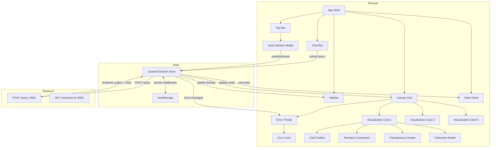

# Design Document

## Overview

This design describes a React + Tailwind CSS single-page application that replaces the existing `frontend/index.html` with a fully featured conversational BI interface. The application connects to the existing NLP Translator backend (`POST /query` on port 8001) and renders query results as interactive visualization cards on a drag-reorderable canvas.

Key design decisions:
- **React 18 + Vite** — Fast dev server, modern bundling, excellent DX
- **Tailwind CSS** — Utility-first styling, no custom CSS file sprawl
- **Recharts** — React-native charting with composable components and built-in tooltips
- **react-dnd** — Declarative drag-and-drop with HTML5 backend for card reordering/resizing
- **zustand** — Minimal, performant state management without boilerplate; localStorage middleware for persistence
- **Web Speech API** — Browser-native voice transcription (progressive enhancement)

The application lives in `frontend/` as a standalone Vite project. The backend CORS is already configured to accept `*` origins, so the React dev server can proxy or direct-call the API at `http://localhost:8001`.

## Architecture



### Data Flow

1. User types prompt in Chat Bar → dispatches to zustand store
2. Store sends `POST /query` with `{ query_text }` to backend
3. Backend returns `{ rendered_output: { output_type, chart_type, chart_data, text_content, description, metadata } }`
4. Store appends a new Visualization Card with parsed data to the canvas grid
5. Canvas renders the card using Recharts (chart) or formatted text
6. Stats Panel reads the `metadata.columns` from the active card's data
7. Session state is persisted to localStorage on every change

**Error Flow:**
1. If backend returns 422/503/504 or request times out (60s), store appends a ChatMessage with `role: 'error'`, `statusCode`, and `originalQuery`
2. Canvas's ErrorThread component renders ErrorCard for each error message
3. ErrorCards for 503/504/408 include a retry button that re-invokes `submitQuery` with the original query text

## Components and Interfaces

### Component Tree

```
<App>
├── <TopBar>
│   └── <SaveSessionModal /> (conditional)
├── <Sidebar>
│   ├── <NewChatButton />
│   ├── <ThreadList />
│   │   └── <ThreadItem /> (×50 max)
│   └── <BookmarkList />
│       └── <BookmarkItem /> (×50 max)
├── <Canvas>
│   ├── <CanvasGrid> (react-dnd DndProvider)
│   │   ├── <DraggableCard /> (×6 max)
│   │   │   └── <VisualizationCard />
│   │   │       ├── <UserMessage />
│   │   │       ├── <CardToolbar />
│   │   │       ├── <ChartRenderer />
│   │   │       │   ├── <BarChart /> | <LineChart /> | <ScatterChart />
│   │   │       │   ├── <PieChart /> | <HeatmapChart />
│   │   │       │   └── <DataTable />
│   │   │       ├── <TransparencyDrawer />
│   │   │       └── <FullscreenModal /> (conditional)
│   │   └── <DropCell /> (×6 drop targets)
│   └── <ErrorThread />
│       └── <ErrorCard /> (per error in chat thread)
├── <StatsPanelAccordion /> (mobile only)
├── <StatsPanel>
│   ├── <LatencyBadge />
│   ├── <ColumnStats /> (per column)
│   └── <EmptyState />
└── <ChatBar>
    ├── <TextInput />
    ├── <SubmitButton />
    └── <VoiceInputButton />
```

### Key Interfaces (TypeScript)

```typescript
// Backend response shape (mirrors RenderedOutput pydantic model)
interface RenderedOutput {
  output_type: 'chart' | 'text';
  chart_type?: 'bar' | 'line' | 'scatter' | 'pie' | 'table' | 'heatmap' | null;
  chart_data?: Record<string, unknown> | null;
  text_content?: string | null;
  description: string;
  metadata: MetaPayload;
}

interface MetaPayload {
  query_id: string;
  query_type: string;
  latency_ms?: number;
  row_count?: number;
  columns?: ColumnMeta[];
  timestamp?: string;
  data_sources?: string[];
}

interface ColumnMeta {
  name: string;
  type: 'numeric' | 'categorical' | 'time-series';
  row_count?: number;
  null_percentage?: number;
  // Numeric stats
  min?: number;
  max?: number;
  mean?: number;
  median?: number;
  std_dev?: number;
  // Categorical stats
  cardinality?: number;
  // Time-series stats
  time_range_start?: string;
  time_range_end?: string;
}

// Canvas card state
interface CardState {
  id: string;
  query: string;
  renderedOutput: RenderedOutput;
  gridPosition: { col: number; row: number };
  gridSize: { colSpan: 1 | 2; rowSpan: 1 | 2 };
  pinned: boolean;
  createdAt: number;
}

// Session store shape
interface SessionState {
  // Canvas
  cards: CardState[];
  activeCardId: string | null;
  
  // Chat
  chatThread: ChatMessage[];
  
  // Sidebar
  threads: ThreadSummary[];
  bookmarks: Bookmark[];
  
  // UI state
  statsPanelCollapsed: boolean;
  loading: boolean;
  
  // Actions
  submitQuery: (queryText: string) => Promise<void>;
  addCard: (card: CardState) => void;
  removeCard: (id: string) => void;
  moveCard: (id: string, position: { col: number; row: number }) => void;
  resizeCard: (id: string, size: { colSpan: 1 | 2; rowSpan: 1 | 2 }) => void;
  pinCard: (id: string) => void;
  unpinCard: (id: string) => void;
  setActiveCard: (id: string | null) => void;
  toggleStatsPanel: () => void;
  saveBookmark: (name: string) => void;
  loadBookmark: (id: string) => void;
  deleteBookmark: (id: string) => void;
  startNewChat: () => void;
}

interface ChatMessage {
  id: string;
  role: 'user' | 'system' | 'error';
  content: string;
  cardId?: string;
  timestamp: number;
  /** HTTP status code for error messages (422, 503, 504, 408) */
  statusCode?: number;
  /** Original query text, stored on error messages for retry */
  originalQuery?: string;
}

interface Bookmark {
  id: string;
  name: string;
  savedAt: number;
  chatThread: ChatMessage[];
  cards: CardState[];
  workspaceName: string;
}

interface ThreadSummary {
  id: string;
  firstMessage: string;
  lastActivity: number;
  messageCount: number;
}
```

### Chart Selection Logic

```typescript
function selectChartType(renderedOutput: RenderedOutput): ChartType {
  // 1. Explicit backend instruction
  if (renderedOutput.chart_type) return renderedOutput.chart_type;
  
  // 2. Text-only response
  if (renderedOutput.output_type === 'text') return 'text';
  
  // 3. Infer from data shape
  const columns = renderedOutput.metadata?.columns ?? [];
  const hasTime = columns.some(c => c.type === 'time-series');
  const numericCols = columns.filter(c => c.type === 'numeric');
  const categoricalCols = columns.filter(c => c.type === 'categorical');
  
  if (hasTime && numericCols.length >= 1) return 'line';
  if (categoricalCols.length >= 1 && numericCols.length >= 1) return 'bar';
  if (numericCols.length === 2 && categoricalCols.length === 0) return 'scatter';
  if (categoricalCols.length >= 1 && numericCols.length === 1 
      && (categoricalCols[0]?.cardinality ?? 9) <= 8) return 'pie';
  if (numericCols.length >= 3) return 'heatmap';
  
  return 'table'; // fallback
}
```

### API Integration Layer

```typescript
const API_BASE = 'http://localhost:8001';
const TIMEOUT_MS = 60_000;

async function queryBackend(queryText: string): Promise<QueryResult> {
  const controller = new AbortController();
  const timeoutId = setTimeout(() => controller.abort(), TIMEOUT_MS);
  const startTime = performance.now();
  
  try {
    const response = await fetch(`${API_BASE}/query`, {
      method: 'POST',
      headers: { 'Content-Type': 'application/json' },
      body: JSON.stringify({ query_text: queryText }),
      signal: controller.signal,
    });
    
    const elapsed = Math.round(performance.now() - startTime);
    const data = await response.json();
    
    if (!response.ok) {
      return { 
        ok: false, 
        status: response.status, 
        error: data,
        latencyMs: elapsed 
      };
    }
    
    return { 
      ok: true, 
      data: data.rendered_output,
      latencyMs: data.rendered_output?.metadata?.latency_ms ?? elapsed 
    };
  } catch (err) {
    if (err.name === 'AbortError') {
      return { ok: false, status: 408, error: { error_message: 'Request timed out after 60s' } };
    }
    throw err;
  } finally {
    clearTimeout(timeoutId);
  }
}
```

## Data Models

### Zustand Store Schema (persisted to localStorage)

```typescript
// Root persisted state
{
  version: 1,                    // Schema version for migrations
  currentSession: {
    id: string,                  // UUID
    chatThread: ChatMessage[],
    cards: CardState[],
    activeCardId: string | null,
    statsPanelCollapsed: boolean,
  },
  threads: ThreadSummary[],      // Max 50, most recent first
  bookmarks: Bookmark[],         // Max 50, most recent first
}
```

### Grid Position Model

The canvas uses a 2×3 grid. Positions are zero-indexed:

```
┌─────────┬─────────┐
│ (0,0)   │ (1,0)   │  row 0
├─────────┼─────────┤
│ (0,1)   │ (1,1)   │  row 1
├─────────┼─────────┤
│ (0,2)   │ (1,2)   │  row 2
└─────────┴─────────┘
  col 0     col 1
```

Cards can span 1–2 columns and 1–2 rows. When fewer than 2 cards exist, layout switches to single-column (full width).

### Card Placement Algorithm

```
nextPosition(cards: CardState[]): { col, row } | null
  1. Build occupied cell set from existing cards (accounting for spans)
  2. Iterate positions left-to-right, top-to-bottom: (0,0), (1,0), (0,1), (1,1), (0,2), (1,2)
  3. Return first unoccupied position
  4. If all 6 positions occupied, return null (canvas full)
```

### localStorage Keys

| Key | Content | Max Size (est.) |
|-----|---------|-----------------|
| `cbi-session` | Current session state | ~2 MB |
| `cbi-bookmarks` | Saved bookmarks array | ~5 MB |

### Backend Response Contract

Request: `POST /query`
```json
{ "query_text": "show revenue by region" }
```

Success Response (HTTP 200):
```json
{
  "rendered_output": {
    "output_type": "chart",
    "chart_type": "bar",
    "chart_data": { "labels": [...], "datasets": [...] },
    "text_content": null,
    "description": "Revenue breakdown by region for Q4 2024",
    "metadata": {
      "query_id": "uuid-string",
      "query_type": "aggregation",
      "latency_ms": 2340,
      "row_count": 8,
      "columns": [
        { "name": "region", "type": "categorical", "cardinality": 8, "null_percentage": 0 },
        { "name": "revenue", "type": "numeric", "min": 12000, "max": 98000, "mean": 45000, "median": 42000, "std_dev": 18000, "null_percentage": 0 }
      ],
      "timestamp": "2025-01-15T10:30:00Z",
      "data_sources": ["financial_data"]
    }
  }
}
```

Error Response (HTTP 422):
```json
{
  "error_code": "UNPARSEABLE_QUERY",
  "error_message": "Could not interpret your question. Try rephrasing.",
  "query_id": "uuid-string"
}
```


## Correctness Properties

*A property is a characteristic or behavior that should hold true across all valid executions of a system — essentially, a formal statement about what the system should do. Properties serve as the bridge between human-readable specifications and machine-verifiable correctness guarantees.*

### Property 1: Whitespace-only queries are never submitted

*For any* string composed entirely of whitespace characters (spaces, tabs, newlines, Unicode whitespace), calling the submit action SHALL be prevented and no network request SHALL be dispatched.

**Validates: Requirements 2.3**

### Property 2: Chart type selection correctness

*For any* valid `RenderedOutput` object, the `selectChartType` function SHALL return the chart type specified in `chart_type` when present, or SHALL return the correct inferred type based on the column composition rules (time-series → line, categorical + numeric → bar, 2 numeric only → scatter, categorical ≤8 + 1 numeric → pie, 3+ numeric → heatmap, else → table) when `chart_type` is absent.

**Validates: Requirements 4.1, 4.2**

### Property 3: CSV export structural correctness

*For any* 2D data array with string column headers and cell values (including special characters, commas, quotes, newlines), the generated CSV string SHALL have column headers as the first row, the correct number of data rows, and properly escaped fields per RFC 4180.

**Validates: Requirements 5.3**

### Property 4: Pinned cards survive new query additions

*For any* canvas state containing at least one pinned card and any sequence of new query result additions, all pinned cards SHALL remain present in the canvas with their original positions and data unchanged after the additions complete.

**Validates: Requirements 5.5**

### Property 5: Drop rejected on pinned card positions

*For any* canvas grid state containing pinned cards and any drag-drop operation targeting a cell occupied by a pinned card, the drop SHALL be rejected and the dragged card SHALL remain at its original position.

**Validates: Requirements 6.7**

### Property 6: Resize constrained to grid boundaries

*For any* card at position (col, row) with current span (colSpan, rowSpan) and any resize attempt, the resulting span SHALL not exceed the 2×3 grid boundaries (col + colSpan ≤ 2, row + rowSpan ≤ 3) and SHALL not overlap any other occupied cell.

**Validates: Requirements 6.6**

### Property 7: Column statistics rendered by type

*For any* `ColumnMeta` array, the Stats Panel SHALL render row_count and null_percentage for every column, AND min/max/mean/median/std_dev for columns of type "numeric", AND cardinality for columns of type "categorical", AND time_range_start/time_range_end for columns of type "time-series".

**Validates: Requirements 7.2, 7.3, 7.4, 7.5**

### Property 8: Latency badge formatting

*For any* non-negative integer N, the latency badge formatter SHALL produce the string `↯ {N}ms` where N is the unmodified integer value.

**Validates: Requirements 7.6**

### Property 9: Bookmark serialization round-trip

*For any* valid session state (chat thread, card configurations with grid positions, pin states, and data arrays), serializing the state into a Bookmark and then restoring from that Bookmark SHALL produce a session state equivalent to the original.

**Validates: Requirements 8.1**

### Property 10: Timestamp display formatting

*For any* timestamp value, if the elapsed time since that timestamp is less than 24 hours, the formatter SHALL produce a relative time string (e.g., "2 hours ago"), and if the elapsed time is 24 hours or more, the formatter SHALL produce a string in "YYYY-MM-DD HH:mm" format.

**Validates: Requirements 8.2**

### Property 11: Next available position follows LTR-TTB order

*For any* canvas grid state with occupied cells, the `nextPosition` function SHALL return the first unoccupied cell in left-to-right, top-to-bottom order: (0,0), (1,0), (0,1), (1,1), (0,2), (1,2), or null if all cells are occupied.

**Validates: Requirements 10.3**

### Property 12: Oldest unpinned card replaced on full canvas

*For any* full canvas state (6 occupied positions) containing at least one unpinned card, adding a new card SHALL replace exactly the unpinned card with the earliest `createdAt` timestamp, leaving all other cards (pinned and newer unpinned) unchanged.

**Validates: Requirements 10.4**

## Error Handling

### Network Errors

| Scenario | User-Facing Behavior |
|----------|---------------------|
| HTTP 422 from backend | Inline error card with `error_message` from response; user prompt preserved in Chat Bar |
| HTTP 503/504 from backend | Service unavailability card with retry button |
| Request timeout (60s) | Abort request, show timeout card with retry button |
| Network failure (no connection) | "Cannot connect to server" error card with retry button |
| Fetch exception | Generic error card with error details |

### Export Errors

| Scenario | User-Facing Behavior |
|----------|---------------------|
| PNG export fails (canvas unavailable) | Inline error toast on the card: "Export failed" |
| CSV export fails | Inline error toast on the card: "Export failed" |

### Storage Errors

| Scenario | User-Facing Behavior |
|----------|---------------------|
| localStorage quota exceeded on bookmark save | Error message suggesting deletion of older bookmarks; in-memory state preserved |
| localStorage quota exceeded on session persist | Non-blocking warning banner; in-memory state preserved |
| localStorage unavailable (private browsing) | Warning on load; app functions normally without persistence |

### State Errors

| Scenario | User-Facing Behavior |
|----------|---------------------|
| Canvas full, all cards pinned | Inline notification: "Canvas full — unpin or remove a card" |
| Corrupted localStorage data on load | Log warning, start with fresh state |
| Invalid chart_data from backend | Render error state in card: "Chart could not be rendered" |

### Retry Strategy

- Retry buttons re-send the identical `POST /query` request with same payload
- No automatic retry (user-initiated only)
- Retry button appears on 503, 504, and timeout errors
- Maximum prompt length enforced client-side (500 chars in input, 2000 chars in API contract)

## Testing Strategy

### Unit Tests (Vitest + React Testing Library)

Unit tests cover specific examples, edge cases, and component rendering:

- **Component rendering**: Each component renders without errors with valid props
- **Layout behavior**: Sidebar width, canvas grid structure, stats panel collapse/expand
- **Chat Bar**: Input validation, submit disabling, voice icon visibility
- **Transparency Drawer**: Toggle behavior, placeholder for missing data
- **Card Toolbar**: All buttons present, fullscreen modal open/close
- **Error cards**: Correct display for 422, 503, 504, timeout scenarios
- **Empty states**: Canvas empty message, Stats Panel no-card message

### Property-Based Tests (fast-check)

Property-based tests verify universal correctness properties using the `fast-check` library with minimum 100 iterations per property:

| Property | Module Under Test | Generator Strategy |
|----------|------------------|--------------------|
| Property 1: Whitespace rejection | `submitQuery` / `ChatBar` | `fc.string` filtered to whitespace-only |
| Property 2: Chart selection | `selectChartType` | Random `RenderedOutput` with varying column compositions |
| Property 3: CSV export | `exportCSV` | Random 2D arrays with special characters |
| Property 4: Pinned card preservation | `SessionStore.addCard` | Random canvas states + add sequences |
| Property 5: Drop rejection on pinned | `CanvasGrid.handleDrop` | Random grids with pinned cards + drop targets |
| Property 6: Resize constraint | `constrainResize` | Random positions + resize deltas |
| Property 7: Column stats rendering | `StatsPanel` | Random `ColumnMeta[]` with mixed types |
| Property 8: Latency badge | `formatLatency` | `fc.nat()` |
| Property 9: Bookmark round-trip | `serialize`/`deserialize` | Random `SessionState` |
| Property 10: Timestamp formatting | `formatTimestamp` | `fc.date()` with varying offsets |
| Property 11: Next position | `nextPosition` | Random occupied-cell sets |
| Property 12: Oldest unpinned replacement | `replaceOldest` | Random full-canvas states |

**Configuration:**
- Library: `fast-check` (npm package)
- Minimum iterations: 100 per property
- Tag format: `Feature: conversational-bi-frontend, Property {N}: {title}`
- Each correctness property maps to exactly one property-based test

### Integration Tests

- **API integration**: Mock Service Worker (msw) to simulate backend responses
- **Drag-and-drop**: react-dnd test utilities for drag/drop operations
- **localStorage**: Mock storage for persistence tests
- **Web Speech API**: Mock SpeechRecognition for voice input

### Test Tooling

| Tool | Purpose |
|------|---------|
| Vitest | Test runner (Vite-native, fast) |
| React Testing Library | Component testing |
| fast-check | Property-based testing |
| msw | API mocking |
| @testing-library/user-event | User interaction simulation |

