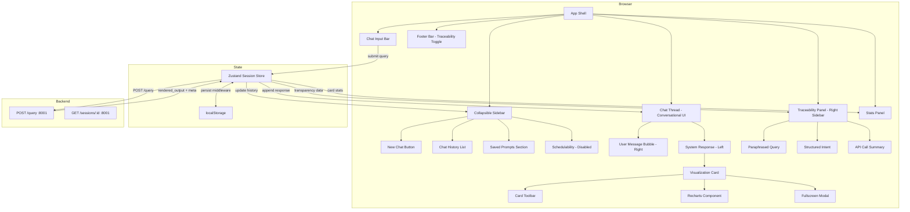

# Design Document

## Overview

This design describes a React + Tailwind CSS single-page application that replaces the existing `frontend/index.html` with a fully featured conversational BI interface. The application features a ChatGPT/Claude-style conversational thread layout, a collapsible sidebar with history and saved prompts, inline visualization cards, a right-side traceability panel toggled via a footer bar, and a refined professional BI aesthetic. It connects to the existing NLP Translator backend (`POST /query` on port 8001).

Key design decisions:
- **React 18 + Vite** — Fast dev server, modern bundling, excellent DX
- **Tailwind CSS** — Utility-first styling with custom design tokens for professional BI look
- **Recharts** — React-native charting with composable components and built-in tooltips
- **react-dnd** — Declarative drag-and-drop with HTML5 backend for card reordering/resizing
- **zustand** — Minimal, performant state management without boilerplate; localStorage middleware for persistence
- **Web Speech API** — Browser-native voice transcription (progressive enhancement)

The application lives in `frontend/` as a standalone Vite project. The backend CORS is already configured to accept `*` origins, so the React dev server can proxy or direct-call the API at `http://localhost:8001`.

## Architecture



### Data Flow

1. User types prompt in Chat Input → dispatches to zustand store
2. Store sends `POST /query` with `{ query_text }` to backend
3. Backend returns `{ rendered_output: { output_type, chart_type, chart_data, text_content, description, metadata } }`
4. Store appends a new system response with Visualization Card to the Chat Thread
5. Chat Thread renders the card using Recharts (chart) or formatted text inline below the user message
6. Stats Panel reads the `metadata.columns` from the active card's data when a card is clicked
7. Footer Bar toggles the Traceability Panel showing query interpretation for the active card
8. Session state is persisted to localStorage on every change

**Error Flow:**
1. If backend returns 422/503/504 or request times out (60s), store appends a ChatMessage with `role: 'error'`, `statusCode`, and `originalQuery`
2. Chat Thread renders error messages as left-aligned system responses with appropriate styling
3. Error messages for 503/504/408 include a retry button that re-invokes `submitQuery` with the original query text

## Components and Interfaces

### Component Tree

```
<App>
├── <Sidebar collapsed={boolean}>
│   ├── <CollapseToggle />
│   ├── <NewChatButton />
│   ├── <ChatHistoryList />
│   │   └── <HistoryItem /> (×50 max)
│   ├── <SavedPromptsList />
│   │   └── <SavedPromptItem /> (×50 max)
│   └── <SchedulabilityPlaceholder /> (disabled)
├── <MainContent>
│   ├── <ChatThread>
│   │   ├── <EmptyState /> (when no messages)
│   │   ├── <UserMessageBubble /> (right-aligned)
│   │   ├── <SystemResponse> (left-aligned)
│   │   │   └── <VisualizationCard />
│   │   │       ├── <CardToolbar />
│   │   │       ├── <ChartRenderer />
│   │   │       │   ├── <BarChart /> | <LineChart /> | <ScatterChart />
│   │   │       │   ├── <PieChart /> | <HeatmapChart />
│   │   │       │   └── <DataTable />
│   │   │       └── <FullscreenModal /> (conditional)
│   │   └── <ErrorMessage /> (left-aligned, per error)
│   │       └── <RetryButton /> (for 503/504/timeout)
│   ├── <FooterBar /> (traceability toggle)
│   └── <ChatInput>
│       ├── <TextInput />
│       ├── <SubmitButton />
│       └── <VoiceInputButton />
├── <TraceabilityPanel visible={boolean}>
│   ├── <QueryRewriteSection />
│   ├── <StructuredIntentSection />
│   ├── <APICallSummarySection />
│   └── <EmptyState /> (no card selected)
└── <StatsPanel collapsed={boolean}>
    ├── <LatencyBadge />
    ├── <ColumnStats /> (per column)
    └── <EmptyState />
```

### Key Interfaces (TypeScript)

```typescript
// Backend response shape (mirrors RenderedOutput pydantic model)
interface RenderedOutput {
  output_type: 'chart' | 'text';
  chart_type?: 'bar' | 'line' | 'scatter' | 'pie' | 'table' | 'heatmap' | null;
  chart_data?: Record<string, unknown> | null;
  text_content?: string | null;
  description: string;
  metadata: MetaPayload;
}

interface MetaPayload {
  query_id: string;
  query_type: string;
  latency_ms?: number;
  row_count?: number;
  columns?: ColumnMeta[];
  timestamp?: string;
  data_sources?: string[];
  entity_refs?: string[];
  routing_metadata?: Record<string, unknown>;
}

interface ColumnMeta {
  name: string;
  type: 'numeric' | 'categorical' | 'time-series';
  row_count?: number;
  null_percentage?: number;
  // Numeric stats
  min?: number;
  max?: number;
  mean?: number;
  median?: number;
  std_dev?: number;
  // Categorical stats
  cardinality?: number;
  // Time-series stats
  time_range_start?: string;
  time_range_end?: string;
}

// Transparency data for the Traceability Panel
interface TransparencyData {
  queryRewrite: string | null;        // Natural language paraphrase
  structuredIntent: {                 // JSON intent breakdown
    query_id: string;
    query_type: string;
    entity_refs: string[];
    routing_metadata: Record<string, unknown>;
    timestamp: string;
  } | null;
  apiCallSummary: {                   // Agent dispatch summary
    agents: Array<{
      id: string;
      dataSources: string[];
      status: 'success' | 'error' | 'timeout';
    }>;
  } | null;
}

// Chat message in the thread
interface ChatMessage {
  id: string;
  role: 'user' | 'system' | 'error';
  content: string;
  cardId?: string;
  timestamp: number;
  statusCode?: number;
  originalQuery?: string;
}

// Visualization card state (inline in chat thread)
interface CardState {
  id: string;
  query: string;
  userRequestedChartType?: 'bar' | 'line' | 'scatter' | 'pie' | 'table' | 'heatmap' | null;
  renderedOutput: RenderedOutput;
  transparencyData: TransparencyData;
  pinned: boolean;
  width: '50%' | '100%';  // Card width within chat thread
  createdAt: number;
}

// Session store shape
interface SessionState {
  // Chat thread
  chatThread: ChatMessage[];
  cards: Map<string, CardState>;  // cardId → CardState
  activeCardId: string | null;
  
  // Sidebar
  chatHistory: ThreadSummary[];
  savedPrompts: SavedPrompt[];
  sidebarCollapsed: boolean;
  
  // Panels
  traceabilityPanelVisible: boolean;
  statsPanelCollapsed: boolean;
  loading: boolean;
  
  // Actions
  submitQuery: (queryText: string) => Promise<void>;
  setActiveCard: (id: string | null) => void;
  pinCard: (id: string) => void;
  unpinCard: (id: string) => void;
  resizeCard: (id: string, width: '50%' | '100%') => void;
  reorderCard: (id: string, newIndex: number) => void;
  toggleSidebar: () => void;
  toggleTraceabilityPanel: () => void;
  toggleStatsPanel: () => void;
  saveSavedPrompt: (name: string) => void;
  loadSavedPrompt: (id: string) => void;
  deleteSavedPrompt: (id: string) => void;
  startNewChat: () => void;
}

interface SavedPrompt {
  id: string;
  name: string;
  savedAt: number;
  chatThread: ChatMessage[];
  cards: CardState[];
}

interface ThreadSummary {
  id: string;
  firstMessage: string;
  lastActivity: number;
  messageCount: number;
}
```

### Chart Selection Logic

```typescript
// Known chart type keywords for user prompt parsing
const CHART_TYPE_KEYWORDS: Record<string, ChartType> = {
  'bar chart': 'bar',
  'bar graph': 'bar',
  'line chart': 'line',
  'line graph': 'line',
  'scatter plot': 'scatter',
  'scatter chart': 'scatter',
  'pie chart': 'pie',
  'pie graph': 'pie',
  'heatmap': 'heatmap',
  'heat map': 'heatmap',
  'table': 'table',
};

function parseUserRequestedChartType(queryText: string): ChartType | null {
  const lower = queryText.toLowerCase();
  for (const [keyword, chartType] of Object.entries(CHART_TYPE_KEYWORDS)) {
    if (lower.includes(keyword)) return chartType;
  }
  return null;
}

function selectChartType(
  renderedOutput: RenderedOutput, 
  userRequestedType?: ChartType | null
): ChartType {
  // 1. User explicitly requested a chart type in their prompt — highest priority
  if (userRequestedType) return userRequestedType;
  
  // 2. Backend specified chart type
  if (renderedOutput.chart_type) return renderedOutput.chart_type;
  
  // 3. Text-only response
  if (renderedOutput.output_type === 'text') return 'text';
  
  // 4. Infer from data shape
  const columns = renderedOutput.metadata?.columns ?? [];
  const hasTime = columns.some(c => c.type === 'time-series');
  const numericCols = columns.filter(c => c.type === 'numeric');
  const categoricalCols = columns.filter(c => c.type === 'categorical');
  
  if (hasTime && numericCols.length >= 1) return 'line';
  if (categoricalCols.length >= 1 && numericCols.length >= 1) return 'bar';
  if (numericCols.length === 2 && categoricalCols.length === 0) return 'scatter';
  if (categoricalCols.length >= 1 && numericCols.length === 1 
      && (categoricalCols[0]?.cardinality ?? 9) <= 8) return 'pie';
  if (numericCols.length >= 3) return 'heatmap';
  
  return 'table'; // fallback
}
```

### Design System Tokens

```typescript
// Tailwind config extension for professional BI design system
const designTokens = {
  colors: {
    // Background layers
    'bg-primary': '#f8f9fa',       // Main background - light warm gray
    'bg-secondary': '#ffffff',     // Card/panel backgrounds
    'bg-sidebar': '#1e293b',       // Sidebar dark background (slate-800)
    'bg-input': '#f1f5f9',         // Input field background (slate-100)
    
    // Text hierarchy
    'text-primary': '#1e293b',     // Headings, primary content (slate-800)
    'text-secondary': '#475569',   // Body text, descriptions (slate-600)
    'text-muted': '#94a3b8',       // Placeholder, disabled (slate-400)
    'text-inverse': '#f8fafc',     // Text on dark backgrounds
    
    // Accent colors (muted, professional)
    'accent-primary': '#3b82f6',   // Primary actions, links (blue-500)
    'accent-hover': '#2563eb',     // Hover state (blue-600)
    'accent-subtle': '#eff6ff',    // Subtle highlight backgrounds (blue-50)
    'accent-teal': '#0d9488',      // Secondary accent for data (teal-600)
    
    // Borders and shadows
    'border-default': '#e2e8f0',   // Default borders (slate-200)
    'border-subtle': '#f1f5f9',    // Subtle separator (slate-100)
    
    // Status colors (muted versions)
    'status-error': '#dc2626',     // Error states (red-600)
    'status-success': '#059669',   // Success states (emerald-600)
    'status-warning': '#d97706',   // Warning states (amber-600)
    
    // Chat-specific
    'bubble-user': '#3b82f6',      // User message bubble (blue-500)
    'bubble-system': '#ffffff',    // System response background
  },
  boxShadow: {
    'card': '0 1px 3px rgba(0, 0, 0, 0.04), 0 1px 2px rgba(0, 0, 0, 0.06)',
    'card-hover': '0 4px 6px rgba(0, 0, 0, 0.04), 0 2px 4px rgba(0, 0, 0, 0.06)',
    'panel': '0 2px 8px rgba(0, 0, 0, 0.06)',
    'sidebar': '2px 0 8px rgba(0, 0, 0, 0.04)',
  },
  fontFamily: {
    'sans': ['Inter', 'system-ui', '-apple-system', 'sans-serif'],
    'mono': ['JetBrains Mono', 'Fira Code', 'monospace'],
  },
  fontSize: {
    'xs': '0.75rem',     // 12px - badges, timestamps
    'sm': '0.8125rem',   // 13px - secondary text
    'base': '0.875rem',  // 14px - body text (BI tools use smaller base)
    'lg': '1rem',        // 16px - section headers
    'xl': '1.25rem',     // 20px - page titles
  },
};
```

### API Integration Layer

```typescript
const API_BASE = 'http://localhost:8001';
const TIMEOUT_MS = 60_000;

async function queryBackend(queryText: string): Promise<QueryResult> {
  const controller = new AbortController();
  const timeoutId = setTimeout(() => controller.abort(), TIMEOUT_MS);
  const startTime = performance.now();
  
  try {
    const response = await fetch(`${API_BASE}/query`, {
      method: 'POST',
      headers: { 'Content-Type': 'application/json' },
      body: JSON.stringify({ query_text: queryText }),
      signal: controller.signal,
    });
    
    const elapsed = Math.round(performance.now() - startTime);
    const data = await response.json();
    
    if (!response.ok) {
      return { 
        ok: false, 
        status: response.status, 
        error: data,
        latencyMs: elapsed 
      };
    }
    
    return { 
      ok: true, 
      data: data.rendered_output,
      latencyMs: data.rendered_output?.metadata?.latency_ms ?? elapsed 
    };
  } catch (err) {
    if (err.name === 'AbortError') {
      return { ok: false, status: 408, error: { error_message: 'Request timed out after 60s' } };
    }
    throw err;
  } finally {
    clearTimeout(timeoutId);
  }
}
```

## Data Models

### Zustand Store Schema (persisted to localStorage)

```typescript
// Root persisted state
{
  version: 2,                    // Schema version for migrations (bumped for new layout)
  currentSession: {
    id: string,                  // UUID
    chatThread: ChatMessage[],
    cards: Record<string, CardState>,
    activeCardId: string | null,
    sidebarCollapsed: boolean,
    traceabilityPanelVisible: boolean,
    statsPanelCollapsed: boolean,
  },
  chatHistory: ThreadSummary[],  // Max 50, most recent first
  savedPrompts: SavedPrompt[],   // Max 50, most recent first (formerly bookmarks)
}
```

### Chat Thread Layout Model

The chat thread uses a vertical scrolling layout:

```
┌──────────────────────────────────────────┐
│  [User message bubble - right aligned]    │
├──────────────────────────────────────────┤
│  [System response - left aligned]         │
│  ┌──────────────────────────────────┐     │
│  │  Visualization Card (50% | 100%) │     │
│  │  ┌─────────────────────────────┐ │     │
│  │  │ Card Toolbar                │ │     │
│  │  ├─────────────────────────────┤ │     │
│  │  │ Chart/Table Content         │ │     │
│  │  └─────────────────────────────┘ │     │
│  └──────────────────────────────────┘     │
├──────────────────────────────────────────┤
│  [User message bubble - right aligned]    │
├──────────────────────────────────────────┤
│  [System response - left aligned]         │
│  ┌──────────────────────────────────┐     │
│  │  Visualization Card              │     │
│  └──────────────────────────────────┘     │
└──────────────────────────────────────────┘
```

Cards can be resized to 50% or 100% width within the chat thread. Pinned cards persist across new queries.

### Card Placement

New responses are appended chronologically to the chat thread (no grid positioning needed). The chat thread scrolls to the newest message automatically.

### localStorage Keys

| Key | Content | Max Size (est.) |
|-----|---------|-----------------|
| `cbi-session` | Current session state | ~2 MB |
| `cbi-saved-prompts` | Saved prompts array (formerly bookmarks) | ~5 MB |

### Backend Response Contract

Request: `POST /query`
```json
{ "query_text": "show me a scatter plot of revenue vs headcount" }
```

Success Response (HTTP 200):
```json
{
  "rendered_output": {
    "output_type": "chart",
    "chart_type": "bar",
    "chart_data": { "labels": [...], "datasets": [...] },
    "text_content": null,
    "description": "Revenue breakdown by region for Q4 2024",
    "metadata": {
      "query_id": "uuid-string",
      "query_type": "aggregation",
      "latency_ms": 2340,
      "row_count": 8,
      "columns": [
        { "name": "region", "type": "categorical", "cardinality": 8, "null_percentage": 0 },
        { "name": "revenue", "type": "numeric", "min": 12000, "max": 98000, "mean": 45000, "median": 42000, "std_dev": 18000, "null_percentage": 0 }
      ],
      "timestamp": "2025-01-15T10:30:00Z",
      "data_sources": ["financial_data"],
      "entity_refs": ["revenue", "region"],
      "routing_metadata": { "agent": "sql-gen", "confidence": 0.92 }
    }
  }
}
```

Error Response (HTTP 422):
```json
{
  "error_code": "UNPARSEABLE_QUERY",
  "error_message": "Could not interpret your question. Try rephrasing.",
  "query_id": "uuid-string"
}
```


## Correctness Properties

*A property is a characteristic or behavior that should hold true across all valid executions of a system — essentially, a formal statement about what the system should do. Properties serve as the bridge between human-readable specifications and machine-verifiable correctness guarantees.*

### Property 1: Whitespace-only queries are never submitted

*For any* string composed entirely of whitespace characters (spaces, tabs, newlines, Unicode whitespace), calling the submit action SHALL be prevented and no network request SHALL be dispatched.

**Validates: Requirements 2.3**

### Property 2: Chart type selection respects user override

*For any* valid `RenderedOutput` object and any user prompt containing an explicit chart type keyword, the `selectChartType` function SHALL return the user-requested chart type regardless of the `chart_type` field in the response or the data shape inference rules.

**Validates: Requirements 4.1**

### Property 3: Chart type selection correctness (no user override)

*For any* valid `RenderedOutput` object where no user chart type override is specified, the `selectChartType` function SHALL return the chart type specified in `chart_type` when present, or SHALL return the correct inferred type based on the column composition rules (time-series → line, categorical + numeric → bar, 2 numeric only → scatter, categorical ≤8 + 1 numeric → pie, 3+ numeric → heatmap, else → table) when `chart_type` is absent.

**Validates: Requirements 4.2, 4.3**

### Property 4: CSV export structural correctness

*For any* 2D data array with string column headers and cell values (including special characters, commas, quotes, newlines), the generated CSV string SHALL have column headers as the first row, the correct number of data rows, and properly escaped fields per RFC 4180.

**Validates: Requirements 5.3**

### Property 5: Pinned cards survive new query additions

*For any* chat thread state containing at least one pinned card and any sequence of new query result additions, all pinned cards SHALL remain present in the chat thread with their original data unchanged after the additions complete.

**Validates: Requirements 5.5**

### Property 6: Drop rejected on pinned card positions

*For any* chat thread state containing pinned cards and any drag-drop operation targeting a pinned card's position, the drop SHALL be rejected and the dragged card SHALL remain at its original position.

**Validates: Requirements 6.7**

### Property 7: Resize constrained to available width

*For any* card with current width setting and any resize attempt, the resulting width SHALL be either '50%' or '100%' of the chat thread width and SHALL not exceed the available container width.

**Validates: Requirements 6.6**

### Property 8: Column statistics rendered by type

*For any* `ColumnMeta` array, the Stats Panel SHALL render row_count and null_percentage for every column, AND min/max/mean/median/std_dev for columns of type "numeric", AND cardinality for columns of type "categorical", AND time_range_start/time_range_end for columns of type "time-series".

**Validates: Requirements 7.2, 7.3, 7.4, 7.5**

### Property 9: Latency badge formatting

*For any* non-negative integer N, the latency badge formatter SHALL produce the string `↯ {N}ms` where N is the unmodified integer value.

**Validates: Requirements 7.6**

### Property 10: Saved prompt serialization round-trip

*For any* valid session state (chat thread, card configurations with pin states and data arrays), serializing the state into a Saved_Prompt and then restoring from that Saved_Prompt SHALL produce a session state equivalent to the original.

**Validates: Requirements 8.1**

### Property 11: Timestamp display formatting

*For any* timestamp value, if the elapsed time since that timestamp is less than 24 hours, the formatter SHALL produce a relative time string (e.g., "2 hours ago"), and if the elapsed time is 24 hours or more, the formatter SHALL produce a string in "YYYY-MM-DD HH:mm" format.

**Validates: Requirements 8.2**

### Property 12: User chart type keyword parsing

*For any* query string containing a recognized chart type keyword (bar chart, line chart, scatter plot, pie chart, heatmap, table), the `parseUserRequestedChartType` function SHALL return the corresponding chart type enum value. For query strings containing no recognized keywords, it SHALL return null.

**Validates: Requirements 4.1**

### Property 13: Chat thread chronological ordering

*For any* sequence of submitted queries, the chat thread SHALL maintain messages in strict chronological order (by timestamp) with each user message immediately followed by its corresponding system response.

**Validates: Requirements 10.3**

## Error Handling

### Network Errors

| Scenario | User-Facing Behavior |
|----------|---------------------|
| HTTP 422 from backend | Left-aligned error message in Chat Thread with `error_message` from response; user prompt preserved in Chat Input |
| HTTP 503/504 from backend | Left-aligned service unavailability message in Chat Thread with retry button |
| Request timeout (60s) | Abort request, show timeout message in Chat Thread with retry button |
| Network failure (no connection) | "Cannot connect to server" error message in Chat Thread with retry button |
| Fetch exception | Generic error message in Chat Thread with error details |

### Export Errors

| Scenario | User-Facing Behavior |
|----------|---------------------|
| PNG export fails (canvas unavailable) | Inline error toast on the card: "Export failed" |
| CSV export fails | Inline error toast on the card: "Export failed" |

### Storage Errors

| Scenario | User-Facing Behavior |
|----------|---------------------|
| localStorage quota exceeded on save | Error message suggesting deletion of older saved prompts; in-memory state preserved |
| localStorage quota exceeded on session persist | Non-blocking warning banner; in-memory state preserved |
| localStorage unavailable (private browsing) | Warning on load; app functions normally without persistence |

### State Errors

| Scenario | User-Facing Behavior |
|----------|---------------------|
| Corrupted localStorage data on load | Log warning, start with fresh state |
| Invalid chart_data from backend | Render error state in card: "Chart could not be rendered" |

### Traceability Panel Errors

| Scenario | User-Facing Behavior |
|----------|---------------------|
| Transparency data unavailable | Section shows placeholder: "Data could not be retrieved" |
| No card selected with panel open | Empty state: "Select a visualization to view traceability" |

### Retry Strategy

- Retry buttons re-send the identical `POST /query` request with same payload
- No automatic retry (user-initiated only)
- Retry button appears on 503, 504, and timeout errors
- Maximum prompt length enforced client-side (500 chars in input, 2000 chars in API contract)

## Testing Strategy

### Unit Tests (Vitest + React Testing Library)

Unit tests cover specific examples, edge cases, and component rendering:

- **Component rendering**: Each component renders without errors with valid props
- **Chat thread layout**: User messages right-aligned, system responses left-aligned, proper ordering
- **Sidebar**: Collapse/expand toggle, history list, saved prompts section, schedulability disabled state
- **Chat Input**: Input validation, submit disabling, voice icon visibility
- **Traceability Panel**: Toggle via footer bar, content update on card selection, empty state
- **Card Toolbar**: All buttons present, fullscreen modal open/close, Save Prompt action
- **Error messages**: Correct display for 422, 503, 504, timeout scenarios in chat thread
- **Empty states**: Chat thread empty message, Stats Panel no-card message, Traceability no-card message
- **Design System**: Tokens applied correctly, no glossy/saturated styles
- **Chart type override**: User-specified chart types honored over data shape inference

### Property-Based Tests (fast-check)

Property-based tests verify universal correctness properties using the `fast-check` library with minimum 100 iterations per property:

| Property | Module Under Test | Generator Strategy |
|----------|------------------|--------------------|
| Property 1: Whitespace rejection | `submitQuery` / `ChatInput` | `fc.string` filtered to whitespace-only |
| Property 2: Chart selection (user override) | `selectChartType` | Random `RenderedOutput` + random chart type keyword |
| Property 3: Chart selection (no override) | `selectChartType` | Random `RenderedOutput` with varying column compositions |
| Property 4: CSV export | `exportCSV` | Random 2D arrays with special characters |
| Property 5: Pinned card preservation | `SessionStore.submitQuery` | Random chat states + add sequences |
| Property 6: Drop rejection on pinned | `ChatThread.handleDrop` | Random threads with pinned cards + drop targets |
| Property 7: Resize constraint | `constrainResize` | Random widths + resize actions |
| Property 8: Column stats rendering | `StatsPanel` | Random `ColumnMeta[]` with mixed types |
| Property 9: Latency badge | `formatLatency` | `fc.nat()` |
| Property 10: Saved prompt round-trip | `serialize`/`deserialize` | Random `SessionState` |
| Property 11: Timestamp formatting | `formatTimestamp` | `fc.date()` with varying offsets |
| Property 12: Chart type keyword parsing | `parseUserRequestedChartType` | Random strings with/without chart keywords |
| Property 13: Chronological ordering | `SessionStore` | Random query submission sequences |

**Configuration:**
- Library: `fast-check` (npm package)
- Minimum iterations: 100 per property
- Tag format: `Feature: conversational-bi-frontend, Property {N}: {title}`
- Each correctness property maps to exactly one property-based test

### Integration Tests

- **API integration**: Mock Service Worker (msw) to simulate backend responses
- **Drag-and-drop**: react-dnd test utilities for drag/drop operations
- **localStorage**: Mock storage for persistence tests
- **Web Speech API**: Mock SpeechRecognition for voice input
- **Traceability Panel**: Toggle behavior with active card changes

### Test Tooling

| Tool | Purpose |
|------|---------|
| Vitest | Test runner (Vite-native, fast) |
| React Testing Library | Component testing |
| fast-check | Property-based testing |
| msw | API mocking |
| @testing-library/user-event | User interaction simulation |
