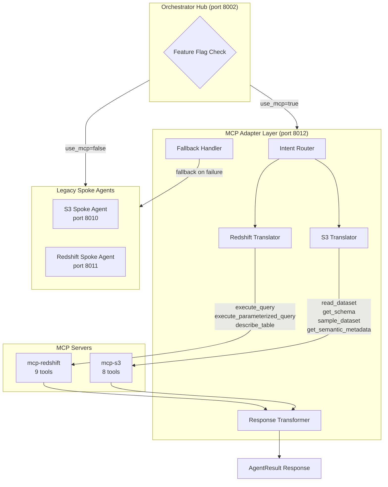
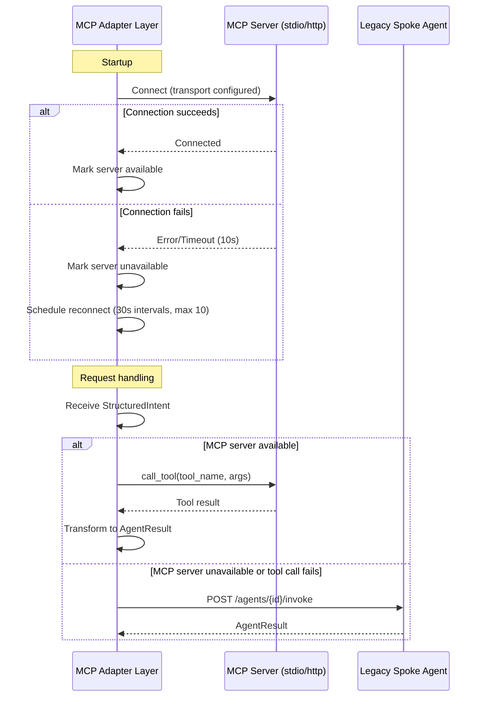
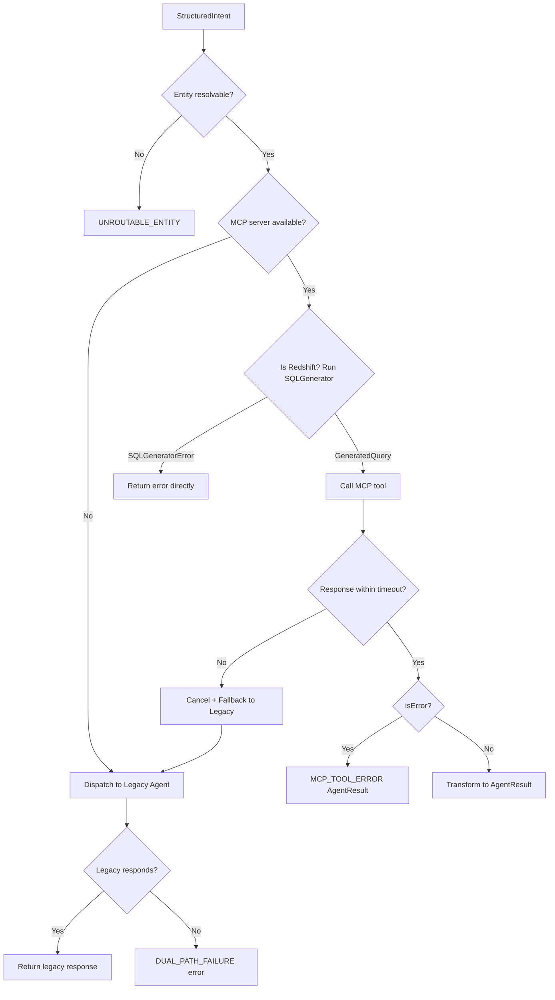

# Design Document: MCP Data Access Integration

## Overview

This design introduces an **MCP Adapter Layer** that acts as a bridge between the existing Orchestrator Hub and the production-ready MCP servers (`mcp-redshift` and `mcp-s3`). The adapter registers itself as a spoke agent using the same `AgentRegistration` interface, receives `StructuredIntent` payloads, translates them into MCP tool calls, and transforms MCP responses back into `AgentResult` format — preserving full compatibility with the downstream Guardrail Layer and Visualization Renderer.

The migration is controlled by feature flags (`use_mcp_adapter`, `use_mcp_redshift`, `use_mcp_s3`) so both legacy and MCP paths coexist. The adapter reuses the existing `SQLGenerator.generate()` for Redshift queries and delegates all data I/O to the MCP servers — no new S3 clients, Redshift connectors, or dataset readers are created.

### Key Design Decisions

1. **Single FastAPI service**: The MCP Adapter Layer runs as one FastAPI process (similar to existing spoke agents) with a single `/agents/{agent_id}/invoke` endpoint per logical adapter.
2. **Two logical agent registrations**: `mcp-redshift-adapter` and `mcp-s3-adapter` register separately so the Orchestrator can route by entity_refs exactly as it does today.
3. **MCP client via `mcp` SDK**: Uses the official Python MCP SDK (`mcp` package) which supports both stdio and streamable-http transports via `StdioClientTransport` and `StreamableHTTPClientTransport`.
4. **Fallback at the adapter level**: When an MCP server is unavailable, the adapter dispatches to the legacy spoke agent via HTTP — the orchestrator is unaware of this internal fallback.
5. **Feature flags read per-request**: Flags are checked at request time from environment variables, allowing hot-toggling without restart.

## Architecture



### Connection Lifecycle



## Components and Interfaces

### 1. MCPClientManager

Manages connections to MCP servers, handles lifecycle (connect, reconnect, shutdown), and exposes a `call_tool()` method.

```python
class MCPClientManager:
    """Manages MCP server connections with reconnection logic."""

    def __init__(self, server_config: MCPServerConfig):
        self.config: MCPServerConfig
        self.session: ClientSession | None
        self.available: bool
        self._reconnect_task: asyncio.Task | None
        self._reconnect_attempts: int

    async def connect(self) -> bool:
        """Establish connection within 10s timeout. Returns success."""

    async def call_tool(self, tool_name: str, arguments: dict) -> MCPToolResult:
        """Invoke a tool on the connected MCP server.
        Raises MCPUnavailableError if not connected.
        Raises MCPTimeoutError if response exceeds per-server timeout."""

    async def disconnect(self) -> None:
        """Graceful disconnect within 5s, cancelling in-flight calls."""

    async def _reconnect_loop(self) -> None:
        """Reconnect at 30s intervals, up to 10 attempts."""
```

### 2. IntentRouter

Resolves entity_refs via the OntologyStore to determine which MCP server(s) to target.

```python
class IntentRouter:
    """Routes StructuredIntent to appropriate MCP server based on entity_refs."""

    def __init__(self, ontology_store: OntologyStore):
        self.ontology_store: OntologyStore

    def resolve_targets(self, intent: StructuredIntent) -> list[RoutingTarget]:
        """Resolve entity_refs to RoutingTarget(s) with server_id and dataset info.
        Returns UNROUTABLE_ENTITY error if no entity resolves."""
```

### 3. RedshiftTranslator

Translates StructuredIntent to MCP Redshift tool calls, reusing the existing SQLGenerator.

```python
class RedshiftTranslator:
    """Translates StructuredIntent to mcp-redshift tool calls."""

    def __init__(self, sql_generator: SQLGenerator, client: MCPClientManager):
        self.sql_generator: SQLGenerator
        self.client: MCPClientManager
        self._schema_cache: dict[str, list[dict]]  # table -> columns

    async def execute(self, intent: StructuredIntent) -> AgentResult:
        """Generate SQL via SQLGenerator, call execute_query/execute_parameterized_query.
        Fetches table schema via describe_table if not cached."""
```

### 4. S3Translator

Translates StructuredIntent to MCP S3 tool calls with pagination, aggregation, and comparison logic.

```python
class S3Translator:
    """Translates StructuredIntent to mcp-s3 tool calls."""

    def __init__(self, client: MCPClientManager):
        self.client: MCPClientManager
        self._schema_cache: dict[str, list[dict]]  # dataset -> columns

    async def execute(self, intent: StructuredIntent) -> AgentResult:
        """Call read_dataset with pagination. Compute aggregation/comparison locally.
        Uses get_schema or sample_dataset for column type inference.
        Uses get_semantic_metadata for dimension/measure selection when available."""
```

### 5. ResponseTransformer

Converts raw MCP tool responses into AgentResult format.

```python
class ResponseTransformer:
    """Transforms MCP tool responses to AgentResult format."""

    @staticmethod
    def from_redshift_query(
        mcp_result: MCPToolResult, intent: StructuredIntent
    ) -> AgentResult:
        """Transform execute_query/execute_parameterized_query result."""

    @staticmethod
    def from_s3_read(
        rows: list[list], columns: list[str], intent: StructuredIntent
    ) -> AgentResult:
        """Transform read_dataset accumulated rows into AgentResult."""

    @staticmethod
    def error_result(
        server_id: str, tool_name: str, error_description: str
    ) -> AgentResult:
        """Produce error AgentResult from MCP failure."""
```

### 6. FallbackHandler

Dispatches to legacy spoke agents when MCP servers are unavailable.

```python
class FallbackHandler:
    """Handles fallback dispatch to legacy spoke agents."""

    def __init__(self, legacy_endpoints: dict[str, str]):
        self.endpoints: dict[str, str]  # server_id -> legacy agent URL

    async def dispatch(
        self, intent: StructuredIntent, server_id: str, correlation_id: str
    ) -> AgentResult:
        """POST to legacy spoke agent. Raises if both MCP and legacy fail."""
```

### 7. MCPAdapterService (FastAPI Application)

The main FastAPI application exposing the spoke agent interface.

```python
# Port 8012
app = FastAPI(title="MCP Adapter Layer")

@app.post("/agents/mcp-redshift-adapter/invoke")
async def invoke_redshift(request: Request, body: InvokeRequest) -> JSONResponse:
    """Handle Redshift-targeted intents via MCP."""

@app.post("/agents/mcp-s3-adapter/invoke")
async def invoke_s3(request: Request, body: InvokeRequest) -> JSONResponse:
    """Handle S3-targeted intents via MCP."""

@app.get("/health")
async def health() -> dict:
    """Health check with MCP server availability status."""
```

### 8. FeatureFlagRouter (Orchestrator Enhancement)

Added to the Orchestrator Hub to conditionally route to MCP or legacy.

```python
class FeatureFlagRouter:
    """Reads feature flags and decides routing target per request."""

    def should_use_mcp(self, data_source: str) -> bool:
        """Check per-datasource flag first, then global flag.
        Per-datasource flags: USE_MCP_REDSHIFT, USE_MCP_S3
        Global flag: USE_MCP_ADAPTER
        Returns False by default (legacy path)."""
```

## Data Models

### Configuration Models

```python
class MCPServerConfig(BaseModel):
    """Configuration for a single MCP server connection."""
    server_id: str                    # "redshift" or "s3"
    transport: Literal["stdio", "streamable-http"]  # Default: "stdio"
    host: str | None = None           # For streamable-http
    port: int | None = None           # For streamable-http (1024-65535)
    command: str | None = None        # For stdio (executable path)
    timeout: int = 30                 # Per-tool-call timeout (1-300s)
    connection_timeout: int = 10      # Initial connection timeout

class MCPAdapterConfig(BaseModel):
    """Full adapter configuration loaded from environment."""
    redshift: MCPServerConfig
    s3: MCPServerConfig
    max_reconnect_attempts: int = 10
    reconnect_interval: int = 30      # seconds
    max_row_limit: int = 10000        # Max rows to paginate from S3
    shutdown_timeout: int = 5         # seconds for graceful shutdown
```

### Routing Models

```python
class RoutingTarget(BaseModel):
    """Resolved routing target for an intent."""
    server_id: Literal["redshift", "s3"]
    dataset_name: str | None = None   # For S3 (e.g., "financial_data")
    table_name: str | None = None     # For Redshift (resolved from SchemaRegistry)
    entity_refs: list[str]            # The entity_refs targeting this server

class MCPToolResult(BaseModel):
    """Normalized result from an MCP tool call."""
    success: bool
    content: dict | None = None       # Parsed JSON content from tool response
    error_message: str | None = None  # Error text if isError=true
    tool_name: str
    server_id: str
    duration_ms: float
```

### Entity-to-Dataset Mapping

The adapter resolves entity_refs to MCP targets via the OntologyStore `data_source` property:

| Entity Ref | data_source property | MCP Server | Dataset/Table |
|---|---|---|---|
| `ontology:sales_revenue` | `s3` / `financial_data.json` | mcp-s3 | `financial_data` |
| `ontology:quarterly_report` | `s3` / `financial_data.json` | mcp-s3 | `financial_data` |
| `ontology:order_volume` | `s3` / `financial_data.json` | mcp-s3 | `financial_data` |
| `ontology:return_rate` | `s3` / `financial_data.json` | mcp-s3 | `financial_data` |
| `ontology:region` | `s3` / `financial_data.json` | mcp-s3 | `financial_data` |
| `ontology:product_catalog` | `s3` / `product_catalog.csv` | mcp-s3 | `product_catalog` |
| `ontology:inventory_stock` | `s3` / `product_catalog.csv` | mcp-s3 | `product_catalog` |
| `ontology:product_pricing` | `s3` / `product_catalog.csv` | mcp-s3 | `product_catalog` |
| `ontology:supplier_info` | `s3` / `product_catalog.csv` | mcp-s3 | `product_catalog` |
| `ontology:product_category` | `s3` / `product_catalog.csv` | mcp-s3 | `product_catalog` |
| `ontology:workforce_metrics` | `redshift` | mcp-redshift | (SchemaRegistry) |
| `ontology:support_tickets` | `redshift` | mcp-redshift | (SchemaRegistry) |
| `ontology:marketing_campaigns` | `redshift` | mcp-redshift | (SchemaRegistry) |

### Environment Variable Schema

| Variable | Required For | Default | Description |
|---|---|---|---|
| `MCP_ADAPTER_REDSHIFT_TRANSPORT` | Always | `stdio` | Transport mode |
| `MCP_ADAPTER_REDSHIFT_HOST` | streamable-http | — | Server host |
| `MCP_ADAPTER_REDSHIFT_PORT` | streamable-http | — | Server port (1024-65535) |
| `MCP_ADAPTER_REDSHIFT_COMMAND` | stdio | — | Server executable path |
| `MCP_ADAPTER_REDSHIFT_TIMEOUT` | Optional | `30` | Tool call timeout (1-300s) |
| `MCP_ADAPTER_S3_TRANSPORT` | Always | `stdio` | Transport mode |
| `MCP_ADAPTER_S3_HOST` | streamable-http | — | Server host |
| `MCP_ADAPTER_S3_PORT` | streamable-http | — | Server port (1024-65535) |
| `MCP_ADAPTER_S3_COMMAND` | stdio | — | Server executable path |
| `MCP_ADAPTER_S3_TIMEOUT` | Optional | `30` | Tool call timeout (1-300s) |
| `USE_MCP_ADAPTER` | Optional | `false` | Global MCP routing flag |
| `USE_MCP_REDSHIFT` | Optional | — | Per-datasource Redshift flag |
| `USE_MCP_S3` | Optional | — | Per-datasource S3 flag |


## Correctness Properties

*A property is a characteristic or behavior that should hold true across all valid executions of a system — essentially, a formal statement about what the system should do. Properties serve as the bridge between human-readable specifications and machine-verifiable correctness guarantees.*

### Property 1: Entity-ref routing resolves to correct MCP server and dataset

*For any* valid StructuredIntent with entity_refs that exist in the OntologyStore, the IntentRouter SHALL resolve each entity_ref to the correct MCP server (redshift or s3) and dataset name by reading the `data_source` property of the matched ontology concept — financial entities route to mcp-s3 with dataset "financial_data", product entities route to mcp-s3 with dataset "product_catalog", and Redshift entities route to mcp-redshift.

**Validates: Requirements 2.4, 2.5, 2.10, 6.1, 6.2**

### Property 2: SQL generation reuse — adapter passes SQLGenerator output to MCP execute tool

*For any* valid StructuredIntent with entity_refs that resolve to a Redshift table in the SchemaRegistry, the MCP Adapter Layer SHALL invoke `SQLGenerator.generate()` with that intent, and when a `GeneratedQuery` is produced, SHALL invoke the MCP Redshift `execute_parameterized_query` tool with the exact SQL string and parameters list from the GeneratedQuery — never creating its own SQL.

**Validates: Requirements 2.1, 2.2, 2.3, 5.1, 5.2**

### Property 3: SQLGeneratorError short-circuits without MCP invocation

*For any* StructuredIntent where `SQLGenerator.generate()` returns a `SQLGeneratorError`, the MCP Adapter Layer SHALL return an AgentResult with status "error", error_type matching the SQLGeneratorError's error_type, and error_description from the SQLGeneratorError's description, without making any call to the MCP Redshift server.

**Validates: Requirements 5.6**

### Property 4: MCP response to AgentResult transformation preserves data

*For any* successful MCP tool response (from either mcp-redshift or mcp-s3), the ResponseTransformer SHALL produce an AgentResult where: status is "success"; agent_id is "mcp-redshift-adapter" for Redshift responses or "mcp-s3-adapter" for S3 responses; data_source is "mcp-redshift" or "mcp-s3" respectively; payload.data_type maps to "tabular" for lookup, "aggregation" for aggregation, or "comparison" for comparison based on the original query_type; row_count equals pagination.total_count for Redshift or len(rows) for S3; and all columns and row data from the MCP response are preserved in the payload.

**Validates: Requirements 3.1, 3.2, 3.3, 3.5, 3.6, 3.8**

### Property 5: MCP error responses produce correctly-structured error AgentResults

*For any* MCP tool response where the error flag is set (isError=true) or the tool call fails with a timeout/connection error, the MCP Adapter Layer SHALL produce an AgentResult with status "error", error_type "MCP_TOOL_ERROR", and error_description containing the MCP server identifier, tool name, and the error text from the MCP response.

**Validates: Requirements 2.9, 3.4**

### Property 6: Feature flag routing decision follows precedence rules

*For any* StructuredIntent and any combination of feature flag values (USE_MCP_ADAPTER, USE_MCP_REDSHIFT, USE_MCP_S3), the routing decision SHALL follow: (1) if a per-datasource flag is set for the intent's resolved data source, use that flag's value; (2) otherwise use the global USE_MCP_ADAPTER value; (3) if no flags are set, route to legacy (default false). When the effective flag is true, route to MCP Adapter; when false, route to legacy spoke agent.

**Validates: Requirements 4.2, 4.3, 4.5, 4.6**

### Property 7: Unavailable MCP server routes all requests to legacy spoke agent

*For any* StructuredIntent arriving while the target MCP server is marked unavailable, the MCP Adapter Layer SHALL dispatch the intent to the corresponding legacy spoke agent and return the legacy agent's response, without attempting any MCP tool call.

**Validates: Requirements 1.4, 7.1, 7.2**

### Property 8: S3 pagination retrieves all rows up to max_row_limit

*For any* dataset where the total row count exceeds the per-page limit, the S3Translator SHALL issue successive `read_dataset` calls with incremented offset until either `has_more` is false or the accumulated row count reaches max_row_limit (10000), and the final result SHALL contain all accumulated rows.

**Validates: Requirements 6.3**

### Property 9: S3 aggregation computes correct numeric summaries

*For any* set of rows with numeric columns returned from the MCP S3 server when query_type is "aggregation", the S3Translator SHALL compute sum, avg, min, max, and count for each numeric column, and the computed values SHALL equal the mathematically correct aggregations of the input data.

**Validates: Requirements 6.4**

### Property 10: S3 comparison groups by correct column and computes per-group aggregates

*For any* set of rows returned from the MCP S3 server when query_type is "comparison", the S3Translator SHALL group rows by "category" if that column exists, otherwise by the first string-typed column excluding identifier columns (product_id, name, id), and SHALL compute sum and avg for each numeric column within each group — with the results matching the mathematically correct per-group values.

**Validates: Requirements 6.5**

### Property 11: Cancelled requests produce QUERY_CANCELLED without further MCP calls

*For any* request where the cancellation registry indicates the correlation_id has been cancelled, the MCP Adapter Layer SHALL immediately return an AgentResult with status "error" and error_type "QUERY_CANCELLED", and SHALL NOT invoke any further MCP tool calls after detecting the cancellation.

**Validates: Requirements 8.5, 8.6**

### Property 12: Configuration parsing validates and applies env vars correctly

*For any* set of environment variables with MCP_ADAPTER_REDSHIFT_ or MCP_ADAPTER_S3_ prefixes, the configuration loader SHALL: parse TRANSPORT as exactly "stdio" or "streamable-http" (defaulting to "stdio" when missing); parse TIMEOUT as an integer clamped to 1-300 (defaulting to 30 when missing); mark the server as unavailable if a required variable for the configured transport is missing (HOST/PORT for streamable-http, COMMAND for stdio); and mark the server as unavailable if TRANSPORT contains an invalid value.

**Validates: Requirements 9.1, 9.2, 9.3, 9.4, 9.7, 9.8**

### Property 13: Correlation-ID propagation through MCP tool calls

*For any* request received with an X-Correlation-ID header, all outbound MCP tool calls made while processing that request SHALL include the same correlation_id value in their arguments.

**Validates: Requirements 7.5**

### Property 14: All adapter responses conform to AgentResult schema

*For any* StructuredIntent processed by the MCP Adapter Layer (success or failure), the response SHALL be a valid AgentResult containing at minimum: status (one of "success" or "error"), agent_id (non-empty string), and data_source (non-empty string). On success, payload SHALL be a non-null dict. On error, error_type SHALL be a non-empty string.

**Validates: Requirements 8.3**

### Property 15: Unresolvable entity_refs produce UNROUTABLE_ENTITY error

*For any* StructuredIntent where none of the entity_refs can be resolved to a configured MCP server via the OntologyStore, the MCP Adapter Layer SHALL return an AgentResult with status "error", error_type "UNROUTABLE_ENTITY", and error_description containing the unresolved entity_ref identifiers.

**Validates: Requirements 2.11**

## Error Handling

### Error Categories and Responses

| Error Scenario | Error Type | Fallback Behavior |
|---|---|---|
| MCP server connection refused at startup | Logged, server marked unavailable | Requests route to legacy |
| MCP tool call timeout (exceeds per-server timeout) | `MCP_TOOL_ERROR` | Cancel call, fallback to legacy |
| MCP tool returns isError=true | `MCP_TOOL_ERROR` | Return error AgentResult |
| Connection reset during tool call | Attempt 1 reconnect (3s) | If reconnect fails, fallback to legacy |
| SQLGenerator returns error | Matching error_type | No MCP call, return error directly |
| Entity_refs unresolvable | `UNROUTABLE_ENTITY` | Return error (no fallback possible) |
| Both MCP and legacy agent fail | `DUAL_PATH_FAILURE` | Return error with both failure details |
| Request cancelled | `QUERY_CANCELLED` | Stop processing immediately |
| Invalid transport config | Logged at startup | Server marked unavailable |
| MCP Adapter unreachable (from Orchestrator) | `MCP_ADAPTER_UNAVAILABLE` | Orchestrator returns error |

### Error Propagation Flow



### Graceful Degradation Principles

1. **MCP failure never breaks the system** — every MCP failure path has a legacy fallback (except unroutable entities, which would also fail in legacy).
2. **Timeouts are strict** — 30s default per tool call, same as legacy agent timeout.
3. **Reconnection is bounded** — max 10 attempts at 30s intervals avoids infinite loops.
4. **Cancellation is cooperative** — checked before each outbound call, not mid-stream.
5. **Logging is structured** — all fallback events include correlation_id, server name, and failure reason for observability.

## Testing Strategy

### Property-Based Tests (Hypothesis)

The project already uses Hypothesis for property-based testing. Each correctness property above maps to one property-based test.

**Library**: `hypothesis` (already in project dependencies)
**Configuration**: Minimum 100 iterations per property test (`@settings(max_examples=100)`)
**Tag format**: `# Feature: mcp-data-access-integration, Property {N}: {title}`

Property tests will focus on:
- **IntentRouter** (Properties 1, 15): Generate random entity_refs, verify routing
- **ResponseTransformer** (Properties 4, 5, 14): Generate random MCP responses, verify AgentResult output
- **FeatureFlagRouter** (Property 6): Generate random flag combinations, verify routing decisions
- **S3Translator aggregation/comparison** (Properties 9, 10): Generate random row data, verify computations
- **Configuration parsing** (Property 12): Generate random env var sets, verify parsing
- **SQL generation pass-through** (Properties 2, 3): Generate random intents, verify SQLGenerator called correctly

### Unit Tests (Example-Based)

Unit tests cover specific scenarios, edge cases, and integration points:

- Connection lifecycle (startup, shutdown, reconnect timing)
- Transport mode selection (stdio vs streamable-http)
- Schema cache behavior (hit vs miss)
- Semantic metadata usage for column selection
- Hot flag toggle between requests
- Connection reset + single reconnect attempt
- Double failure (MCP + legacy both fail)
- Empty dataset responses
- Pagination boundary (exactly at max_row_limit)

### Integration Tests

- Full round-trip: StructuredIntent → MCP Adapter → mock MCP server → AgentResult
- Orchestrator routing with feature flags enabled
- Registration with Orchestrator Hub
- Cancellation mid-processing
- Fallback to legacy agent when MCP mock is down

### Test Infrastructure

- **Mock MCP servers**: Use `pytest` fixtures that create in-process FastMCP instances for controlled testing
- **Environment variable fixtures**: `monkeypatch` for config parsing tests
- **Mock OntologyStore**: Pre-loaded with known entity-to-datasource mappings
- **Mock SQLGenerator**: Returns predictable GeneratedQuery or SQLGeneratorError based on input
