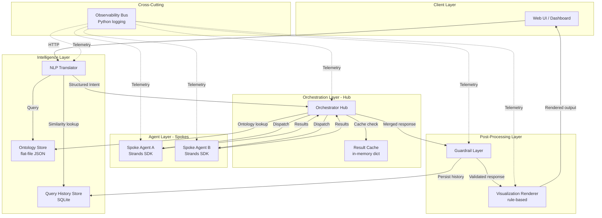
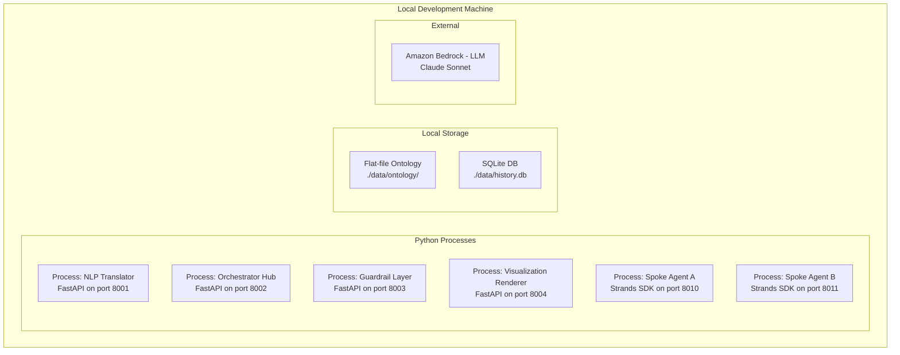
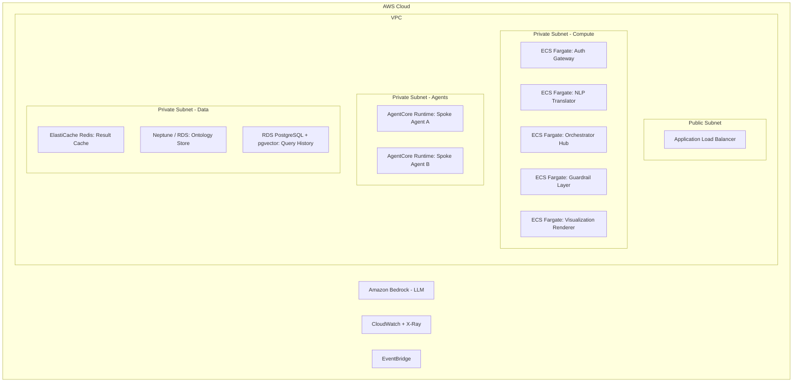
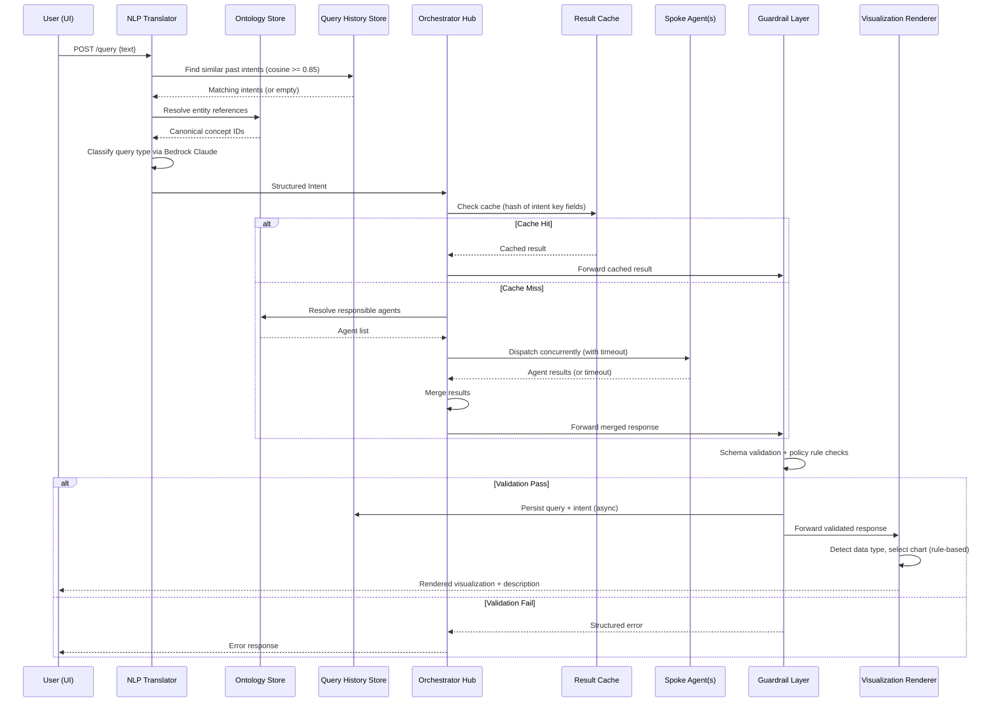

# Design Document: Ontology NLP Query System

## Overview

This document describes the technical design of an ontology-based, NLP-driven query system that follows a **hub-and-spoke architecture**. The system accepts natural language queries, translates them into structured intents using an ontology layer, routes them to specialized spoke agents via a central orchestrator, validates responses through a guardrail layer, and renders results as visualizations.

### Phased Approach

This design is structured in two phases:

- **Phase 1 (Current)**: A development-ready local system with minimal infrastructure dependencies. Focuses on core logic correctness using local processes, flat-file storage, and in-memory caching.
- **Future Phase**: Production deployment with AWS managed services, authentication, streaming, and horizontal scaling.

### Phase 1 Scope Summary

| Concern | Phase 1 (Current) | Future Phase |
|---------|-------------------|--------------|
| Auth Gateway | Skipped (all requests trusted) | JWT-based auth with RBAC |
| NLP Translator | ✅ Core functionality (Bedrock Claude) | Same |
| Orchestrator Hub | ✅ Routing + concurrent dispatch | + Event Broker for streaming |
| Spoke Agents | ✅ 2 demo agents (Strands SDK, local) | AgentCore Runtime deployment |
| Guardrail Layer | ✅ Schema validation + policy rules | + ML-based content detection |
| Visualization Renderer | ✅ Rule-based chart selection | + ReAct reasoning loop |
| Ontology Store | ✅ Flat-file backend only | + Graph DB, RDBMS backends |
| Result Cache | In-memory dict | ElastiCache Redis |
| Query History Store | Local SQLite + embeddings | RDS PostgreSQL + pgvector |
| Event Broker | Skipped | EventBridge + WebSockets |
| Observability Bus | Python logging (structured JSON) | X-Ray + CloudWatch |
| Deployment | Local Python processes | ECS Fargate + AgentCore Runtime |

**Core Design Principles:**
- **Hub-and-spoke topology**: A central Orchestrator Hub routes work to isolated Spoke Agents, each responsible for a single data source.
- **Agent-first backend**: Spoke Agents are built using the [Strands Agents SDK](https://strandsagents.com/), running locally in Phase 1.
- **Ontology-driven routing**: The shared Ontology Store informs both query understanding (NLP Translator) and agent dispatch (Orchestrator Hub).
- **Cross-cutting observability**: Every service boundary emits structured telemetry via a decorator pattern.
- **Fail-safe guardrails**: All agent output passes through validation before reaching the user.
- **Extensible architecture**: Phase 1 components expose the same interfaces that will be used in production, making the upgrade path additive rather than rewrite-based.

**Key Technology Decisions (Phase 1):**
| Concern | Choice | Rationale |
|---------|--------|-----------|
| Spoke Agent framework | Strands Agents SDK (Python) | Model-driven, open-source, tool decorator pattern |
| Agent deployment | Local Python processes | Fast iteration, no cloud costs during dev |
| LLM provider | Amazon Bedrock (Claude Sonnet) | Low-latency, pay-per-token |
| Ontology persistence | Flat-file (JSON) | Simple, no DB setup required |
| Result Cache | In-memory Python dict | Zero dependencies, sufficient for dev |
| Query History | SQLite + numpy cosine similarity | Local, no server needed, good enough for dev |
| Observability | Python `logging` (structured JSON) | Standard library, structured output |
| Chart selection | Rule-based logic | Deterministic, no extra LLM calls |

---

## Architecture

### High-Level Hub-and-Spoke Model (Phase 1)



### Deployment Architecture (Phase 1)



### Future Phase Deployment Architecture



---

## Components and Interfaces

### 1. Auth Gateway (Future Phase)

> **Phase 1**: Skipped. All requests are treated as authenticated and authorized. The NLP Translator accepts requests directly without token validation.

**Future Phase Design:**
- Stateless JWT token validation with RS256 signatures.
- Role-based access control (RBAC) with roles stored in token claims.
- Token expiry checked against server clock with a 30-second skew tolerance.
- Returns 401 for invalid/expired tokens, 403 for insufficient permissions.

---

### 2. NLP Translator

**Responsibility:** Parse natural language queries into Structured Intents using ontology context and query history bias.

**Interface:**
```python
class NLPTranslator:
    async def translate(self, query_text: str, user_id: str = "anonymous") -> StructuredIntent | NLPError:
        """
        1. Check Query History Store for similar past intents (cosine >= 0.85)
        2. Resolve entities against Ontology Store
        3. Classify query type via Bedrock Claude
        4. Produce Structured Intent
        """
        ...

@dataclass
class StructuredIntent:
    query_id: UUID
    query_type: Literal["lookup", "aggregation", "comparison"]  # Phase 1: no "streaming"
    entity_refs: list[str]  # Canonical ontology concept IDs
    routing_metadata: dict  # Agent path hints
    timestamp: datetime

@dataclass
class NLPError:
    error_code: Literal["UNPARSEABLE_QUERY", "NO_ONTOLOGY_MATCH", "AMBIGUOUS_INTENT"]
    error_message: str
    query_id: UUID
```

**Design Decisions:**
- Uses Amazon Bedrock (Claude Sonnet) for intent classification via a structured prompt that includes ontology context.
- Entity resolution is a deterministic lookup against the Ontology Store (not LLM-based) to ensure consistency.
- History bias is applied only when similarity >= 0.85; otherwise the NLP Translator produces routing metadata from scratch.
- The NLP Translator gracefully degrades if the Query History Store is unavailable.
- **Phase 1**: `query_type` excludes "streaming" since the Event Broker is deferred.
- **Phase 1**: `user_id` defaults to "anonymous" since auth is skipped.

---

### 3. Orchestrator Hub (Strands Agent)

**Responsibility:** Central routing agent that checks cache, resolves agents from the ontology, dispatches work to spoke agents using Strands SDK tool-calling, and merges results.

**Implementation:** Built with [Strands Agents SDK](https://strandsagents.com/). The Orchestrator is itself a Strands `Agent` instance that uses spoke agent invocations as `@tool`-decorated functions. This allows the LLM to reason about which agents to call based on the intent and ontology context.

**Interface:**
```python
from strands import Agent, tool

class OrchestratorHub:
    def __init__(self, ...):
        self._agent = Agent(
            system_prompt="You are an orchestrator that routes queries to data source agents...",
            tools=[self._dispatch_to_agent, self._check_cache, self._resolve_agents],
        )

    async def process_intent(self, intent: StructuredIntent) -> OrchestratorResponse | OrchestratorError:
        """
        1. Check Result Cache (in-memory dict)
        2. If miss: use Strands Agent to reason about which agents to invoke
        3. Dispatch to spoke agents via @tool functions
        4. Merge results, forward to Guardrail Layer
        """
        ...

    def register_agent(self, agent_config: AgentRegistration) -> None: ...
    def deregister_agent(self, agent_id: str) -> None: ...

@tool
def dispatch_to_agent(agent_id: str, intent_json: str) -> str:
    """Dispatch a structured intent to a specific spoke agent and return its result."""
    ...

@tool
def check_cache(cache_key: str) -> str:
    """Check the result cache for a previously computed response."""
    ...

@tool
def resolve_agents(entity_refs: list[str]) -> str:
    """Resolve which registered agents handle the given ontology entity references."""
    ...

@dataclass
class AgentRegistration:
    agent_id: str
    agent_name: str
    data_source: str
    endpoint_url: str  # Phase 1: local HTTP endpoint
    entity_refs: list[str]  # Ontology concepts this agent handles

@dataclass
class OrchestratorResponse:
    query_id: UUID
    results: list[AgentResult]
    unavailable_agents: list[str]

@dataclass
class OrchestratorError:
    error_type: Literal["NO_AGENTS_RESOLVED", "ALL_AGENTS_TIMED_OUT"]
    message: str
    query_id: UUID
```

**Design Decisions:**
- **The Orchestrator Hub is a Strands Agent** that uses `@tool`-decorated functions to interact with the cache, ontology store, and spoke agents. The LLM reasons about which agents to dispatch to based on the structured intent and ontology context.
- **Phase 1**: Result Cache is an in-memory Python `dict` keyed by a composite hash of `(query_type, sorted(entity_refs), routing_metadata)`. No TTL management in Phase 1 (cache cleared on restart).
- Agent dispatch uses the Strands Agent's tool-calling mechanism. The agent decides which spoke agents to invoke based on entity_refs and ontology context.
- Agent routing table is an in-memory registry (Python dict), updated immediately on registration changes.
- The `@tool` functions handle HTTP calls to spoke agent endpoints with per-agent timeout (configurable, default 30s).
- **Phase 1**: No streaming/Event Broker activation. Streaming query_type is not supported.
- **Future Phase**: Replace in-memory cache with ElastiCache Redis; add Event Broker activation for streaming queries.

---

### 4. Spoke Agents

**Responsibility:** Each agent queries exactly one data source, translating a Structured Intent into a source-native query and returning structured results.

**Implementation:** Built with [Strands Agents SDK](https://strandsagents.com/), running as local Python processes in Phase 1.

**Interface:**
```python
from strands import Agent, tool

@tool
def query_data_source(intent: StructuredIntent) -> AgentResult:
    """Translate intent to source-native query and execute."""
    ...

@dataclass
class AgentResult:
    status: Literal["success", "error"]
    payload: dict | None  # Query result data
    error_type: str | None
    error_description: str | None
    agent_id: str
    data_source: str
```

**Design Decisions:**
- Each Spoke Agent runs as a separate local process with its own HTTP endpoint.
- Agents do NOT retry failed data source queries (single-attempt semantics per Requirement 6.4).
- The `@tool` decorator pattern from Strands SDK exposes data source access as agent tools.
- **Phase 1**: Two demo agents are implemented (e.g., one for a JSON file data source, one for a CSV data source).
- **Future Phase**: Deploy to AgentCore Runtime with versioned endpoints, auto-scaling, and security isolation.

---

### 5. Guardrail Layer

**Responsibility:** Validate every merged response against output schemas and safety/policy rules before it reaches the user.

**Interface:**
```python
class GuardrailLayer:
    async def validate(self, response: OrchestratorResponse, intent: StructuredIntent) -> GuardrailResult:
        """
        1. Schema validation against registered output schema for query_type
        2. Safety/policy rule evaluation (rule-based in Phase 1)
        3. Redact partial violations, reject full violations
        4. Persist to Query History Store on success
        """
        ...

@dataclass
class GuardrailResult:
    status: Literal["passed", "redacted", "rejected", "error"]
    validated_response: OrchestratorResponse | None
    applied_rules: list[str]  # Rule IDs that triggered redaction
    error_details: str | None
```

**Design Decisions:**
- Schema validation uses JSON Schema with schemas registered per `query_type`.
- **Phase 1**: Policy rules are a simple list of rule objects loaded from a JSON config file. Each rule specifies a pattern (regex or keyword match) and an action (redact or reject).
- Partial redaction annotates the response with which rules were applied.
- On successful validation, the Guardrail Layer persists the query + intent to the Query History Store (async, fire-and-forget with error logging).
- **Future Phase**: Add ML-based content detection, configurable rule sets without deployment.

---

### 6. Visualization Renderer (Strands Agent)

**Responsibility:** Transform validated agent responses into dynamic, context-aware visualizations using LLM reasoning to select chart types, configure interactivity, and add statistical annotations.

**Implementation:** Built with [Strands Agents SDK](https://strandsagents.com/). The Visualization Renderer is a Strands `Agent` instance that uses `@tool`-decorated functions to analyze data patterns, select chart types, and generate chart specifications. The LLM reasons about the data shape, query intent, and context to produce the most effective visualization.

**Interface:**
```python
from strands import Agent, tool

class VisualizationRenderer:
    def __init__(self, ...):
        self._agent = Agent(
            system_prompt="You are a data visualization expert...",
            tools=[analyze_data_structure, generate_chart_spec, generate_description],
        )

    async def render(self, response: OrchestratorResponse, intent_metadata: dict | None = None) -> RenderedOutput:
        """
        1. Present data and query context to the Strands Agent
        2. Agent analyzes data patterns (trends, distributions, comparisons)
        3. Agent selects optimal chart type based on data + query intent
        4. Agent generates interactive chart specification (Chart.js/Vega-Lite)
        5. Agent writes a human-readable description with statistical insights
        6. Return rendered output
        """
        ...

@tool
def analyze_data_structure(columns: list[str], sample_rows: list[list], row_count: int) -> str:
    """Analyze data to identify patterns, column types, distributions, and relationships."""
    ...

@tool
def generate_chart_spec(chart_type: str, columns: list[str], rows: list[list], options: str) -> str:
    """Generate a Chart.js/Vega-Lite spec with interactive features, annotations, and styling."""
    ...

@tool
def generate_description(chart_type: str, data_summary: str, query_context: str) -> str:
    """Generate a human-readable description of the visualization with statistical insights."""
    ...

@dataclass
class RenderedOutput:
    output_type: Literal["chart", "text"]
    chart_type: Literal["bar", "line", "scatter", "pie", "table"] | None
    chart_data: dict | None  # Chart.js / Vega-Lite compatible spec
    text_content: str | None
    description: str  # Human-readable description with statistical insights
    metadata: dict  # query_id, timestamp, data source names
```

**Design Decisions:**
- **The Visualization Renderer is a Strands Agent** that reasons about data and query context to select the most effective chart type and configuration.
- The agent considers: data shape, column types, cardinality, query intent (lookup vs aggregation vs comparison), and the number of data points.
- Can produce interactive chart specs with tooltips, animations, trend lines, confidence intervals, and drill-down annotations.
- Includes a deterministic fallback path (rule-based) if the LLM is unavailable or fails.
- Falls back to table if the agent cannot determine a better chart type within 3 reasoning iterations.
- Output format is compatible with standard charting libraries (Chart.js or Vega-Lite).
- Each visualization includes an LLM-generated description explaining what the data shows and highlighting key statistical insights.

---

### 7. Event Broker (Future Phase)

> **Phase 1**: Skipped entirely. No streaming query support. All queries are synchronous request/response.

**Future Phase Design:**
- WebSocket connections via API Gateway WebSocket APIs.
- Inactivity timeout (default 60s, configurable 1–600s) triggers automatic channel closure.
- On UI disconnect, resources released within 5 seconds.
- Results forwarded in receipt order (FIFO per channel).
- Activated by Orchestrator Hub when `query_type == "streaming"`.

---

### 8. Ontology Store

**Responsibility:** Persist and serve domain ontology definitions to the NLP Translator and Orchestrator Hub via a uniform interface.

**Interface:**
```python
class OntologyStore:
    # Query interface
    async def lookup_concept(self, concept_id: str) -> OntologyConcept | None: ...
    async def traverse_hierarchy(self, concept_id: str, direction: str) -> list[OntologyConcept]: ...
    async def search_concepts(self, keyword: str) -> list[OntologyConcept]: ...

    # Admin interface
    async def create_definition(self, definition: OntologyDefinition) -> None: ...
    async def update_definition(self, definition: OntologyDefinition) -> None: ...
    async def delete_definition(self, concept_id: str) -> None: ...

    # Serialization interface
    def serialize(self, definition: OntologyDefinition) -> str: ...
    def deserialize(self, data: str) -> OntologyDefinition: ...
    def pretty_print(self, definition: OntologyDefinition) -> str: ...

@dataclass
class OntologyConcept:
    concept_id: str
    label: str
    properties: dict[str, Any]
    relationships: list[OntologyRelationship]

@dataclass
class OntologyRelationship:
    source_id: str
    target_id: str
    relation_type: str
    properties: dict[str, Any]

@dataclass
class OntologyDefinition:
    concepts: list[OntologyConcept]
    relationships: list[OntologyRelationship]
    metadata: dict
```

**Design Decisions:**
- **Phase 1**: Flat-file backend only. Ontology definitions stored as JSON files on disk in `./data/ontology/`.
- The interface remains the same as the future multi-backend version — a factory pattern instantiates the flat-file adapter.
- Changes are immediately visible (single-process, file-based reads on each request).
- Serialization format is JSON with a defined schema for round-trip consistency.
- **Future Phase**: Add graph DB (Neptune) and RDBMS backends behind the same interface. Add cache invalidation events for propagation SLA.

---

### 9. Query History Store

**Responsibility:** Persist past queries and resolved intents; support semantic similarity lookups for routing bias.

**Interface:**
```python
class QueryHistoryStore:
    async def persist(self, query_text: str, intent: StructuredIntent) -> None: ...
    async def find_similar(self, query_text: str, threshold: float = 0.85) -> list[HistoryMatch]: ...
    async def expire_old_records(self, retention_days: int) -> int: ...

@dataclass
class HistoryMatch:
    intent: StructuredIntent
    similarity_score: float  # 0.0 to 1.0 (cosine similarity)
    original_query: str
    timestamp: datetime
```

**Design Decisions:**
- **Phase 1**: SQLite database stored locally at `./data/history.db`.
- Embeddings generated via Amazon Bedrock Titan Embeddings model and stored as BLOB in SQLite.
- Similarity search: load embeddings into memory, compute cosine similarity with numpy. Acceptable for small-to-medium history sizes during development.
- Retention configurable 1–365 days with manual or scheduled cleanup.
- **Future Phase**: Migrate to RDS PostgreSQL with pgvector extension for HNSW-indexed vector search. Lookup SLA: results within 200ms.

---

### 10. Result Cache

**Responsibility:** Cache query results to avoid redundant agent invocations.

**Interface:**
```python
class ResultCache:
    def get(self, intent_key: str) -> OrchestratorResponse | None: ...
    def put(self, intent_key: str, response: OrchestratorResponse) -> None: ...
    def invalidate(self, intent_key: str) -> None: ...
    def clear(self) -> None: ...
```

**Design Decisions:**
- **Phase 1**: Simple Python `dict` in the Orchestrator Hub process memory. No TTL — cache is cleared on process restart.
- Cache key is a deterministic hash of `(query_type, sorted(entity_refs), sorted(routing_metadata.items()))`.
- **Future Phase**: Replace with ElastiCache Redis for sub-ms reads, TTL support, and persistence across restarts.

---

### 11. Observability Bus

**Responsibility:** Cross-cutting decorator that emits structured telemetry at every service entry point.

**Interface:**
```python
import logging
import time
import uuid

logger = logging.getLogger("observability")

def observability_decorator(service_name: str):
    """Decorator applied to all service entry points."""
    def decorator(func):
        async def wrapper(*args, **kwargs):
            correlation_id = extract_or_generate_correlation_id(kwargs)
            start = time.monotonic()
            try:
                result = await func(*args, **kwargs)
                logger.info(json.dumps({
                    "service_name": service_name,
                    "operation_name": func.__name__,
                    "correlation_id": correlation_id,
                    "timestamp": datetime.utcnow().isoformat(),
                    "request_duration_ms": int((time.monotonic() - start) * 1000)
                }))
                return result
            except Exception as e:
                logger.error(json.dumps({
                    "service_name": service_name,
                    "operation_name": func.__name__,
                    "correlation_id": correlation_id,
                    "timestamp": datetime.utcnow().isoformat(),
                    "request_duration_ms": int((time.monotonic() - start) * 1000),
                    "exception_type": type(e).__name__,
                    "exception_message": str(e),
                    "stack_trace": traceback.format_exc()
                }))
                raise
        return wrapper
    return decorator
```

**Design Decisions:**
- **Phase 1**: Uses Python standard library `logging` with structured JSON output to stdout/file.
- Correlation ID propagated via request headers (`X-Correlation-ID`) between local services.
- If no correlation ID exists on the first entry point, a new UUID is generated.
- No metrics aggregation endpoint in Phase 1 (read logs for debugging).
- **Future Phase**: Replace with AWS X-Ray for distributed tracing, CloudWatch Structured Logs for aggregation, and a `/metrics` endpoint with rolling 60-second window aggregation (p50/p95/p99).

---

## Data Models

### Structured Intent

```json
{
  "query_id": "550e8400-e29b-41d4-a716-446655440000",
  "query_type": "aggregation",
  "entity_refs": ["ontology:sales_revenue", "ontology:quarterly_report"],
  "routing_metadata": {
    "preferred_agent": "spoke-agent-financial",
    "source": "history_bias"
  },
  "timestamp": "2025-01-15T10:30:00Z"
}
```

### Agent Result

```json
{
  "status": "success",
  "payload": {
    "data_type": "numeric_series",
    "columns": ["quarter", "revenue"],
    "rows": [
      ["Q1 2024", 1250000],
      ["Q2 2024", 1380000],
      ["Q3 2024", 1420000],
      ["Q4 2024", 1550000]
    ],
    "metadata": {
      "source": "financial_db",
      "query_time_ms": 234
    }
  },
  "error_type": null,
  "error_description": null,
  "agent_id": "spoke-agent-financial",
  "data_source": "financial_db"
}
```

### Ontology Definition (Serialization Format)

```json
{
  "version": "1.0",
  "metadata": {
    "name": "enterprise_ontology",
    "created_at": "2025-01-01T00:00:00Z",
    "updated_at": "2025-01-15T10:00:00Z"
  },
  "concepts": [
    {
      "concept_id": "ontology:sales_revenue",
      "label": "Sales Revenue",
      "properties": {
        "domain": "finance",
        "unit": "currency",
        "aggregatable": true
      }
    }
  ],
  "relationships": [
    {
      "source_id": "ontology:sales_revenue",
      "target_id": "ontology:quarterly_report",
      "relation_type": "contributes_to",
      "properties": {
        "weight": 1.0
      }
    }
  ]
}
```

### Guardrail Rule Configuration

```json
{
  "rule_id": "RULE_001",
  "rule_name": "pii_detection",
  "rule_type": "safety",
  "action": "redact",
  "pattern": "regex::\\b\\d{3}-\\d{2}-\\d{4}\\b",
  "severity": "high",
  "enabled": true
}
```

### Query History Record (SQLite Schema)

```sql
CREATE TABLE query_history (
    record_id TEXT PRIMARY KEY,
    query_text TEXT NOT NULL,
    structured_intent TEXT NOT NULL,  -- JSON serialized
    embedding BLOB NOT NULL,          -- numpy array bytes
    created_at TEXT NOT NULL,         -- ISO 8601
    user_id TEXT DEFAULT 'anonymous',
    expires_at TEXT
);
```

---

## Data Flow

### Primary Query Flow (Phase 1 - Synchronous)



---

## API Contracts

### Client → NLP Translator (Phase 1: No Auth Gateway)

```
POST /query
Headers:
  X-Correlation-ID: <uuid> (optional, generated if missing)
Body:
{
  "query_text": "string"
}
Response 200:
{
  "rendered_output": { RenderedOutput }
}
Response 422:
{
  "error_code": "UNPARSEABLE_QUERY | NO_ONTOLOGY_MATCH | AMBIGUOUS_INTENT",
  "error_message": "string",
  "query_id": "uuid"
}
```

### NLP Translator → Orchestrator Hub

```
POST /internal/process
Headers:
  X-Correlation-ID: <uuid>
Body:
{
  "structured_intent": { StructuredIntent }
}
Response 200:
{
  "orchestrator_response": { OrchestratorResponse }
}
Response 422:
{
  "error_type": "NO_AGENTS_RESOLVED | ALL_AGENTS_TIMED_OUT",
  "message": "string",
  "query_id": "uuid"
}
```

### Orchestrator Hub → Spoke Agent

```
POST /agents/{agent_id}/invoke
Headers:
  X-Correlation-ID: <uuid>
Body:
{
  "structured_intent": { StructuredIntent }
}
Response 200:
{
  "status": "success | error",
  "payload": { ... },
  "error_type": "string | null",
  "error_description": "string | null",
  "agent_id": "string",
  "data_source": "string"
}
Timeout: configurable (default 30s, range 1-300s)
```

### Orchestrator Hub → Guardrail Layer

```
POST /internal/validate
Headers:
  X-Correlation-ID: <uuid>
Body:
{
  "orchestrator_response": { OrchestratorResponse },
  "structured_intent": { StructuredIntent }
}
Response 200:
{
  "status": "passed | redacted",
  "validated_response": { OrchestratorResponse },
  "applied_rules": ["RULE_001"]
}
Response 422:
{
  "status": "rejected",
  "error_details": "string",
  "triggered_rules": ["RULE_002", "RULE_003"]
}
```

### Guardrail Layer → Visualization Renderer

```
POST /internal/render
Headers:
  X-Correlation-ID: <uuid>
Body:
{
  "validated_response": { OrchestratorResponse },
  "structured_intent": { StructuredIntent }
}
Response 200:
{
  "output_type": "chart | text",
  "chart_type": "bar | line | scatter | pie | table | null",
  "chart_data": { ... },
  "text_content": "string | null",
  "description": "string",
  "metadata": { "query_id": "uuid", "timestamp": "iso8601", "data_sources": ["..."] }
}
Response 500:
{
  "error_type": "RENDER_FAILURE",
  "message": "string"
}
```

### Agent Registration API

```
POST /admin/agents
Body:
{
  "agent_id": "string",
  "agent_name": "string",
  "data_source": "string",
  "endpoint_url": "http://localhost:8010",
  "entity_refs": ["ontology:concept_a", "ontology:concept_b"]
}
Response 201: { "registered": true }

DELETE /admin/agents/{agent_id}
Response 200: { "deregistered": true }
```

---

## Correctness Properties

*A property is a characteristic or behavior that should hold true across all valid executions of a system — essentially, a formal statement about what the system should do. Properties serve as the bridge between human-readable specifications and machine-verifiable correctness guarantees.*

### Property 1: Structured Intent Completeness

*For any* valid natural language query submitted to the NLP Translator, it SHALL produce a Structured Intent containing a valid UUID as query_id, exactly one of {lookup, aggregation, comparison} as query_type, a non-empty list of canonical ontology concept identifiers as entity_refs, routing_metadata, and a timestamp.

**Validates: Requirements 2.1, 2.3**

### Property 2: Entity Resolution Against Ontology

*For any* query containing references to concepts that exist in the Ontology Store, the NLP Translator SHALL resolve those references to canonical ontology concept identifiers and include them in the entity_refs field of the Structured Intent.

**Validates: Requirements 2.2**

### Property 3: History-Based Routing Bias

*For any* query where the Query History Store returns one or more past Structured Intents with cosine similarity >= 0.85, the NLP Translator SHALL set routing_metadata to the agent path recorded in the most recent matching past Structured Intent.

**Validates: Requirements 2.4**

### Property 4: Malformed Ontology Definition Rejection Preserves State

*For any* malformed, schema-invalid, or duplicate-identifier ontology definition submitted to the Ontology Store, the store SHALL reject the submission with a structured error and the existing store state SHALL remain unchanged.

**Validates: Requirements 3.8**

### Property 5: Cache Hit Prevents Agent Dispatch

*For any* Structured Intent for which the Result Cache contains an entry with an exactly matching key (same query_type, entity_refs, and routing_metadata), the Orchestrator Hub SHALL return the cached result without invoking any Spoke Agent.

**Validates: Requirements 4.2**

### Property 6: Concurrent Dispatch and Result Merge Correctness

*For any* set of resolved Spoke Agents and any combination of agent responses and timeouts, the Orchestrator Hub SHALL dispatch to all resolved agents concurrently, mark timed-out agents as unavailable, and produce a merged response that correctly identifies each unavailable agent by name.

**Validates: Requirements 4.4, 4.6, 4.7**

### Property 7: Spoke Agent Data Source Isolation

*For any* Spoke Agent and any Structured Intent dispatched to it, the agent SHALL query only the single designated data source for which it is registered and no other.

**Validates: Requirements 6.1**

### Property 8: Spoke Agent Output Schema Compliance

*For any* Structured Intent dispatched to a Spoke Agent, the agent SHALL return a response containing at minimum a status indicator (success or error) and, on success, a query result payload; the response must conform to the AgentResult schema.

**Validates: Requirements 6.2, 6.3**

### Property 9: Guardrail Schema Validation

*For any* merged response received by the Guardrail Layer, it SHALL validate the response against the registered output schema for the query type; responses failing schema validation SHALL be rejected with a structured error and never forwarded.

**Validates: Requirements 7.2, 7.4**

### Property 10: Guardrail Partial Redaction

*For any* response containing a mix of policy-compliant and policy-violating content, the Guardrail Layer SHALL redact only the specific violating content, annotate the response with the identifiers of all applied rules, and forward the annotated response.

**Validates: Requirements 7.5**

### Property 11: Visualization Data Type Detection

*For any* validated response payload, the Visualization Renderer SHALL classify it as requiring graphical rendering if and only if it contains structured numeric or categorical data fields; otherwise it SHALL classify it as plain text.

**Validates: Requirements 8.1**

### Property 12: Similarity Threshold Filtering

*For any* set of query history records and a new query embedding, the Query History Store SHALL return all and only those records whose cosine similarity to the new query is >= 0.85.

**Validates: Requirements 10.3**

### Property 13: History Retention Expiry

*For any* configured retention period (1–365 days) and set of query history records, the Query History Store SHALL expire and remove all records older than the configured retention period while preserving records within the window.

**Validates: Requirements 10.4**

### Property 14: Observability Telemetry Correctness

*For any* service entry point invocation, the Observability Bus SHALL emit a structured JSON log entry containing service_name, operation_name, correlation_id (generated as UUID if not present on inbound request), timestamp (ISO 8601), and request_duration_ms; on unhandled exceptions, it SHALL additionally emit exception_type, exception_message, and stack_trace. For any downstream service call, the current correlation_id SHALL be propagated.

**Validates: Requirements 11.2, 11.3, 11.4, 11.5**

### Property 15: Ontology Serialization Round-Trip

*For any* valid ontology definition object, serializing and then deserializing it using the Ontology Store interface SHALL produce an object containing the same set of concepts, the same set of relationships, and the same property values as the original, regardless of element ordering.

**Validates: Requirements 12.1, 12.2, 12.3**

### Property 16: Ontology Pretty-Print Round-Trip

*For any* valid ontology definition object, formatting it via the pretty-printer and then parsing it back using the Ontology Store's deserialization interface SHALL produce an object containing the same set of concepts, relationships, and property values as the original.

**Validates: Requirements 12.4, 12.5**

### Property 17: Malformed Serialized Data Rejection

*For any* malformed or non-conforming serialized data submitted to the Ontology Store's deserialization interface, the store SHALL reject the data with a structured error indicating the parse failure location and reason, and the in-memory state SHALL remain unchanged.

**Validates: Requirements 12.6**

---

## Error Handling

### Error Propagation Strategy

The system uses a **structured error envelope** pattern. Every error response contains:

```json
{
  "error_code": "string",
  "error_message": "string",
  "correlation_id": "uuid",
  "service": "string",
  "timestamp": "iso8601"
}
```

### Error Categories and Handling (Phase 1)

| Layer | Error Type | Action | User-Visible? |
|-------|-----------|--------|---------------|
| NLP Translator | Unparseable query | Return error with code | Yes |
| NLP Translator | No ontology match | Return error with code | Yes |
| NLP Translator | Ambiguous intent | Return error with code | Yes |
| NLP Translator | History Store unavailable | Skip bias, continue | No (degraded) |
| Orchestrator Hub | Cache miss | Normal path (dispatch) | No |
| Orchestrator Hub | No agents resolved | Return structured error | Yes |
| Orchestrator Hub | All agents timed out | Return structured error | Yes |
| Orchestrator Hub | Partial agent timeout | Merge available results | Partial (annotated) |
| Spoke Agent | Data source error | Return error (no retry) | Yes (via merge) |
| Guardrail Layer | Schema validation failure | Reject response | Yes |
| Guardrail Layer | Full policy violation | Reject response | Yes |
| Guardrail Layer | Partial policy violation | Redact + annotate + forward | Partial |
| Guardrail Layer | Internal failure | Return error, no forward | Yes |
| Visualization Renderer | Render failure | Return structured error | Yes |
| Visualization Renderer | No rule matches | Fall back to table | No (graceful) |
| Ontology Store | Malformed definition | Reject, preserve state | Yes (to admin) |
| Ontology Store | Serialization failure | Error, no partial write | Yes (to admin) |
| Query History Store | Write unavailable | Log error, continue | No (degraded) |
| Query History Store | Read unavailable | Skip bias, continue | No (degraded) |

### Graceful Degradation Hierarchy

1. **Query History Store unavailable** → Skip routing bias, proceed with fresh NLP translation.
2. **Partial agent timeout** → Return results from available agents, annotate unavailable ones.
3. **No chart rule matches** → Fall back to table rendering.
4. **Ontology Store file read error** → Return structured error (no stale cache in Phase 1).

### Future Phase Additions

- Circuit breaker pattern for external dependencies (5 failures in 30s → open circuit).
- Auth Gateway errors (401, 403).
- Event Broker channel failures and inactivity timeouts.

---

## Testing Strategy

### Dual Testing Approach

This system benefits from **both** property-based testing and traditional unit/integration testing due to the mix of pure logic components and external service integrations.

### Property-Based Testing (PBT)

**Library:** [Hypothesis](https://hypothesis.readthedocs.io/) (Python)

**Configuration:**
- Minimum 100 iterations per property test
- Each property test tagged with: `Feature: ontology-nlp-query-system, Property {N}: {title}`
- Custom strategies (generators) for domain objects: `StructuredIntent`, `OntologyDefinition`, `AgentResult`, `GuardrailRule`

**PBT-Suitable Components (Phase 1):**

| Component | Properties | Strategy |
|-----------|-----------|----------|
| NLP Translator | 1, 2, 3 | Generate random queries with mock Bedrock responses and ontologies |
| Orchestrator Hub | 5, 6 | Generate random intents, cache states, and agent timeout combos |
| Spoke Agents | 7, 8 | Generate random intents, verify isolation and output schema |
| Guardrail Layer | 9, 10 | Generate random responses with mixed valid/invalid content |
| Visualization Renderer | 11 | Generate random payloads, verify data type classification |
| Query History Store | 12, 13 | Generate embeddings and timestamps, verify filtering and expiry |
| Observability Bus | 14 | Generate random invocations and call chains, verify log fields and ID propagation |
| Ontology Store | 4, 15, 16, 17 | Generate random ontology definitions, verify round-trips and rejection |

**Custom Hypothesis Strategies:**

```python
from hypothesis import strategies as st

# Ontology concept generator
ontology_concepts = st.builds(
    OntologyConcept,
    concept_id=st.from_regex(r"ontology:[a-z_]{1,30}", fullmatch=True),
    label=st.text(min_size=1, max_size=100),
    properties=st.dictionaries(
        st.text(min_size=1, max_size=20),
        st.one_of(st.text(), st.integers(), st.booleans())
    ),
    relationships=st.just([])  # filled separately
)

# Structured intent generator
structured_intents = st.builds(
    StructuredIntent,
    query_id=st.uuids(),
    query_type=st.sampled_from(["lookup", "aggregation", "comparison"]),
    entity_refs=st.lists(
        st.from_regex(r"ontology:[a-z_]{1,20}", fullmatch=True),
        min_size=1, max_size=5
    ),
    routing_metadata=st.dictionaries(
        st.text(min_size=1, max_size=20),
        st.text(min_size=1, max_size=50)
    ),
    timestamp=st.datetimes()
)
```

### Unit Tests (Example-Based)

- NLP Translator: known query → expected Structured Intent mappings, error cases
- Orchestrator Hub: specific cache hit/miss scenarios, agent registration
- Guardrail Layer: specific policy rule triggers, full-rejection edge case
- Visualization Renderer: each chart type rule produces correct output, fallback to table
- Ontology Store: CRUD operations against flat-file backend

### Integration Tests

- End-to-end: full query flow from NLP → Orchestrator → Agent → Guardrail → Renderer
- Query History Store: embedding persistence and retrieval from SQLite
- Ontology Store: file-based CRUD with concurrent access
- Agent dispatch: real HTTP calls between local processes with timeout handling

### Smoke Tests

- All local services start and respond to health checks
- Ontology flat-file directory is readable/writable
- SQLite database is accessible
- Bedrock endpoint is reachable (requires AWS credentials)

### Test Execution

```bash
# Run all property-based tests
pytest tests/properties/ --hypothesis-seed=random -v

# Run unit tests
pytest tests/unit/ -v

# Run integration tests
pytest tests/integration/ -v --timeout=60

# Run smoke tests
pytest tests/smoke/ -v
```
