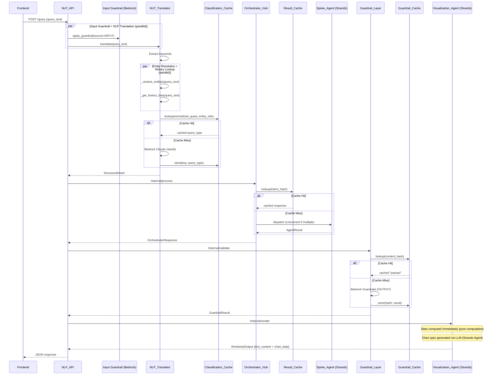

# Design Document: Performance Optimization

## Overview

This design specifies concrete performance optimizations to the existing ontology-based NLP query system. The system currently suffers from high latency in three main areas: spoke agent data retrieval (~17s), visualization rendering (~15s), and guardrail checks (~1-2s). The optimization strategy addresses these through:

1. **Prompt compression** — Reducing spoke agent and visualization agent system prompts to minimize LLM input/output tokens
2. **Guardrail streamlining** — Using only Bedrock Guardrails API, removing redundant local regex rules
3. **Parallel execution** — Running independent pipeline stages concurrently (entity resolution + history lookup; input guardrails + NLP translation)
4. **Intelligent caching** — Adding Classification_Cache and Guardrail_Cache with LRU eviction
5. **Progressive response** — Computing statistics immediately, chart after LLM reasoning
6. **Model verification** — Ensuring all services use `DEFAULT_MODEL_ID` from config

All changes preserve functional correctness: the system produces equivalent results for equivalent inputs. The spoke agent and visualization agent retain LLM reasoning (Strands Agent) because complex/vague queries require LLM interpretation for tool selection and dynamic chart generation.

---

## Architecture



---

## Components and Interfaces

### 1. Spoke Agent (`src/agents/spoke_agent.py`)

**Changes:**
- Replace verbose system prompt (~90 tokens currently, but includes unnecessary detail) with a compressed prompt under 200 tokens focused on tool-call-only output
- Set `max_tokens=500` on the Strands Agent model configuration
- Simplify the per-request prompt to include only `query_type`, `entity_refs`, and one-line tool descriptions

**Interface (unchanged):**
```python
POST /agents/spoke-agent/invoke
Request: {"structured_intent": StructuredIntent}
Response: AgentResult
```

**New system prompt:**
```
You are a data retrieval agent. Call the appropriate tool and return ONLY the tool output.
Tools: query_financial_data (sales, revenue, quarterly data), query_product_catalog (products, prices, stock).
Do not add text, markdown, or explanations. Output: raw tool JSON only.
```

**New per-request prompt:**
```
{query_type} query for entities: {entity_refs}. Call the matching tool with query_type='{query_type}' and entity_refs={entity_refs_json}.
```

**Model configuration change:**
```python
spoke_agent = Agent(
    tools=[query_financial_data, query_product_catalog],
    model=get_strands_bedrock_model(),
    callback_handler=None,
    system_prompt=SPOKE_SYSTEM_PROMPT,  # compressed
    model_kwargs={"max_tokens": 500},
)
```

### 2. Visualization Agent (`src/services/visualization_renderer.py`)

**Changes:**
- Compress `VISUALIZER_SYSTEM_PROMPT` to under 250 tokens with clear JSON output directive
- Set `max_tokens=500` on the visualization agent model
- Ensure stats are computed immediately from raw data before LLM call
- The agent receives structured data (columns + rows) and produces a single JSON with `chart_type`, `chart_data`, `description`

**New system prompt:**
```
You are a chart generation agent. Analyze the data and produce a single JSON response:
{"chart_type": "bar|line|scatter|pie|table", "chart_data": <Chart.js spec>, "description": "<insights>"}

Rules:
- Time series → line. Categories + numbers → bar. Two numerics → scatter. ≤8 categories proportional → pie. Otherwise → table.
- Include tooltips, legend, responsive sizing in chart_data.
- Add trend lines/averages as annotations where useful.
- Description: explain key patterns, notable stats (highs, lows, averages).
- Output ONLY the JSON object. No surrounding text.
```

**Progressive response pattern:**
```python
async def render(self, response, intent_metadata):
    payload = self._extract_payload(response)
    
    # Immediate: compute statistics (pure computation, <50ms)
    stats_text = self._generate_stats_description(payload)
    
    # LLM: generate chart spec (agent call)
    chart_spec = await self._agent_render(payload, intent_metadata)
    
    return RenderedOutput(
        output_type="chart",
        chart_type=chart_spec["chart_type"],
        chart_data=chart_spec["chart_data"],
        text_content=stats_text,  # available immediately
        description=chart_spec["description"],
        metadata=metadata,
    )
```

### 3. Guardrail Layer (`src/services/guardrail_layer.py`)

**Changes:**
- Remove `_load_rules()`, `_evaluate_rules()`, `_apply_redactions()`, and `GuardrailRule` class
- Remove dependency on `data/guardrail_rules.json`
- `validate()` now only calls Bedrock Guardrails with `source="OUTPUT"`
- On Bedrock unavailability: fail open (allow content, log warning)

**New validate flow:**
```python
async def validate(self, response, intent):
    # 1. Schema validation (unchanged)
    schema_error = self._validate_schema(response, intent)
    if schema_error:
        return GuardrailResult(status="rejected", ...)
    
    # 2. Check guardrail cache
    content_hash = self._compute_content_hash(response)
    cached = self._guardrail_cache.get(content_hash)
    if cached is not None:
        return cached
    
    # 3. Bedrock Guardrails only (no local rules)
    bedrock_result = self._evaluate_bedrock_guardrails(response)
    if bedrock_result and bedrock_result["action"] == "BLOCKED":
        result = GuardrailResult(status="rejected", ...)
    else:
        result = GuardrailResult(status="passed", validated_response=response, ...)
    
    # 4. Cache the result
    self._guardrail_cache.put(content_hash, result)
    return result
```

### 4. Input Guardrails (`src/services/nlp_api.py`)

**Changes:**
- Remove `_INPUT_GUARDRAIL_PATTERNS` list and `_check_input_guardrails()` regex logic
- Replace with Bedrock-only input check using `apply_guardrail(source="INPUT")`
- Run input guardrail check in parallel with NLP translation

**New input guardrail:**
```python
async def _check_input_guardrails_bedrock(query_text: str) -> dict | None:
    """Check input via Bedrock Guardrails only. No local regex."""
    from src.config import BEDROCK_GUARDRAIL_ID, BEDROCK_GUARDRAIL_VERSION
    if not BEDROCK_GUARDRAIL_ID:
        return None  # No guardrail configured
    try:
        client = get_bedrock_client()
        result = client.apply_guardrail(
            guardrailIdentifier=BEDROCK_GUARDRAIL_ID,
            guardrailVersion=BEDROCK_GUARDRAIL_VERSION,
            source="INPUT",
            content=[{"text": {"text": query_text}}],
        )
        if result.get("action") == "GUARDRAIL_INTERVENED":
            outputs = result.get("outputs", [])
            message = outputs[0].get("text", "Content blocked") if outputs else "Content policy violation"
            return {"error_code": "CONTENT_POLICY_VIOLATION", "error_message": message, "query_id": str(uuid.uuid4())}
    except Exception as e:
        logger.warning(f"Input Bedrock Guardrails check failed: {e}")
    return None  # Fail open
```

**Parallel execution in query endpoint:**
```python
@app.post("/query")
async def query_endpoint(request, body):
    # Run input guardrail + NLP translation in parallel
    guardrail_task = asyncio.create_task(
        asyncio.to_thread(_check_input_guardrails_bedrock, body.query_text)
    )
    translate_task = asyncio.create_task(translator.translate(body.query_text))
    
    input_rejection, translation_result = await asyncio.gather(
        guardrail_task, translate_task
    )
    
    if input_rejection:
        return JSONResponse(status_code=422, content=input_rejection)
    # ... continue with translation_result
```

### 5. NLP Translator (`src/services/nlp_translator.py`)

**Changes:**
- Add `Classification_Cache` with LRU eviction (max 1000 entries)
- Run `_resolve_entities()` and `_get_history_bias()` concurrently via `asyncio.gather`
- Check classification cache before calling Bedrock classifier

**Classification Cache integration:**
```python
class NLPTranslator:
    def __init__(self, ...):
        ...
        self._classification_cache = LRUCache(max_size=1000)
    
    async def translate(self, query_text, user_id="anonymous"):
        # ... validate input ...
        
        # Parallel: entity resolution + history bias
        entity_refs, routing_metadata = await asyncio.gather(
            asyncio.to_thread(self._resolve_entities, query_text),
            asyncio.to_thread(self._get_history_bias, query_text),
        )
        
        if not entity_refs:
            return NLPError(...)
        
        # Classification cache lookup
        cache_key = self._classification_cache_key(query_text, entity_refs)
        cached_type = self._classification_cache.get(cache_key)
        if cached_type is not None:
            query_type = cached_type
        else:
            ontology_context = self._build_ontology_context(entity_refs)
            query_type = self.classifier.classify_query_type(query_text, ontology_context)
            if query_type:
                self._classification_cache.put(cache_key, query_type)
        
        # ... build StructuredIntent ...
```

### 6. LRU Cache Utility (new: `src/services/lru_cache.py`)

**New file providing a generic LRU cache used by Classification_Cache and Guardrail_Cache:**

```python
from collections import OrderedDict
from typing import TypeVar, Generic

K = TypeVar("K")
V = TypeVar("V")

class LRUCache(Generic[K, V]):
    """Thread-safe LRU cache with configurable max size."""
    
    def __init__(self, max_size: int = 1000):
        self._max_size = max_size
        self._store: OrderedDict[K, V] = OrderedDict()
    
    def get(self, key: K) -> V | None:
        if key in self._store:
            self._store.move_to_end(key)
            return self._store[key]
        return None
    
    def put(self, key: K, value: V) -> None:
        if key in self._store:
            self._store.move_to_end(key)
        self._store[key] = value
        while len(self._store) > self._max_size:
            self._store.popitem(last=False)
    
    @property
    def size(self) -> int:
        return len(self._store)
    
    def clear(self) -> None:
        self._store.clear()
```

### 7. Orchestrator Hub (`src/services/orchestrator_hub.py`)

**Changes:**
- Convert `_direct_dispatch` to use `asyncio.gather` for concurrent agent dispatch
- Keep existing `ResultCache` as-is (already functional)

**Concurrent dispatch:**
```python
async def _direct_dispatch(self, intent, resolved_agents, cache_key):
    intent_json = intent.model_dump_json()
    
    # Dispatch to all resolved agents concurrently
    tasks = [
        asyncio.to_thread(
            dispatch_to_spoke_agent,
            agent_id=agent.agent_id,
            endpoint_url=agent.endpoint_url,
            intent_json=intent_json,
        )
        for agent in resolved_agents
    ]
    await asyncio.gather(*tasks)
    
    return self._build_response_from_results(intent, resolved_agents, cache_key)
```

### 8. Model Verification (`src/config.py`)

**No changes needed** — `DEFAULT_MODEL_ID` is already defined and used by:
- `BedrockClassifier` in `nlp_translator.py` (uses `DEFAULT_MODEL_ID`)
- `get_strands_bedrock_model()` defaults to `DEFAULT_MODEL_ID`
- `spoke_agent.py` uses `get_strands_bedrock_model()` → `DEFAULT_MODEL_ID`
- `visualization_renderer.py` uses `get_strands_bedrock_model()` → `DEFAULT_MODEL_ID`
- `cost_tracker.py` logs `model_id` per invocation

**Verification approach:** Each service's model initialization already flows through `get_strands_bedrock_model(model_id)` which defaults to `DEFAULT_MODEL_ID`. The cost tracker logs the actual `model_id` used per invocation for audit purposes.

---

## Data Models

### New: LRUCache (generic)

| Field | Type | Description |
|-------|------|-------------|
| `_max_size` | `int` | Maximum entries before LRU eviction |
| `_store` | `OrderedDict[K, V]` | Ordered storage for LRU tracking |

### Classification_Cache Key

```python
cache_key = hashlib.sha256(
    f"{normalized_query}|{','.join(sorted(entity_refs))}".encode()
).hexdigest()
```

Where `normalized_query = query_text.strip().lower()`.

### Guardrail_Cache Key

```python
content_hash = hashlib.sha256(
    json.dumps(response.model_dump(mode="json"), sort_keys=True).encode()
).hexdigest()
```

### Existing models (unchanged)

- `StructuredIntent`, `AgentResult`, `OrchestratorResponse`, `RenderedOutput`, `GuardrailResult` — all preserve their existing schemas.

---

## Correctness Properties

*A property is a characteristic or behavior that should hold true across all valid executions of a system — essentially, a formal statement about what the system should do. Properties serve as the bridge between human-readable specifications and machine-verifiable correctness guarantees.*

### Property 1: Spoke Agent Prompt Minimalism

*For any* valid StructuredIntent with arbitrary query_type and entity_refs, the prompt constructed for the spoke agent LLM call SHALL contain only the query_type value, the entity_refs list, and single-line tool descriptions — and SHALL NOT contain full tool schemas, verbose instructions, or example data.

**Validates: Requirements 1.3**

### Property 2: Chart Type Selection Correctness

*For any* structured data payload with identifiable column types (numeric, categorical, temporal), the rule-based chart selector SHALL produce: line charts for time-series data, bar charts for categorical+numeric data, scatter plots for two-numeric-column data, and tables for unclassifiable data — matching the documented selection rules.

**Validates: Requirements 2.2**

### Property 3: Chart Specification Validity

*For any* structured data payload rendered through the visualization pipeline (agent or fallback), the produced chart specification SHALL be a valid Chart.js-compatible object containing `type`, `datasets` or `rows`, and interactive options (tooltips enabled, legend displayed), and SHALL conform to the RenderedOutput model schema.

**Validates: Requirements 2.3, 8.2**

### Property 4: Rendered Output Completeness

*For any* structured data payload processed through the visualization renderer (including fallback path on agent failure), the resulting RenderedOutput SHALL contain a non-empty `description` field AND a non-null `text_content` field with statistical summary AND (for structured data) a non-null `chart_data` field.

**Validates: Requirements 2.5, 6.2, 2.9**

### Property 5: Classification Cache Determinism and Hit Behavior

*For any* query text and entity_refs combination, the classification cache key generated SHALL be deterministic (same inputs always produce same key), AND when the cache contains a result for that key, the NLP Translator SHALL return the cached classification without invoking the Bedrock classifier.

**Validates: Requirements 5.1, 5.2**

### Property 6: LRU Cache Eviction

*For any* sequence of N insertions into an LRU cache with max_size M where N > M, the cache size SHALL never exceed M entries, AND the evicted entries SHALL be the least recently accessed ones.

**Validates: Requirements 5.3, 5.7**

### Property 7: Guardrail Cache Keying and Hit Behavior

*For any* OrchestratorResponse, the guardrail cache key SHALL be the SHA-256 hash of the deterministically serialized response content, AND when the cache contains a "passed" result for that hash, the Guardrail Layer SHALL skip Bedrock validation and return the cached result directly.

**Validates: Requirements 5.5, 5.6**

### Property 8: Statistical Summary Correctness

*For any* structured data payload containing numeric columns, the statistical summary computation SHALL produce correct totals (sum of values), averages (sum/count), counts (number of rows), and ranges (min, max) matching the actual data values.

**Validates: Requirements 6.1**

### Property 9: Entity Resolution Determinism

*For any* query text, the entity resolution step (keyword extraction + ontology lookup) SHALL produce identical entity_refs before and after optimization, since it uses deterministic keyword matching against the ontology store (no LLM involvement).

**Validates: Requirements 8.3**

### Property 10: Error Response Format Preservation

*For any* error condition in the optimized pipeline (unparseable query, no ontology match, ambiguous intent, agent timeout, guardrail rejection), the system SHALL return a response conforming to the existing error model schemas (NLPError with error_code + error_message + query_id, or OrchestratorError with error_type + message + query_id).

**Validates: Requirements 8.4**

---

## Error Handling

### Bedrock Guardrails Unavailability
- **Behavior:** Fail open — allow content through, log a structured warning
- **Applies to:** Both input guardrails (nlp_api.py) and output guardrails (guardrail_layer.py)
- **Rationale:** Availability is prioritized over safety enforcement when the guardrail service is down; the system was already doing this for local rules

### Classification Cache Miss
- **Behavior:** Fall through to Bedrock Claude classification (existing path)
- **No degradation:** System works identically to pre-optimization on cache miss

### Guardrail Cache Miss
- **Behavior:** Fall through to Bedrock Guardrails evaluation (existing path)
- **Cache stores both passed and rejected results** to avoid re-evaluating known-bad content

### Visualization Agent Failure
- **Behavior:** Fall back to deterministic rule-based chart selection (existing `_fallback_render`)
- **Stats still available:** Progressive response ensures `text_content` is populated regardless of agent success
- **Logging:** Structured JSON warning log with error type and message

### Parallel Task Failure
- **Entity resolution failure:** Returns `NLPError(NO_ONTOLOGY_MATCH)` as before
- **History lookup failure:** Graceful degradation — returns empty routing_metadata (existing behavior)
- **Input guardrail + NLP parallel:** If guardrail fails, fail open. If NLP fails, return NLPError. Both can fail independently.

### Spoke Agent Timeout
- **Behavior:** Unchanged — returns AgentResult with `status="error"` and `error_type="TIMEOUT"`
- **Fallback:** `_fallback_direct_query` deterministic path (existing)

---

## Testing Strategy

### Property-Based Testing (Hypothesis)

The feature is suitable for property-based testing because it involves pure functions (cache key generation, stats computation, chart selection rules) and universal properties that hold across wide input ranges.

**Library:** Hypothesis (already used in project — see `tests/properties/`)
**Configuration:** Minimum 100 iterations per property test (`@settings(max_examples=100)`)
**Tag format:** `# Feature: performance-optimization, Property {N}: {title}`

Properties to implement as PBT:
- Property 1: Prompt minimalism — generate random StructuredIntents, verify prompt content
- Property 2: Chart selection — generate random payloads with typed columns, verify chart type
- Property 3: Chart spec validity — generate payloads, verify output schema
- Property 4: Output completeness — generate payloads, verify all fields populated
- Property 5: Cache determinism — generate query+entity_refs, verify key stability and hit behavior
- Property 6: LRU eviction — generate insertion sequences exceeding max_size, verify eviction
- Property 7: Guardrail cache — generate responses, verify SHA-256 keying and hit behavior
- Property 8: Stats correctness — generate numeric data, verify computed stats match
- Property 9: Entity resolution — generate queries, verify determinism
- Property 10: Error format — generate error conditions, verify model conformance

### Unit Tests

- Spoke agent system prompt token count < 200
- Visualization agent system prompt token count < 250
- `max_tokens=500` configuration on both agents
- Bedrock Guardrails called with correct `source` parameter (INPUT/OUTPUT)
- No local regex rules loaded in optimized guardrail layer
- Cost tracker logs model_id on every invocation
- Parallel execution uses `asyncio.gather` for independent operations

### Integration Tests

- End-to-end query latency measurement (spoke agent < 8s, visualization < 10s)
- Bedrock Guardrails fail-open behavior when service is unavailable
- Full pipeline produces equivalent results to pre-optimization for sample queries
- Existing test suite (`tests/properties/`, `tests/unit/`) passes without modification
