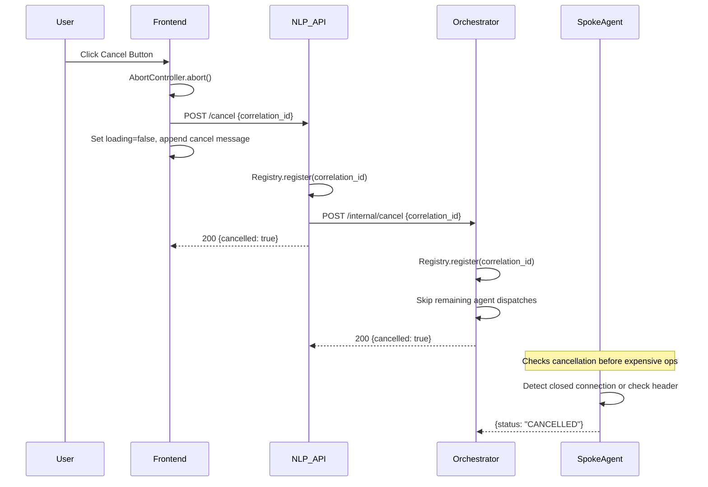
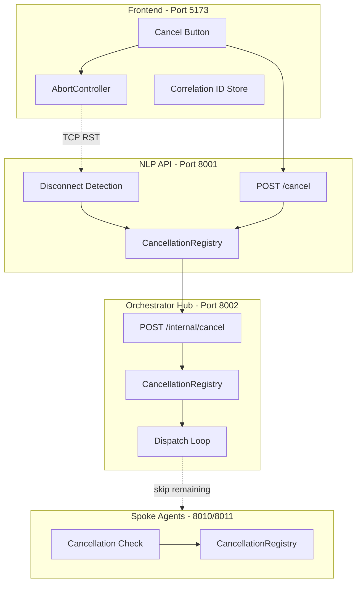

# Design Document: Query Cancellation

## Overview

This design implements cooperative query cancellation across the full service chain: Frontend → NLP API → Orchestrator Hub → Spoke Agents. The pattern uses a correlation-ID-based cancellation token stored in an in-memory `CancellationRegistry` at each service layer. Cancellation is triggered from the frontend via two mechanisms (AbortController for the HTTP connection + explicit POST /cancel), propagated downstream through internal cancel endpoints, and checked cooperatively by each service before expensive operations.

The design prioritizes:
- **Fast user feedback**: The frontend immediately aborts the connection and resets UI state.
- **Resource conservation**: Backend services stop work as soon as they detect cancellation.
- **Isolation**: Cancelling one query never affects other concurrent queries.
- **Memory safety**: Registries auto-clean via TTL and capacity limits.

## Architecture

### Cancellation Flow Sequence



### Component Interaction Diagram



## Components and Interfaces

### 1. CancellationRegistry (Shared Module)

A reusable in-memory data structure used by all backend services. Each service instantiates its own instance.

**Location**: `src/services/cancellation_registry.py`

```python
class CancellationRegistry:
    """Thread-safe in-memory cancellation token store.
    
    Supports TTL-based expiry, max capacity eviction, and O(1) lookups.
    """
    
    def __init__(self, ttl_seconds: float = 300.0, max_entries: int = 1000):
        ...

    def register(self, correlation_id: str) -> None:
        """Mark a correlation ID as cancelled."""
        ...

    def is_cancelled(self, correlation_id: str) -> bool:
        """Check if a correlation ID is cancelled. Returns False for unknown IDs."""
        ...

    def remove(self, correlation_id: str) -> None:
        """Explicitly remove a cancellation entry (on query completion)."""
        ...

    def cleanup(self) -> int:
        """Remove expired entries. Returns count of removed entries."""
        ...

    @property
    def size(self) -> int:
        """Current number of entries in the registry."""
        ...
```

### 2. Frontend Changes

**Files modified**:
- `frontend/src/api/queryApi.ts` — Add correlation ID generation, expose AbortController, add `cancelQuery()` function
- `frontend/src/store/sessionStore.ts` — Add `cancelQuery` action, store active correlation ID and AbortController reference
- `frontend/src/components/ChatInput.tsx` — Swap submit button for cancel button when `loading=true`

**New API function** (`frontend/src/api/queryApi.ts`):

```typescript
export function generateCorrelationId(): string {
  return crypto.randomUUID();
}

export async function queryBackendWithCancel(
  queryText: string,
  correlationId: string,
  signal: AbortSignal,
): Promise<QueryResult> { ... }

export async function cancelQuery(correlationId: string): Promise<void> {
  try {
    await fetch(`${API_BASE}/cancel`, {
      method: 'POST',
      headers: { 'Content-Type': 'application/json' },
      body: JSON.stringify({ correlation_id: correlationId }),
    });
  } catch {
    // Fire-and-forget: log but don't block the user
    console.warn('Cancel request failed, continuing with local cancellation');
  }
}
```

**Store additions** (`sessionStore.ts`):

```typescript
interface SessionActions {
  // ... existing actions
  cancelQuery: () => void;
}

// Internal refs (not persisted)
let _activeAbortController: AbortController | null = null;
let _activeCorrelationId: string | null = null;
```

### 3. NLP API Changes

**Files modified**:
- `src/services/nlp_api.py` — Add POST /cancel endpoint, integrate disconnect detection, add cancellation propagation

**New endpoint**:

```python
@app.post("/cancel")
async def cancel_query_endpoint(body: CancelRequest) -> JSONResponse:
    """Cancel an in-flight query by correlation ID.
    
    Marks the correlation ID in the local registry and propagates
    cancellation to the Orchestrator Hub.
    
    Returns 200 with confirmation regardless of whether the query
    was active (idempotent / no-op safe).
    """
```

**Disconnect detection** (middleware-level or per-request check):

```python
async def check_client_disconnect(request: Request, correlation_id: str):
    """Background task that monitors the client connection.
    
    When the client disconnects, registers the cancellation and
    propagates downstream.
    """
```

### 4. Orchestrator Hub Changes

**Files modified**:
- `src/services/orchestrator_api.py` — Add POST /internal/cancel endpoint
- `src/services/orchestrator_hub.py` — Add cancellation check in dispatch loop

**New endpoint** (`orchestrator_api.py`):

```python
@app.post("/internal/cancel")
async def cancel_internal_endpoint(body: CancelRequest) -> JSONResponse:
    """Internal cancel endpoint called by NLP API.
    
    Marks the correlation ID as cancelled so the dispatch loop
    can skip remaining agents.
    """
```

**Dispatch loop modification** (`orchestrator_hub.py`):

The `_direct_dispatch` and `_agent_dispatch` methods will check the registry before each agent dispatch call:

```python
for agent in resolved_agents:
    if self._cancellation_registry.is_cancelled(correlation_id):
        break  # Skip remaining agents
    dispatch_to_spoke_agent(...)
```

### 5. Spoke Agent Changes

**Files modified**:
- `src/agents/redshift_spoke_agent.py` — Add pre-operation cancellation check
- CSV/JSON agent (port 8010) — Same pattern

Spoke agents receive the `X-Correlation-ID` header and check for client disconnect before expensive operations:

```python
async def invoke_endpoint(request: Request, body: InvokeRequest):
    correlation_id = request.headers.get("X-Correlation-ID", "")
    
    # Check before expensive operation
    if await request.is_disconnected():
        return JSONResponse(status_code=499, content={"status": "CANCELLED"})
    
    # ... proceed with query execution
```

## Data Models

### CancellationEntry

```python
@dataclass
class CancellationEntry:
    correlation_id: str
    registered_at: float  # time.monotonic() timestamp
    source: str  # "disconnect" | "explicit" | "propagated"
```

### API Request/Response Models

**POST /cancel (NLP API)**:
```python
class CancelRequest(BaseModel):
    correlation_id: str

class CancelResponse(BaseModel):
    cancelled: bool
    correlation_id: str
    message: str  # "Cancellation registered" or "No active query (no-op)"
```

**POST /internal/cancel (Orchestrator Hub)**:
```python
class InternalCancelRequest(BaseModel):
    correlation_id: str

class InternalCancelResponse(BaseModel):
    cancelled: bool
    correlation_id: str
```

### Frontend State Additions

```typescript
// Transient state (not persisted to localStorage)
interface TransientQueryState {
  activeCorrelationId: string | null;
  activeAbortController: AbortController | null;
}
```

## Correctness Properties

*A property is a characteristic or behavior that should hold true across all valid executions of a system — essentially, a formal statement about what the system should do. Properties serve as the bridge between human-readable specifications and machine-verifiable correctness guarantees.*

### Property 1: Registration makes cancellation detectable

*For any* valid correlation ID string, after calling `registry.register(correlation_id)`, calling `registry.is_cancelled(correlation_id)` SHALL return `True`.

**Validates: Requirements 3.1, 4.2, 5.2**

### Property 2: Cancellation isolation

*For any* two distinct correlation IDs A and B, registering a cancellation for A SHALL NOT cause `is_cancelled(B)` to return `True`.

**Validates: Requirements 9.1**

### Property 3: TTL-based cleanup removes expired entries

*For any* correlation ID registered in the registry, after the TTL period (300 seconds) has elapsed and cleanup runs, `is_cancelled(correlation_id)` SHALL return `False`.

**Validates: Requirements 8.1**

### Property 4: Explicit removal clears entries

*For any* correlation ID that has been registered, after calling `registry.remove(correlation_id)`, `is_cancelled(correlation_id)` SHALL return `False`.

**Validates: Requirements 8.2**

### Property 5: Maximum capacity enforcement

*For any* sequence of N registrations where N > max_entries (1000), the registry size SHALL never exceed max_entries. The oldest entries SHALL be evicted first.

**Validates: Requirements 8.3**

### Property 6: Dispatch interruption on cancellation

*For any* list of N resolved agents and a cancellation registered after K dispatches (0 ≤ K < N), the total number of agents that receive dispatch calls SHALL be at most K + 1 (the one in-flight at cancellation time plus those already dispatched).

**Validates: Requirements 5.3**

### Property 7: Cancelled query produces QUERY_CANCELLED error

*For any* correlation ID that is marked as cancelled in the Orchestrator Hub's registry, the `process_intent` call for that correlation ID SHALL return an `OrchestratorError` with `error_type="QUERY_CANCELLED"`.

**Validates: Requirements 5.5**

### Property 8: Spoke agent cancellation detection and response

*For any* correlation ID that is marked as cancelled (or whose upstream connection is closed), the spoke agent SHALL return a response with status "CANCELLED" and SHALL NOT execute the expensive operation.

**Validates: Requirements 6.1, 6.3**

### Property 9: Correlation ID uniqueness per query

*For any* two consecutive query submissions from the frontend, the generated correlation IDs SHALL be distinct and conform to UUID v4 format.

**Validates: Requirements 10.3**

## Error Handling

| Scenario | Handling |
|----------|----------|
| `/cancel` called for non-existent correlation ID | Return 200 with no-op acknowledgment (idempotent) |
| `/cancel` network failure from frontend | Frontend logs warning, continues with local abort (fire-and-forget) |
| Orchestrator `/internal/cancel` unreachable | NLP API logs error, local cancellation still effective for its own scope |
| Spoke agent already completed before cancellation arrives | No harm — the result is returned normally; cancellation entry cleaned up |
| Registry at max capacity when new cancellation arrives | Evict oldest entry (LRU), register new one |
| Cancellation registered after query already returned | No-op — entry cleaned up by normal completion flow |
| Client reconnects after cancel | Frontend has already reset state; new query gets a new correlation ID |
| Race condition: response arrives just as cancel fires | Frontend prioritizes the cancellation state; response is discarded |

## Testing Strategy

### Property-Based Tests (Hypothesis)

The `CancellationRegistry` is a pure in-memory data structure with clear input/output behavior, making it ideal for property-based testing.

**Library**: [Hypothesis](https://hypothesis.readthedocs.io/) (already in use in the project based on `.hypothesis/` directory)

**Configuration**: Minimum 100 examples per property test.

**Tag format**: `# Feature: query-cancellation, Property {N}: {title}`

Tests will cover Properties 1–5 and 9 directly against the `CancellationRegistry` class and correlation ID generation utility.

Properties 6–8 require mocking HTTP interactions and will use a combination of property-based testing (for the logic paths) and example-based integration tests (for the HTTP layer).

### Unit Tests (Example-Based)

- Frontend: Cancel button visibility toggle (Req 1.1–1.3)
- Frontend: Cancel action triggers AbortController.abort() (Req 2.1)
- Frontend: Cancel appends system message (Req 2.3)
- Frontend: POST /cancel fire-and-forget (Req 10.1, 10.2)
- NLP API: POST /cancel returns 200 for active and inactive IDs (Req 4.3, 4.4)
- Orchestrator: POST /internal/cancel returns 200 (Req 5.1)

### Integration Tests

- End-to-end cancellation flow: submit query, cancel, verify all services cease processing
- Concurrent query isolation: two simultaneous queries, cancel one, verify other completes
- Propagation latency validation (Req 7.1–7.3)
- Disconnect detection: close TCP connection, verify NLP API detects and propagates

### Frontend Tests (Vitest + Testing Library)

- ChatInput component renders cancel button when `loading=true`
- Cancel button click calls `cancelQuery()` store action
- Store action aborts controller, sends POST /cancel, appends message, resets loading
- Correlation ID is generated and sent as header with each query
