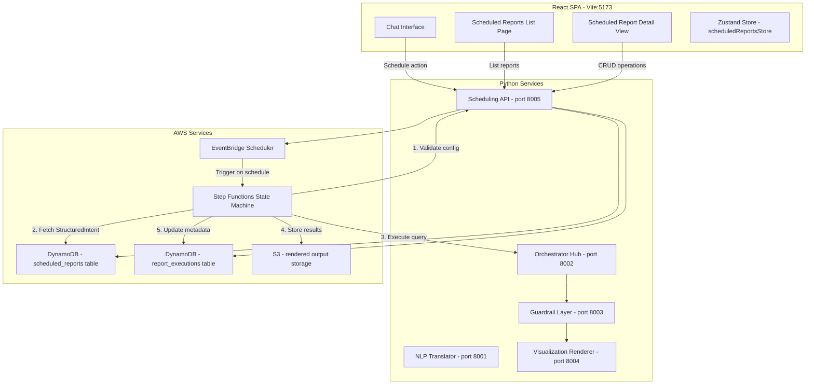
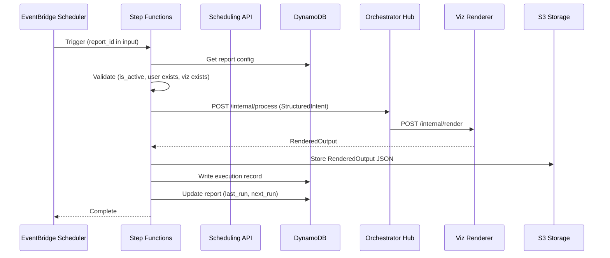

# Design Document: Scheduled Reports

## Overview

The Scheduled Reports feature adds automated recurring execution of saved conversational queries to the Conversational BI platform. Users can configure pinned visualization boxes to re-execute on a schedule (daily, weekly, monthly, custom), with AWS Step Functions orchestrating the execution workflow including retry logic, error handling, and audit trails.

The design extends the existing architecture by:
1. Adding scheduling UI controls to the existing CardToolbar and three-dot menu
2. Creating a new `/scheduled-reports` frontend route with list and detail views
3. Introducing a backend Scheduling Service (port 8005) that manages report configurations and triggers
4. Leveraging AWS Step Functions for reliable orchestration of query re-execution
5. Using DynamoDB for report configuration and execution metadata, S3 for rendered output storage

### Key Design Decisions

- **Pinned visualizations as scheduling unit**: Only pinned cards can be scheduled, reusing the existing `pinned` state in `CardState`. This constrains scheduling to explicitly valued content.
- **StructuredIntent replay (not NL re-parse)**: Scheduled executions replay the stored `StructuredIntent` directly, bypassing the NLP Translator. This guarantees deterministic, comparable results across runs.
- **Per-report state machine scheduling**: Each report gets an EventBridge Scheduler rule that triggers a shared Step Functions state machine with report-specific input. This avoids creating N state machine definitions.
- **Soft-delete with audit retention**: Deleting a report deactivates the schedule and soft-deletes the config, but execution history is preserved for audit.

---

## Architecture



### Execution Flow (Scheduled Run)



---

## Components and Interfaces

### Frontend Components

#### 1. ScheduleButton (CardToolbar extension)

Adds a clock icon to the existing `CardToolbar` component. Only visible on pinned cards.

```typescript
// Integrated into CardToolbar.tsx
interface ScheduleButtonProps {
  card: CardState;
  disabled?: boolean; // true if card is not pinned
}
```

#### 2. ScheduledReportsListPage

New route component at `/scheduled-reports`.

```typescript
interface ScheduledReportsListPageProps {}

// Internal state
interface ScheduledReportListItem {
  report_id: string;
  title: string;
  next_execution_time: string | null;
  last_run_timestamp: string | null;
  recurrence_display: string; // "Every Monday at 5 PM"
  status: 'active' | 'paused' | 'failed';
}
```

#### 3. ScheduledReportDetailPage

Full-page detail view for a single report.

```typescript
interface ScheduledReportDetailPageProps {
  reportId: string;
}

interface ExecutionHistoryItem {
  execution_id: string;
  execution_timestamp: string;
  status: 'success' | 'failed' | 'retrying';
  query_latency_ms: number | null;
  error_message: string | null;
}
```

#### 4. RecurrencePatternSelector

Reusable form component for selecting schedule patterns.

```typescript
interface RecurrencePattern {
  type: 'daily' | 'weekday' | 'weekly' | 'monthly' | 'custom';
  day_of_week?: number; // 0=Sunday, 6=Saturday
  day_of_month?: number; // 1-31
  time_hour: number; // 0-23
  time_minute: number; // 0-59
  timezone: string; // IANA timezone, e.g. "America/New_York"
  custom_interval?: number; // every N days/weeks/months
  custom_unit?: 'days' | 'weeks' | 'months';
}
```

#### 5. Zustand Store Extension (scheduledReportsStore)

Separate zustand store for scheduled reports state management.

```typescript
interface ScheduledReportsState {
  reports: ScheduledReportListItem[];
  currentReport: ScheduledReportDetail | null;
  executionHistory: ExecutionHistoryItem[];
  loading: boolean;
  error: string | null;

  // Actions
  fetchReports: () => Promise<void>;
  fetchReportDetail: (reportId: string) => Promise<void>;
  createReport: (config: CreateReportRequest) => Promise<string>;
  updateReport: (reportId: string, updates: Partial<UpdateReportRequest>) => Promise<void>;
  deleteReport: (reportId: string) => Promise<void>;
  pauseReport: (reportId: string) => Promise<void>;
  resumeReport: (reportId: string) => Promise<void>;
  retryReport: (reportId: string) => Promise<void>;
  fetchExecutionHistory: (reportId: string, page?: number) => Promise<void>;
}
```

### Backend Components

#### 6. Scheduling API Service (port 8005)

New FastAPI service for scheduled reports CRUD and orchestration triggers.

```python
# Endpoints
POST   /scheduled-reports              # Create a new scheduled report
GET    /scheduled-reports              # List all reports for authenticated user
GET    /scheduled-reports/{report_id}  # Get report detail
PATCH  /scheduled-reports/{report_id}  # Update report (title, recurrence, etc.)
DELETE /scheduled-reports/{report_id}  # Soft-delete report
POST   /scheduled-reports/{report_id}/pause   # Pause schedule
POST   /scheduled-reports/{report_id}/resume  # Resume schedule
POST   /scheduled-reports/{report_id}/retry   # Trigger immediate execution
GET    /scheduled-reports/{report_id}/executions  # Get execution history
```

#### 7. Recurrence Calculator Module

Pure function module for computing next execution times from recurrence patterns.

```python
# src/services/recurrence_calculator.py

def compute_next_execution(
    pattern: RecurrencePattern,
    after: datetime,  # compute next run after this time
    timezone: str,
) -> datetime:
    """Compute the next execution time given a recurrence pattern."""
    ...

def serialize_recurrence(pattern: RecurrencePattern) -> str:
    """Serialize a RecurrencePattern to a cron-like string for EventBridge."""
    ...

def deserialize_recurrence(cron_expr: str, timezone: str) -> RecurrencePattern:
    """Deserialize an EventBridge schedule expression to a RecurrencePattern."""
    ...

def format_recurrence_display(pattern: RecurrencePattern) -> str:
    """Format a RecurrencePattern as a human-readable string."""
    ...
```

#### 8. Step Functions State Machine Definition

Shared state machine invoked per-report with report-specific input.

```json
{
  "Comment": "Scheduled Report Execution",
  "StartAt": "ValidateConfig",
  "States": {
    "ValidateConfig": {
      "Type": "Task",
      "Resource": "arn:aws:lambda:...:validate-report-config",
      "Next": "FetchIntent",
      "Catch": [{"ErrorEquals": ["States.ALL"], "Next": "MarkFailed"}]
    },
    "FetchIntent": {
      "Type": "Task",
      "Resource": "arn:aws:lambda:...:fetch-structured-intent",
      "Next": "ExecuteQuery"
    },
    "ExecuteQuery": {
      "Type": "Task",
      "Resource": "arn:aws:lambda:...:execute-query",
      "Retry": [
        {
          "ErrorEquals": ["QueryExecutionError"],
          "MaxAttempts": 2,
          "IntervalSeconds": 1,
          "BackoffRate": 5.0
        }
      ],
      "Next": "StoreResults",
      "Catch": [{"ErrorEquals": ["States.ALL"], "Next": "MarkFailed"}]
    },
    "StoreResults": {
      "Type": "Task",
      "Resource": "arn:aws:lambda:...:store-execution-results",
      "Next": "UpdateMetadata"
    },
    "UpdateMetadata": {
      "Type": "Task",
      "Resource": "arn:aws:lambda:...:update-report-metadata",
      "End": true
    },
    "MarkFailed": {
      "Type": "Task",
      "Resource": "arn:aws:lambda:...:mark-execution-failed",
      "End": true
    }
  }
}
```

#### 9. EventBridge Scheduler Integration

Each report gets an EventBridge Scheduler rule that passes `report_id` as input to the Step Functions state machine.

```python
# src/services/scheduler_manager.py

class SchedulerManager:
    """Manages EventBridge Scheduler rules for scheduled reports."""

    def create_schedule(self, report_id: str, pattern: RecurrencePattern) -> str:
        """Create an EventBridge Scheduler rule. Returns schedule ARN."""
        ...

    def update_schedule(self, report_id: str, pattern: RecurrencePattern) -> None:
        """Update an existing schedule's recurrence pattern."""
        ...

    def disable_schedule(self, report_id: str) -> None:
        """Disable (pause) a schedule without deleting it."""
        ...

    def enable_schedule(self, report_id: str) -> None:
        """Re-enable a paused schedule."""
        ...

    def delete_schedule(self, report_id: str) -> None:
        """Permanently delete a schedule rule."""
        ...
```

### API Contract

#### Create Scheduled Report

```
POST /scheduled-reports
Authorization: Bearer <session_token>

Request:
{
  "title": "Weekly Sales Report",
  "description": "Quarterly revenue breakdown every Monday",
  "original_chat_id": "chat-uuid-123",
  "pinned_visualization_ids": ["card-uuid-456"],
  "recurrence_pattern": {
    "type": "weekly",
    "day_of_week": 1,
    "time_hour": 17,
    "time_minute": 0,
    "timezone": "America/New_York"
  }
}

Response (201):
{
  "report_id": "rpt-uuid-789",
  "title": "Weekly Sales Report",
  "next_execution_time": "2025-01-20T17:00:00-05:00",
  "status": "active",
  "created_at": "2025-01-15T10:30:00Z"
}
```

#### List Scheduled Reports

```
GET /scheduled-reports
Authorization: Bearer <session_token>

Response (200):
{
  "reports": [
    {
      "report_id": "rpt-uuid-789",
      "title": "Weekly Sales Report",
      "next_execution_time": "2025-01-20T17:00:00-05:00",
      "last_run_timestamp": "2025-01-13T17:00:00-05:00",
      "recurrence_display": "Every Monday at 5:00 PM EST",
      "status": "active"
    }
  ],
  "total_count": 1
}
```

#### Get Execution History

```
GET /scheduled-reports/{report_id}/executions?page=1&page_size=10
Authorization: Bearer <session_token>

Response (200):
{
  "executions": [
    {
      "execution_id": "exec-uuid-001",
      "execution_timestamp": "2025-01-13T17:00:00-05:00",
      "actual_start_timestamp": "2025-01-13T17:00:02Z",
      "status": "success",
      "query_latency_ms": 4523,
      "error_message": null
    }
  ],
  "total_count": 5,
  "page": 1,
  "page_size": 10
}
```

---

## Data Models

### DynamoDB Table: `scheduled_reports`

**Partition Key**: `user_id` (String)
**Sort Key**: `report_id` (String)
**GSI**: `report_id-index` (PK: `report_id`) — for direct lookups by Step Functions

| Attribute | Type | Description |
|-----------|------|-------------|
| user_id | String | Authenticated user ID (partition key) |
| report_id | String (UUID) | Unique report identifier (sort key) |
| title | String | User-provided report title (max 255 chars) |
| description | String | Optional description (max 1000 chars) |
| original_chat_id | String | Reference to the original chat session |
| pinned_visualization_ids | List[String] | IDs of pinned cards to re-execute |
| structured_intents | Map | Stored StructuredIntents for each pinned viz (keyed by viz ID) |
| recurrence_pattern | Map | JSON: {type, day_of_week, day_of_month, time_hour, time_minute, timezone, custom_interval, custom_unit} |
| is_active | Boolean | Whether the schedule is currently active |
| schedule_arn | String | EventBridge Scheduler rule ARN |
| next_execution_time | String (ISO8601) | Pre-computed next run time |
| last_run_timestamp | String (ISO8601) | Last execution timestamp |
| last_run_status | String | 'success' / 'failed' / null |
| created_at | String (ISO8601) | Record creation time |
| updated_at | String (ISO8601) | Last modification time |
| deleted_at | String (ISO8601) | Soft-delete timestamp (null if active) |

### DynamoDB Table: `report_executions`

**Partition Key**: `report_id` (String)
**Sort Key**: `execution_timestamp` (String - ISO8601)

| Attribute | Type | Description |
|-----------|------|-------------|
| report_id | String | Reference to scheduled report |
| execution_id | String (UUID) | Unique execution identifier |
| execution_timestamp | String (ISO8601) | Scheduled execution time |
| actual_start_timestamp | String (ISO8601) | When execution actually started |
| actual_end_timestamp | String (ISO8601) | When execution completed |
| status | String | 'success' / 'failed' / 'retrying' |
| query_latency_ms | Number | Total execution time in milliseconds |
| rendered_output_s3_key | String | S3 key for full RenderedOutput JSON |
| error_message | String | Error details if failed |
| retry_count | Number | Number of retries attempted |
| step_functions_execution_arn | String | ARN for traceability |

### S3 Storage: Rendered Output

**Key Pattern**: `scheduled-reports/outputs/{report_id}/{execution_id}.json`

Stores the full `RenderedOutput` JSON for each successful execution, enabling historical comparison and detail view rendering.

### Backend Pydantic Models

```python
# src/models/scheduled_reports.py

from datetime import datetime
from typing import Literal
from uuid import UUID
from pydantic import BaseModel, Field, field_validator


class RecurrencePattern(BaseModel):
    """Recurrence schedule specification."""
    type: Literal["daily", "weekday", "weekly", "monthly", "custom"]
    day_of_week: int | None = None  # 0=Sunday, 6=Saturday
    day_of_month: int | None = None  # 1-31
    time_hour: int = Field(default=9, ge=0, le=23)
    time_minute: int = Field(default=0, ge=0, le=59)
    timezone: str = "UTC"
    custom_interval: int | None = Field(default=None, ge=1, le=365)
    custom_unit: Literal["days", "weeks", "months"] | None = None

    @field_validator("day_of_week")
    @classmethod
    def validate_day_of_week(cls, v: int | None) -> int | None:
        if v is not None and (v < 0 or v > 6):
            raise ValueError("day_of_week must be 0-6")
        return v

    @field_validator("day_of_month")
    @classmethod
    def validate_day_of_month(cls, v: int | None) -> int | None:
        if v is not None and (v < 1 or v > 31):
            raise ValueError("day_of_month must be 1-31")
        return v


class ScheduledReportConfig(BaseModel):
    """Full scheduled report configuration stored in DynamoDB."""
    report_id: UUID
    user_id: str
    title: str = Field(max_length=255, min_length=1)
    description: str = Field(default="", max_length=1000)
    original_chat_id: str
    pinned_visualization_ids: list[str] = Field(min_length=1)
    structured_intents: dict[str, dict]  # viz_id -> StructuredIntent as dict
    recurrence_pattern: RecurrencePattern
    is_active: bool = True
    schedule_arn: str | None = None
    next_execution_time: datetime | None = None
    last_run_timestamp: datetime | None = None
    last_run_status: Literal["success", "failed"] | None = None
    created_at: datetime
    updated_at: datetime
    deleted_at: datetime | None = None


class CreateReportRequest(BaseModel):
    """Request body for creating a scheduled report."""
    title: str = Field(max_length=255, min_length=1)
    description: str = Field(default="", max_length=1000)
    original_chat_id: str
    pinned_visualization_ids: list[str] = Field(min_length=1)
    recurrence_pattern: RecurrencePattern


class UpdateReportRequest(BaseModel):
    """Request body for updating a scheduled report."""
    title: str | None = Field(default=None, max_length=255, min_length=1)
    description: str | None = Field(default=None, max_length=1000)
    recurrence_pattern: RecurrencePattern | None = None


class ExecutionRecord(BaseModel):
    """A single execution record for a scheduled report."""
    execution_id: UUID
    report_id: UUID
    execution_timestamp: datetime
    actual_start_timestamp: datetime
    actual_end_timestamp: datetime | None = None
    status: Literal["success", "failed", "retrying"]
    query_latency_ms: int | None = None
    rendered_output_s3_key: str | None = None
    error_message: str | None = None
    retry_count: int = 0
    step_functions_execution_arn: str | None = None
```

---


## Correctness Properties

*A property is a characteristic or behavior that should hold true across all valid executions of a system — essentially, a formal statement about what the system should do. Properties serve as the bridge between human-readable specifications and machine-verifiable correctness guarantees.*

### Property 1: Pinned card filtering

*For any* collection of CardState objects with a mix of pinned and unpinned states, the scheduling eligibility filter SHALL return only cards where `pinned === true`, and the result set SHALL never contain any card with `pinned === false`.

**Validates: Requirements 2.1**

### Property 2: Recurrence pattern computation

*For any* valid RecurrencePattern and any reference timestamp, `compute_next_execution` SHALL produce a datetime that:
1. Is strictly in the future relative to the reference timestamp
2. Is no more than 30 days after the reference timestamp (for non-custom patterns)
3. Respects the specified IANA timezone (the local hour/minute matches the pattern's time_hour/time_minute in that timezone)
4. Falls on the correct day_of_week or day_of_month as specified by the pattern

**Validates: Requirements 4.3, 5.3, 5.4, 5.5, 11.3**

### Property 3: Scheduled report configuration round-trip

*For any* valid ScheduledReportConfig object, serializing it to DynamoDB format, persisting it, and then retrieving and deserializing it SHALL produce an object equal to the original (all fields preserved exactly).

**Validates: Requirements 8.1**

### Property 4: Execution record persistence round-trip

*For any* valid ExecutionRecord (including its rendered_output S3 payload), storing the record and then retrieving it by report_id and execution_timestamp SHALL produce an identical record with all fields preserved.

**Validates: Requirements 6.5, 8.2**

### Property 5: Execution replays stored StructuredIntent

*For any* scheduled report with stored structured_intents, when the execution engine triggers a re-run, the StructuredIntent passed to the Orchestrator Hub SHALL be byte-for-byte identical to the stored intent — never re-parsed from natural language text.

**Validates: Requirements 7.1, 2.4**

### Property 6: Ownership enforcement

*For any* pair of (requesting_user_id, report_owner_id), read/update/delete operations SHALL succeed if and only if requesting_user_id equals report_owner_id. Mismatched pairs SHALL always result in HTTP 403.

**Validates: Requirements 9.3, 9.5**

### Property 7: Report title and description validation

*For any* string input as report title, validation SHALL accept it if and only if `1 <= len(title) <= 255`. *For any* string input as description, validation SHALL accept it if and only if `len(description) <= 1000`. Empty strings for title SHALL always be rejected.

**Validates: Requirements 10.1, 10.2**

### Property 8: Text truncation with ellipsis

*For any* string and a given maximum display length, the truncation function SHALL:
- Return the original string unchanged if `len(string) <= maxLength`
- Return a string of exactly `maxLength` characters ending with "…" if `len(string) > maxLength`
- Never return a string longer than `maxLength`

**Validates: Requirements 10.5**

### Property 9: Execution history ordering and pagination

*For any* set of execution records for a given report_id, querying with a page_size of N SHALL return records sorted by execution_timestamp descending, with the result count never exceeding N, and each page's last timestamp being strictly earlier than the previous page's last timestamp.

**Validates: Requirements 6.6, 8.3**

### Property 10: Pause/resume state transitions

*For any* active scheduled report, pausing SHALL set `is_active = false`. *For any* paused scheduled report, resuming SHALL set `is_active = true` and compute a valid next_execution_time (in the future, respecting the recurrence pattern). The transitions are idempotent: pausing an already-paused report or resuming an already-active report SHALL be a no-op.

**Validates: Requirements 11.2, 11.3**

### Property 11: Deletion preserves execution history

*For any* scheduled report with N associated execution records, after deletion the execution records SHALL remain queryable by report_id and their count SHALL still equal N. Only the report configuration SHALL be marked as deleted.

**Validates: Requirements 12.3**

---

## Error Handling

### Frontend Errors

| Scenario | Behavior |
|----------|----------|
| API timeout (>30s) on list/detail fetch | Show skeleton shimmer, then inline error with retry button |
| 403 Forbidden on report access | Redirect to `/scheduled-reports` with toast: "Report not found or access denied" |
| 422 Validation error on create/update | Highlight invalid field with inline error message |
| Network failure | Show connection error banner (reusable from existing ErrorMessage component) |
| Create report with no pinned cards | Disable schedule button, show tooltip: "Pin a visualization first" |

### Backend Errors

| Error | HTTP Status | Error Code | Description |
|-------|-------------|------------|-------------|
| Report not found | 404 | `REPORT_NOT_FOUND` | report_id doesn't exist or is soft-deleted |
| Unauthorized | 401 | `UNAUTHORIZED` | Missing or invalid session token |
| Forbidden | 403 | `FORBIDDEN` | User doesn't own the report |
| Validation error | 422 | `VALIDATION_ERROR` | Invalid recurrence pattern, empty title, etc. |
| Next execution >30 days | 422 | `SCHEDULE_TOO_FAR` | Computed next run exceeds 30-day maximum |
| Chat/visualization not found | 422 | `CHAT_NOT_FOUND` | Referenced chat_id or viz_id no longer exists |
| AWS service error | 503 | `SERVICE_UNAVAILABLE` | EventBridge/Step Functions/DynamoDB unavailable |
| Rate limit | 429 | `RATE_LIMITED` | Too many create/retry requests |

### Step Functions Error Handling

| Step | Error | Behavior |
|------|-------|----------|
| ValidateConfig | Report deleted/deactivated | Skip execution, log warning |
| ValidateConfig | User auth expired | Mark failed, store "AUTH_EXPIRED" error |
| FetchIntent | Intent not found | Mark failed, store "INTENT_NOT_FOUND" |
| ExecuteQuery | Timeout (>60s) | Retry up to 2x with 1s, 5s backoff |
| ExecuteQuery | Data source unavailable | Mark failed, store "DATA_SOURCE_UNAVAILABLE" |
| StoreResults | S3 write failure | Retry 1x, then mark failed |
| UpdateMetadata | DynamoDB write failure | Retry 1x, then mark failed (results still in S3) |

---

## Testing Strategy

### Property-Based Testing (fast-check)

This feature is well-suited for property-based testing in the following areas:

**Target Library**: `fast-check` (already in project devDependencies)

**Backend**: Python `hypothesis` (already in project — `.hypothesis/` directory exists)

**Configuration**: Minimum 100 iterations per property test.

**Frontend property tests** (fast-check, vitest):
- Property 1: Pinned card filtering
- Property 7: Title/description validation
- Property 8: Text truncation
- Property 9: Execution history ordering (mock data)

**Backend property tests** (hypothesis, pytest):
- Property 2: Recurrence pattern computation
- Property 3: Config persistence round-trip
- Property 4: Execution record round-trip
- Property 5: StructuredIntent replay fidelity
- Property 6: Ownership enforcement
- Property 10: Pause/resume state transitions
- Property 11: Deletion preserves history

**Tag format**: `Feature: scheduled-reports, Property {N}: {title}`

### Unit Tests (Example-Based)

| Area | Tests |
|------|-------|
| RecurrencePatternSelector | Renders all predefined options; time selector appears on selection |
| CardToolbar schedule button | Clock icon visible on pinned cards, hidden on unpinned |
| Three-dot menu | "Schedule" option present in menu |
| Detail view debouncing | Title save fires after 500ms inactivity |
| Pagination | Shows pagination controls when >10 executions |
| Delete confirmation | Dialog shows report title, confirms before action |
| Error states | Failed report shows error + retry button |

### Integration Tests

| Area | Tests |
|------|-------|
| Full create flow | Create report → verify DynamoDB record + EventBridge schedule |
| Execution flow | Trigger Step Functions → verify execution record + S3 output |
| Auth flow | Verify 401 for unauthenticated, 403 for wrong user |
| Pause/resume | Pause → verify EventBridge disabled; Resume → verify re-enabled |
| Delete flow | Delete → verify soft-delete + schedule removed + history preserved |

### Smoke Tests

| Area | Tests |
|------|-------|
| `/scheduled-reports` route | Page renders without errors |
| Step Functions definition | State machine contains all required states |
| DynamoDB tables | Tables exist with correct key schema |
