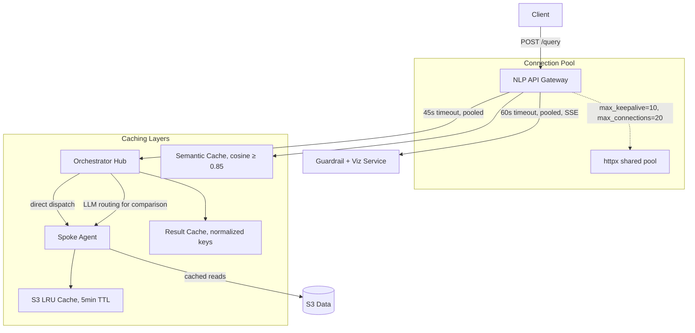

# Design Document: Service Latency Optimization

## Overview

This design addresses latency bottlenecks in the multi-service query pipeline (`nlp_api.py` → `orchestrator_hub.py` → `guardrail_api.py` → `visualization_renderer.py`). The current architecture has 4 sequential HTTP hops with excessive timeouts (totaling 270s), creates a new `httpx.AsyncClient` per request, lacks S3 caching in the spoke agent, and sends full ontology context to LLM prompts unnecessarily.

The optimization strategy targets:
1. **HTTP chain reduction**: Tighter timeouts (45s/15s/60s) and connection pooling
2. **Hop elimination**: Merge Guardrail + Visualization into a single service (4 hops → 3)
3. **LLM efficiency**: Cap ontology context at 5 concepts, expand direct dispatch
4. **Caching layers**: S3 file cache with TTL, pre-warming, normalized cache keys, semantic caching
5. **Streaming**: SSE for progressive visualization delivery

Target: 40–70% reduction in end-to-end latency.

## Architecture



### Key Architectural Changes

1. **Before**: `NLP_API` → `Orchestrator` → `Guardrail` → `Visualization` (4 hops, 270s total timeout)
2. **After**: `NLP_API` → `Orchestrator` → `GuardrailVisualization` (3 hops, 135s total timeout)

The merged `GuardrailVisualization` service runs guardrail validation first; on pass, it immediately invokes the renderer in-process without a network hop.

## Components and Interfaces

### 1. Connection Pool Manager (in `nlp_api.py`)

A module-level shared `httpx.AsyncClient` initialized at startup with:
```python
httpx.AsyncClient(
    limits=httpx.Limits(max_keepalive_connections=10, max_connections=20),
    timeout=httpx.Timeout(connect=5.0)  # per-request timeouts override this
)
```

**Interface**:
- `get_http_pool() -> httpx.AsyncClient` — returns the shared pool
- Lifecycle tied to FastAPI startup/shutdown events

### 2. Merged Guardrail + Visualization Service (`guardrail_viz_api.py`)

Combines `guardrail_api.py` and `visualization_renderer.py` into a single FastAPI process:

**Endpoint**: `POST /internal/validate-and-render`
```python
class ValidateAndRenderRequest(BaseModel):
    orchestrator_response: dict
    structured_intent: dict

class ValidateAndRenderResponse(BaseModel):
    rendered_output: dict | None
    rejected: bool
    rejection_reason: str | None
```

**Flow**: Validate → if pass → render → return. If reject → return rejection immediately.

### 3. S3 Cache (in `spoke_agent.py`)

In-memory LRU cache with TTL for S3 file contents:

```python
class S3Cache:
    def __init__(self, max_size: int = 100, ttl_seconds: int = 300):
        ...
    
    def get(self, key: str) -> bytes | None: ...
    def put(self, key: str, content: bytes) -> None: ...
    def pre_warm(self, keys: list[str]) -> None: ...
```

**Eviction**: LRU when at capacity. Stale entries served on S3 failure with logged warning.

### 4. Semantic Cache (in `result_cache.py`)

Extends `ResultCache` with embedding-based similarity matching:

```python
class SemanticCache:
    def __init__(self, similarity_threshold: float = 0.85):
        ...
    
    def find_similar(self, query_text: str) -> CachedResult | None: ...
    def store(self, query_text: str, embedding: list[float], result: OrchestratorResponse) -> None: ...
```

### 5. NLP Translator Prompt Optimization (in `nlp_translator.py`)

Modify `_build_ontology_context()` to:
- Limit output to 5 concepts maximum
- Sort by keyword match relevance score before truncating

### 6. Direct Dispatch Expansion (in `orchestrator_hub.py`)

Modify `process_intent()` routing logic:
- **Before**: Direct dispatch only for single-agent, non-comparison queries
- **After**: Direct dispatch for `query_type in ("lookup", "aggregation")` regardless of agent count. Only `"comparison"` triggers LLM routing.

### 7. SSE Streaming (in `nlp_api.py` and `guardrail_viz_api.py`)

The merged service streams LLM-generated chart chunks. `nlp_api.py` forwards these as SSE events to the client:
- `event: chunk` — partial chart config data
- `event: metadata` — latency breakdown after completion
- `event: error` — if streaming is interrupted, partial response indication

## Data Models

### S3CacheEntry
```python
@dataclass
class S3CacheEntry:
    content: bytes
    cached_at: float  # time.monotonic()
    s3_key: str
```

### SemanticCacheEntry
```python
@dataclass
class SemanticCacheEntry:
    query_text: str
    embedding: list[float]
    result: OrchestratorResponse
    stored_at: datetime
```

### Normalized Cache Key Fields
The `ResultCache.generate_key()` will be updated to exclude:
- `timestamp` / `stored_at`
- `query_id` / `correlation_id`
- `source` field in routing_metadata

Included in key computation:
- `query_type`
- `sorted(entity_refs)`
- `query_text` (lowercased, stripped)

### ValidateAndRenderRequest / Response
As defined in Components section above.

## Correctness Properties

*A property is a characteristic or behavior that should hold true across all valid executions of a system—essentially, a formal statement about what the system should do. Properties serve as the bridge between human-readable specifications and machine-verifiable correctness guarantees.*

### Property 1: S3 cache TTL correctness

*For any* S3 file key and any point in time, `get()` SHALL return the cached content if and only if the entry was stored less than 300 seconds (5 minutes) ago. Entries at or beyond the TTL SHALL be treated as cache misses.

**Validates: Requirements 5.1, 5.2, 5.3**

### Property 2: S3 cache LRU eviction order

*For any* sequence of `put()` and `get()` operations that causes the cache to exceed its maximum capacity, the evicted entry SHALL always be the least recently used (oldest access time) entry.

**Validates: Requirements 5.4**

### Property 3: S3 cache stale-on-error fallback

*For any* cached S3 entry that has expired (past TTL), if the S3 fetch to refresh it fails, the cache SHALL return the stale content rather than an error.

**Validates: Requirements 5.5**

### Property 4: Normalized cache key volatile field exclusion

*For any* two `StructuredIntent` instances that differ only in volatile fields (`timestamp`, `query_id`, `correlation_id`, `source`), the `generate_key()` function SHALL produce identical cache keys.

**Validates: Requirements 9.1, 9.2, 9.3**

### Property 5: Normalized cache key text normalization

*For any* two query texts that differ only in leading/trailing whitespace or letter casing, the normalized cache key SHALL be identical.

**Validates: Requirements 9.2, 9.3**

### Property 6: Semantic cache threshold correctness

*For any* query embedding and set of cached embeddings, the semantic cache SHALL return a cached result if and only if the maximum cosine similarity is ≥ 0.85. Queries below the threshold SHALL always miss.

**Validates: Requirements 10.1, 10.2**

### Property 7: Ontology context capped at 5 concepts

*For any* query that resolves N ontology concepts (where N > 5), the `_build_ontology_context()` function SHALL return exactly 5 concepts, selected by highest keyword match relevance score.

**Validates: Requirements 4.1, 4.2**

### Property 8: Direct dispatch for non-comparison queries

*For any* structured intent with `query_type` in `{"lookup", "aggregation"}`, the orchestrator SHALL route directly to spoke agents without invoking the LLM routing agent, regardless of how many agents are resolved.

**Validates: Requirements 7.1, 7.2**

### Property 9: LLM routing for comparison queries

*For any* structured intent with `query_type == "comparison"` and multiple resolved agents, the orchestrator SHALL invoke the LLM routing agent for multi-agent coordination.

**Validates: Requirements 7.3**

### Property 10: Guardrail rejection short-circuits rendering

*For any* orchestrator response that fails guardrail validation in the merged service, the service SHALL return the rejection immediately without invoking the visualization renderer.

**Validates: Requirements 3.5**

## Error Handling

| Scenario | Behavior |
|----------|----------|
| Orchestrator timeout (>45s) | Return 504 with `GATEWAY_TIMEOUT` error |
| Guardrail+Viz timeout (>60s) | Return 504, include partial data if streaming |
| S3 fetch failure with stale cache | Serve stale content, log warning |
| S3 fetch failure with no cache | Return data source error from spoke agent |
| Pre-warm failure for individual file | Log warning, continue warming remaining files |
| Connection pool exhausted | httpx queues request until connection available |
| Semantic cache embedding failure | Skip cache, proceed with full pipeline |
| SSE stream interruption | Send `event: error` with partial response flag |

## Testing Strategy

### Property-Based Tests (using Hypothesis)

Each correctness property maps to a property-based test with minimum 100 iterations. Library: **Hypothesis** (already in use in this project).

| Property | Generator Strategy |
|----------|-------------------|
| P1: S3 cache TTL | Random keys/values + random time offsets (0–600s). Verify hit/miss relative to 300s boundary. |
| P2: S3 cache LRU | Random sequences of put/get ops exceeding capacity. Verify eviction order matches LRU. |
| P3: S3 stale-on-error | Random expired entries + simulated S3 failure. Verify stale content returned. |
| P4: Volatile field exclusion | Random intents with randomized volatile fields (uuid, datetime, strings). Verify key identity. |
| P5: Text normalization | Random query strings with injected whitespace/casing variations. Verify key identity. |
| P6: Semantic threshold | Random embedding vector pairs with known cosine similarity. Verify hit iff ≥ 0.85. |
| P7: Ontology cap | Random concept lists (length 1–50) with random scores. Verify output ≤ 5 and top-scored. |
| P8: Direct dispatch | Random intents with query_type ∈ {lookup, aggregation}. Verify no LLM invocation. |
| P9: LLM routing | Random comparison intents with 2+ agents. Verify LLM is invoked. |
| P10: Short-circuit | Random responses that fail validation. Verify renderer not called. |

Tag format: `Feature: service-latency-optimization, Property {N}: {description}`

### Unit Tests (Example-Based)

- Connection pool configuration: verify `max_keepalive_connections=10`, `max_connections=20`
- Timeout configuration: verify 45s, 15s, 60s values applied to respective calls
- Pool lifecycle: startup initializes pool eagerly, shutdown closes cleanly
- Pre-warming: verify configured files loaded into cache on startup within 10s
- Pre-warm partial failure: one file fails, remaining files still loaded
- SSE event format: verify `event: chunk`, `event: metadata`, `event: error` structure
- Merged service endpoint: concrete validate-then-render flow
- Semantic cache logging: verify match score logged on hit

### Integration Tests

- End-to-end pipeline with merged service (3-hop path vs previous 4-hop)
- S3 cache with mocked S3: verify cache prevents repeat calls
- Streaming SSE delivery: progressive chunk delivery to client
- Connection pool reuse: multiple requests share same pool (verify via transport inspection)
